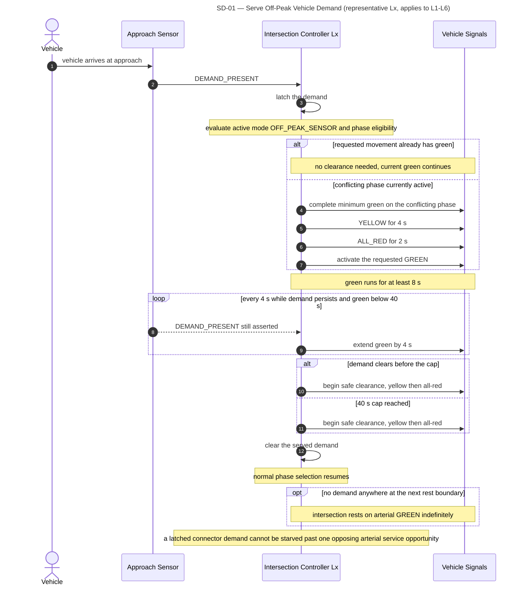
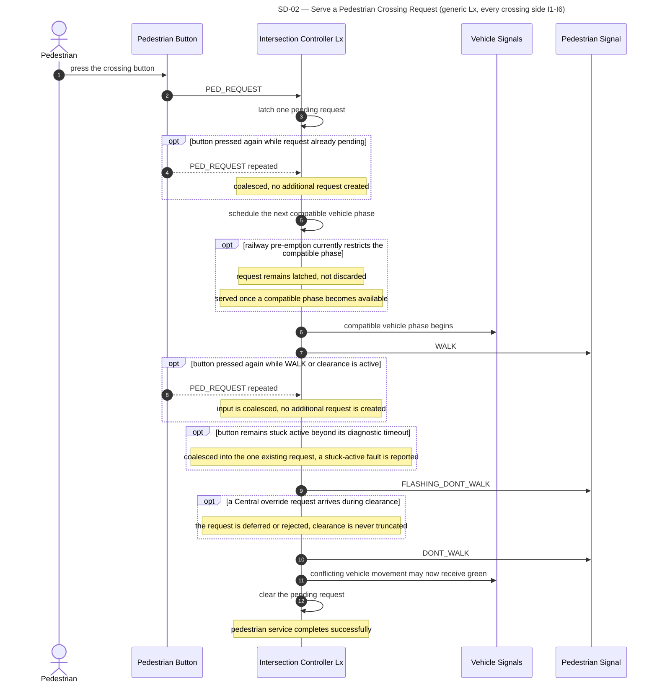
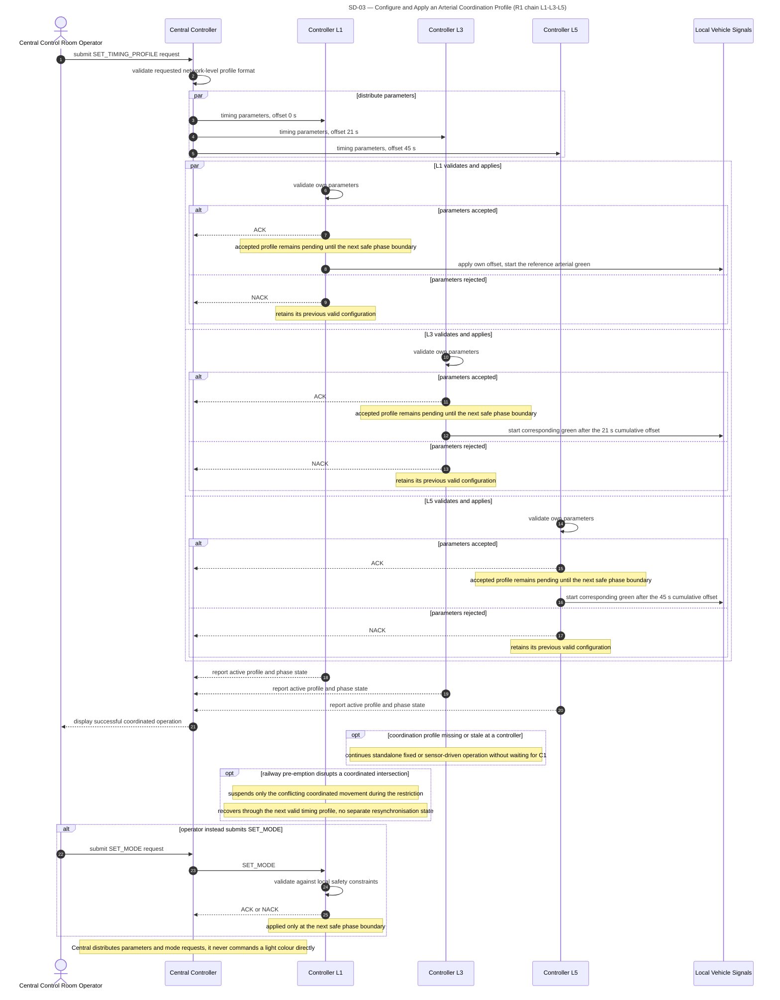
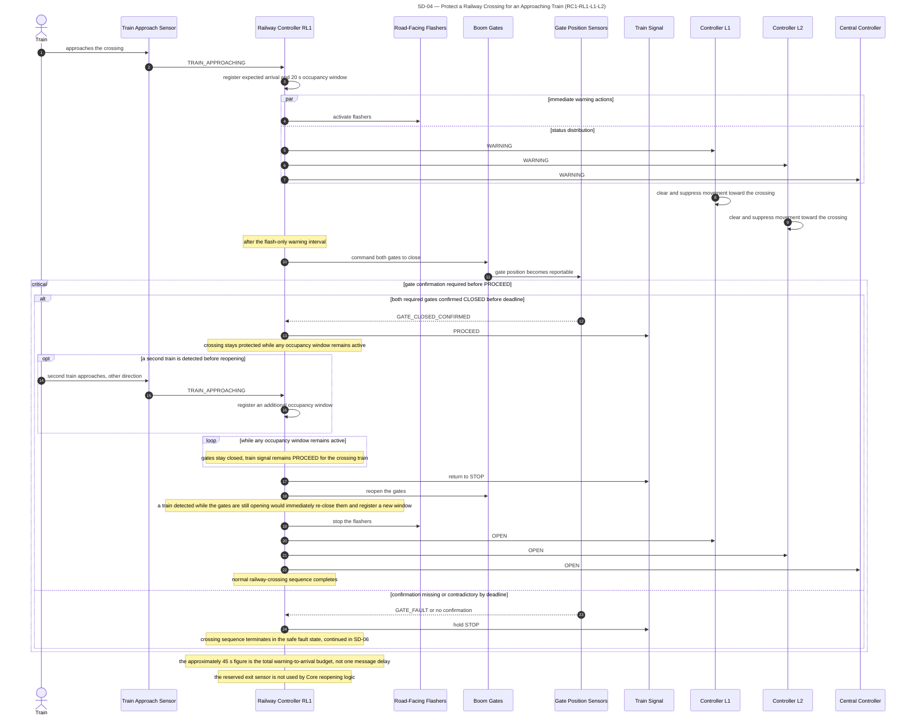
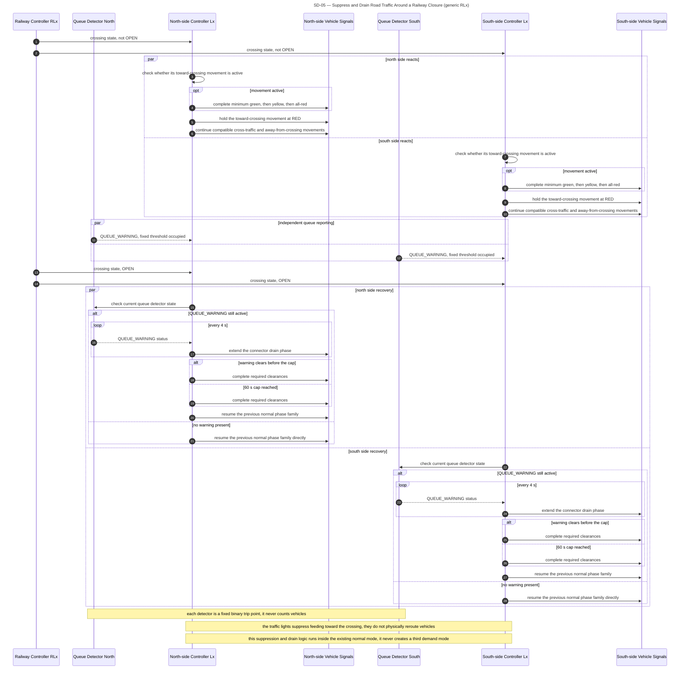
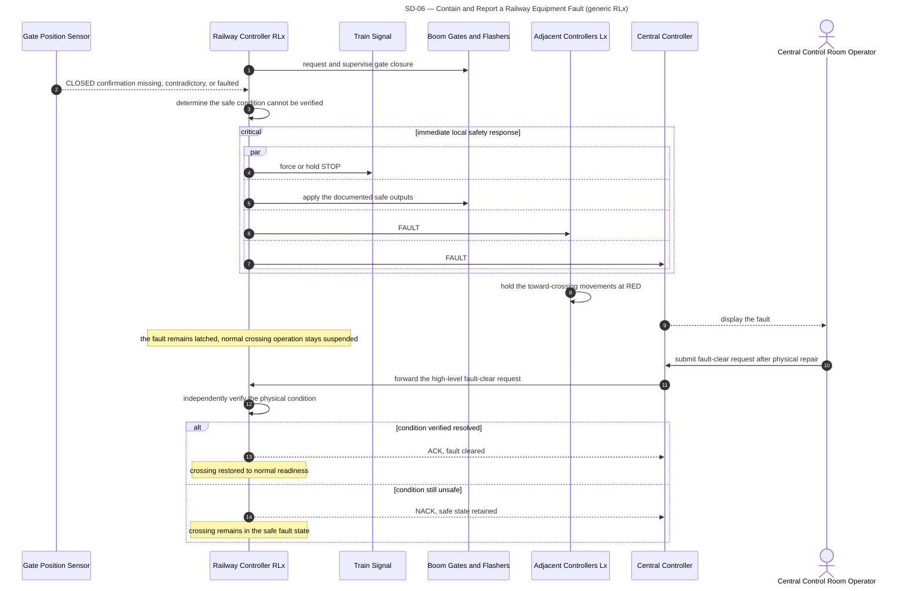
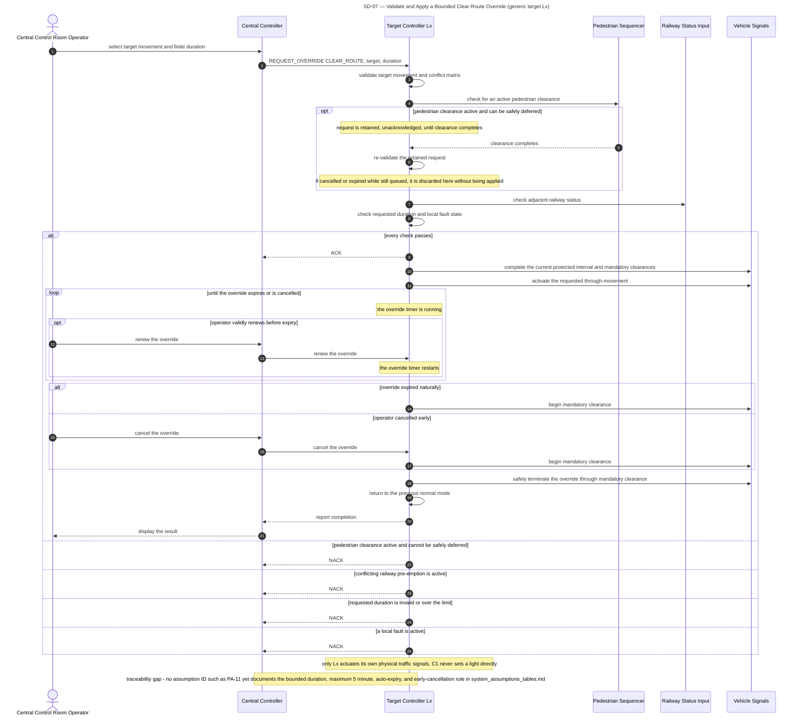

# Section 4.2 — Behavioural Specifications (Sequence Diagrams)

Companion to `STATE_CHARTS.md` (Section 4.1), `scenarios_and_written_specifications.md`, `system_assumptions_tables.md`, and `PROJECT_SPECIFICATION.md`. Produced for the Initial Design Report requirement: *"Include behavioral specifications such as sequence diagram(s) or collaboration diagrams to map out the chronological flow of actions."*

All diagrams use Mermaid `sequenceDiagram` and were validated by rendering each block with `@mermaid-js/mermaid-cli` (the same Puppeteer/Chromium-based engine behind the Mermaid Live Editor) before being written here — zero parse errors.

---

## 1. Coverage decision

Eight diagrams are sufficient. One diagram per use case is unnecessary in two cases because the *interaction pattern* (who sends what, in what order, with what ACK/NACK shape) is identical even though the triggering scenario differs:

- **UC-03 + UC-07 → SD-03**: both are "Central validates and distributes a parameter change that each `Lx` applies at its own next safe boundary." A coordination offset and a mode switch travel through the exact same `SET_TIMING_PROFILE`/`SET_MODE` → validate → ACK/NACK → apply-at-boundary → report pipeline — drawing a separate diagram for UC-07 would just repeat SD-03 with different payload names.
- **UC-09 + UC-10 → SD-08**: both live on the same heartbeat/connectivity lifeline — "monitor while connected" (UC-09) and "lose the link, run autonomously, resynchronise" (UC-10) are two phases of one continuous interaction, not two separate conversations between the local controller and Central.

The other six use cases (UC-01, UC-02, UC-04, UC-05, UC-06, UC-08) each have a genuinely distinct actor set or message pattern and get their own diagram.

---

## 2. Repository version checked

- Commit: `77f372040ad27dbf4deaa186e3ab0d58651c2a63` (2026-08-24 15:54:02 +0700), working tree clean.
- `scenarios_and_written_specifications.md` contains the approved ten-use-case version, and the IDs/names match the Section 2 baseline exactly (`UC-01`–`UC-10`).
- `PA-11` does **not** exist in `system_assumptions_tables.md` (current pedestrian/sensing/abnormal-operation range is `PA-01`–`PA-10`).

---

## 3. Contradictions or traceability gaps

Only one genuine gap, already flagged by the repository's own use-case file:

- **No assumption ID covers the `CLEAR_ROUTE` override's bounded/auto-expiring rule** (max duration, auto-expiry, early cancellation). `UC-08`'s own Business Rules already cite `PROJECT_SPECIFICATION.md` Sections 8/18/22 directly instead of an ID — this is a pre-existing gap, not something introduced here. Per this task's rule ("if required behaviour has no corresponding assumption ID, identify it as a traceability gap instead of citing the internal specification"), SD-07 marks this in-diagram and in its Constraints bullet rather than citing the Project Specification as authority.

No other unresolved contradiction was found between the official brief, `system_assumptions_tables.md`, the approved use cases, and `PROJECT_SPECIFICATION.md` for the behaviour these eight diagrams need to show.

---

## 4. SD-01 — Serve Off-Peak Vehicle Demand

*What this shows:* a vehicle demand event at a generic intersection controller during `OFF_PEAK_SENSOR` operation — from detector trip through green extension, anti-starvation, and the arterial-rest alternative when no demand exists anywhere.

- **Covers:** UC-01
- **Constraints:** `TL-01`, `TL-03`, `DP-04`, `DP-06`, `PA-04`
- **Official requirement:** p.2 ("Traffic demand and priority may differ between R1-R5; teams must state and justify the assumptions"), p.3 ("Sensor driven ... commonly used in off-peak times")

---

## 5. SD-02 — Serve a Pedestrian Crossing Request

*What this shows:* one pedestrian button press through the latched request, waiting for a compatible vehicle phase, `WALK`, and the uninterruptible clearance sequence — including coalesced repeats and a deferred/rejected Central override.

- **Covers:** UC-02
- **Constraints:** `TL-05`, `TL-06`, `PA-02`, `PA-03`
- **Official requirement:** p.2 ("Pedestrian buttons and pedestrian signals should also be considered if you want to target for grades from a CR level or above")

---

## 6. SD-03 — Configure and Apply an Arterial Coordination Profile

*What this shows:* Central distributing a validated timing/coordination profile to the `L1-L3-L5` arterial chain — parallel distribution and validation, ACK/NACK, boundary-gated application of offsets, and the missing-profile / railway-disruption / `SET_MODE` alternatives. `L2-L4-L6` on R2 follows the same pattern with its own offsets.

- **Covers:** UC-03, UC-07
- **Constraints:** `TC-01`–`TC-05`, `TL-04`, `PA-09` (plus `DP-01` for the `SET_MODE` branch)
- **Official requirement:** p.2 (distance used to determine timing requirements), p.3 ("Advanced: updateable sequence structure or timing requests from central controller"; "central controller may send a command to change the sequence a few times a day")

---

## 7. SD-04 — Protect a Railway Crossing for an Approaching Train

*What this shows:* the Pass-scope example (`RC1`/`RL1`/`L1`/`L2`) — train-approach detection, immediate warning and status distribution, gate closure, the sensor-confirmed-closure gate before `PROCEED`, occupancy-window tracking across a possible second train, and safe reopening.

- **Covers:** UC-04
- **Constraints:** `RC-01`–`RC-06`
- **Official requirement:** p.2 ("boom gates and red flashing lights that operate whenever a train crosses the road"; "traffic light system can sense the state of the railway crossing (but has no control over it)"; "the train should receive a red light if there are any issues with the boom gates – thus indicating an error which should be reported to the control room")

---

## 8. SD-05 — Suppress and Drain Road Traffic Around a Railway Closure

*What this shows:* both intersections adjacent to a crossing independently suppressing their toward-crossing movement during a closure, then independently checking their own binary queue detector and running a bounded drain phase after reopening.

- **Covers:** UC-05
- **Constraints:** `CC-01`–`CC-03`, `TL-01`
- **Official requirement:** p.2 ("By measuring the distance between the traffic light intersections and train crossing you can start to determine the timing requirements ... to clear the intersections and avoid traffic backing up")

---

## 9. SD-06 — Contain and Report a Railway Equipment Fault

*What this shows:* a railway controller detecting an unverifiable gate state, forcing the safe outputs and reporting the fault as parallel (not sequential) actions, and the later verified fault-clear request cycle.

The `par` block inside `critical immediate local safety response` shows `RLx->>TS` (forces `STOP`) running concurrently with, not sequenced after, `RLx->>C1` (fault report) — proving the local safety action does not wait for Central.

- **Covers:** UC-06
- **Constraints:** `RC-06`, `RC-09`, `RC-10`, `PA-09`, `PA-10`
- **Official requirement:** p.2 ("The train should receive a red light if there are any issues with the boom gates – thus indicating an error which should be reported to the control room")

---

## 10. SD-07 — Validate and Apply a Bounded Clear-Route Override

*What this shows:* a Central operator requesting a bounded clear-route override, the target controller validating it against pedestrian, railway, conflict, and fault conditions, and the bounded activation/expiry/renewal/cancellation sequence.

- **Covers:** UC-08
- **Constraints:** `PA-09`. **Traceability gap:** the override's bounded/auto-expiring rule (max 5 min, auto-expiry, early cancellation) has no assumption ID yet — see Section 3.
- **Official requirement:** p.3 ("The central control room may also initiate override commands ... to deal with exceptional situations (e.g. to provide a clear path for a visiting dignitary)")

---

## 11. SD-08 — Monitor Controllers, Lose Central Link, and Resynchronise

*What this shows:* normal heartbeat monitoring, entry into `DEGRADED_LOCAL` after three missed heartbeats with continued local autonomy across sensors/clock/actuators, and the resynchronisation sequence on reconnection. One "Generic Local Controller" lifeline stands in for any `Lx` or `RLx`.

```mermaid
---
title: SD-08 — Monitor Controllers, Lose Central Link, and Resynchronise (generic Lx or RLx)
---
sequenceDiagram
    accTitle: SD-08 Monitor Controllers, Lose Central Link, and Resynchronise
    accDescr: Chronological flow of normal heartbeat monitoring, entry into DEGRADED_LOCAL after three missed heartbeats with continued local autonomy, and the resynchronisation sequence on reconnection.
    autonumber

    actor Op as Central Control Room Operator
    participant C1 as Central Controller
    participant Gx as Generic Local Controller
    participant Clk as Local Clock
    participant Sn as Local Sensors
    participant Ac as Local Actuators

    loop every 1 s while connected
        Gx->>C1: heartbeat
    end

    Gx->>C1: report state transitions and faults
    C1->>C1: update the network display
    Op->>C1: review current controller status

    Note over Gx,C1: three consecutive heartbeats are missed
    Gx->>Gx: declare the Central link unavailable, enter DEGRADED_LOCAL
    Note over Gx: Central coordination and override availability are disabled locally
    Gx->>Gx: retain the last validated timing parameters

    par local operation continues
        Clk->>Gx: continue selecting PEAK_FIXED or OFF_PEAK_SENSOR
    and
        Sn->>Gx: continue driving local behaviour
    and
        Gx->>Ac: continue operating under local authority
    and
        C1->>C1: mark the controller state as stale or unavailable
    end

    opt a railway event occurs while disconnected
        Note over Gx: the full railway-protection sequence runs to completion with zero Central dependency
    end

    alt the link remains unavailable
        Note over Gx: continues safe autonomous operation indefinitely
    else communication returns
        Gx->>C1: send the complete current state
        C1->>C1: replace the stale view with the reported actual state

        critical before accepting new commands
            Note over Gx,C1: no new Central request is accepted until state synchronisation completes
        end

        Gx->>Gx: begin accepting new Central requests
        Note over Gx,C1: normal coordination resumes
    end
```

- **Covers:** UC-09, UC-10
- **Constraints:** `PA-07`, `PA-08`, `TC-04`, `RC-10`
- **Official requirement:** p.2 ("Each local controller also communicates with a central controller (but should continue to operate if either communication link fails or the central controller goes offline)"; "the central controller does not directly control the individual lights ... must be maintained even in the event that the controller cannot communicate")

---

## 12. Use-case coverage summary

- UC-01 → SD-01
- UC-02 → SD-02
- UC-03 → SD-03
- UC-04 → SD-04
- UC-05 → SD-05
- UC-06 → SD-06
- UC-07 → SD-03
- UC-08 → SD-07
- UC-09 → SD-08
- UC-10 → SD-08

All ten approved use cases are covered by at least one diagram.

---

## 13. Final consistency and Mermaid validation check

1. All ten use cases covered — confirmed in Section 12. ✔
2. Every Main Flow reaches a complete observable outcome (SD-01 served/rest, SD-02 request served/latched, SD-03 coordinated/standalone, SD-04 `OPEN`, SD-05 resumed normal phase, SD-06 cleared/retained fault, SD-07 completed/`NACK`, SD-08 resynchronised/autonomous). ✔
3. Every `alt`/`opt` branch either rejoins the flow or ends in a named state (`NACK`, safe fault state, standalone operation). ✔
4. `C1` never appears actuating a light, gate, flasher, or train signal in any diagram — only issuing requests and receiving reports/ACK/NACK. ✔
5. No message from `L1`/`L2`/`Lx` commands `RLx`'s gates, flashers, or train signal in SD-04/05/06 — status flows one way only. ✔
6. SD-04 and SD-06 show the local `STOP`/safe-output action independent of `C1` (SD-06's `par` block explicitly). ✔
7. SD-04's `critical` block gates `PROCEED` strictly on `GATE_CLOSED_CONFIRMED`. ✔
8. SD-04's `loop while any occupancy window remains active` keeps gates down through a second train before reopening. ✔
9. SD-04/SD-05 route the toward-crossing movement through minimum green, yellow, and all-red before holding red. ✔
10. SD-02's `WALK`/`FLASHING_DONT_WALK` sequence runs straight through regardless of a concurrent Central override request, which is only ever deferred or rejected, never allowed to truncate clearance. ✔
11. SD-05's queue detectors are shown as binary triggers (`QUEUE_WARNING`), never a count. ✔
12. SD-03, SD-06, SD-07 all show a `NACK` path for an unsafe/invalid request. ✔
13. SD-08 shows `DEGRADED_LOCAL` retaining parameters while `Clk` keeps selecting `PEAK_FIXED`/`OFF_PEAK_SENSOR`. ✔
14. SD-08 shows the local controller pushing its state to `C1` before `C1` accepts new commands. ✔
15. These diagrams show message order and who-decides-what; none re-draws the state names/transitions already covered in `STATE_CHARTS.md`. ✔
16. All 8 Mermaid blocks were rendered with `@mermaid-js/mermaid-cli` (real Puppeteer/Chromium engine) before being written into this file — zero parse errors. ✔
