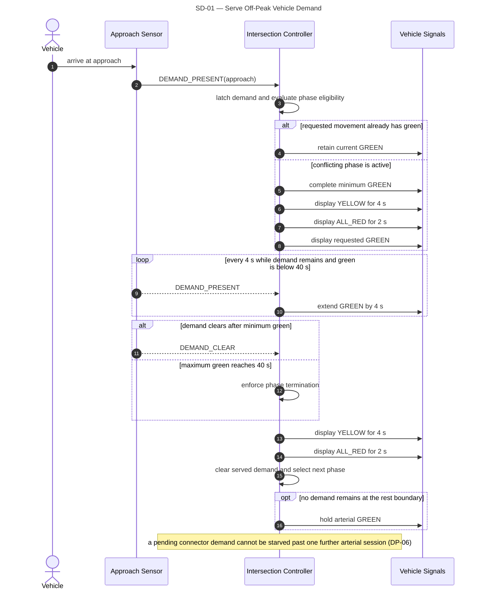
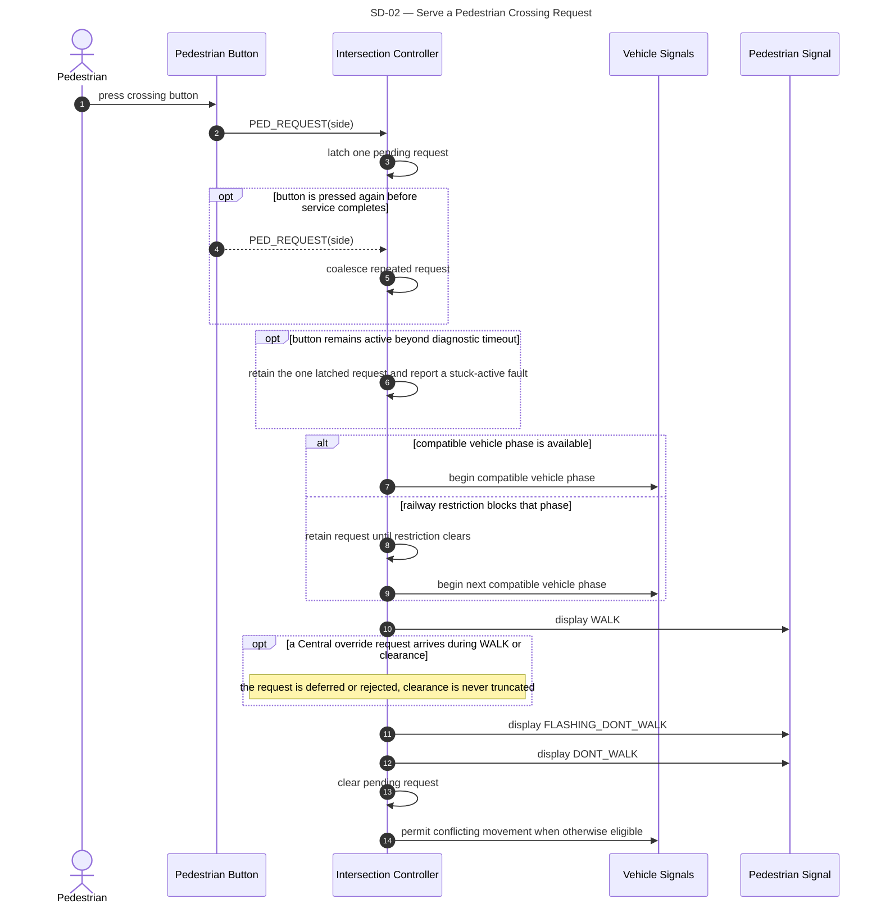
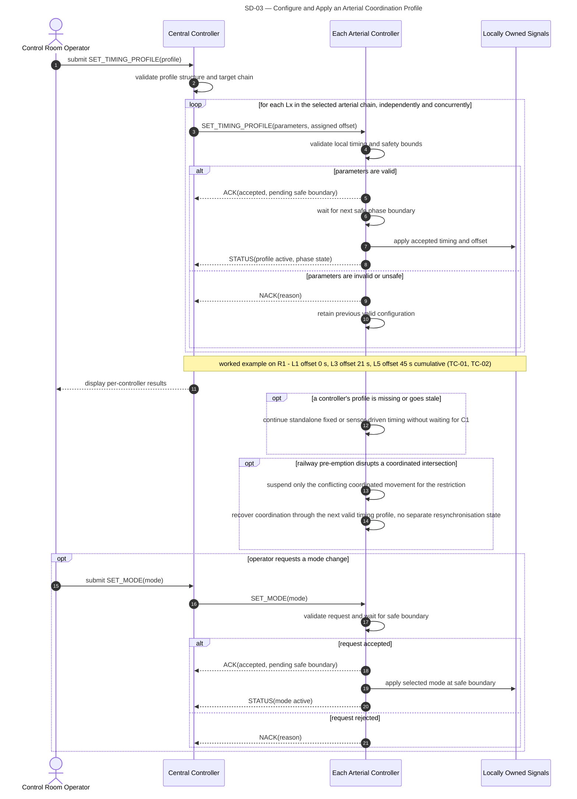
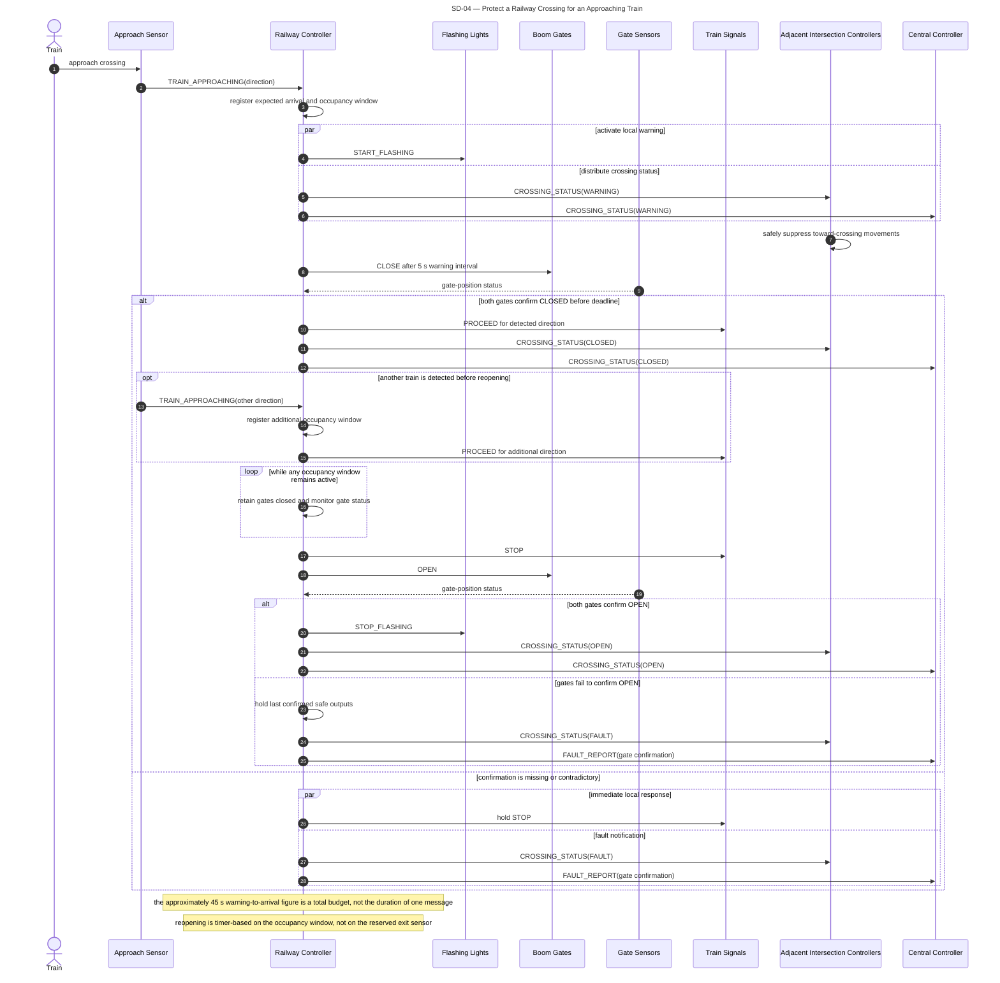
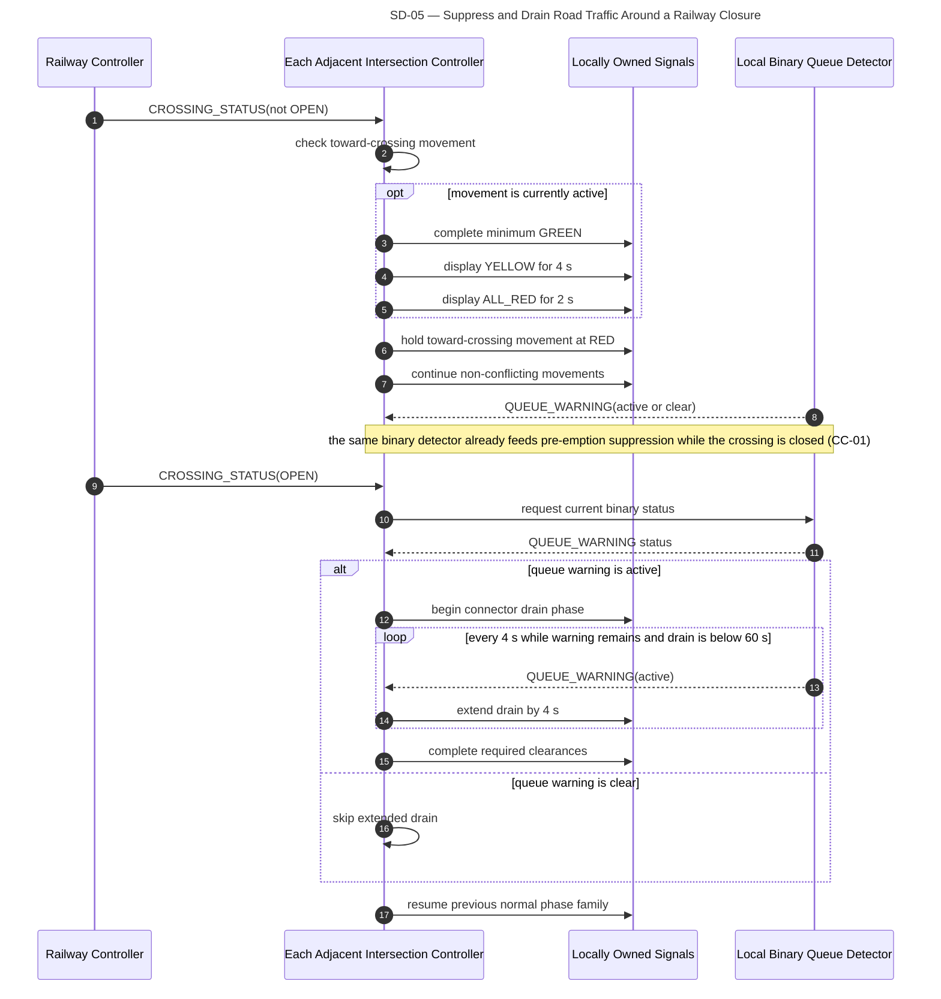
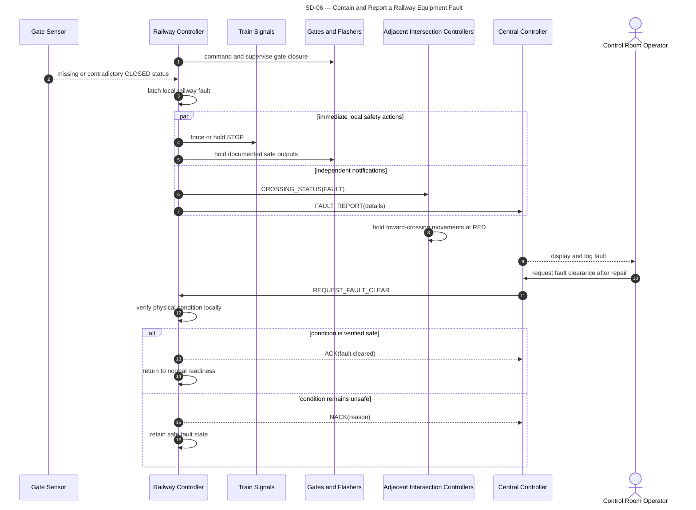
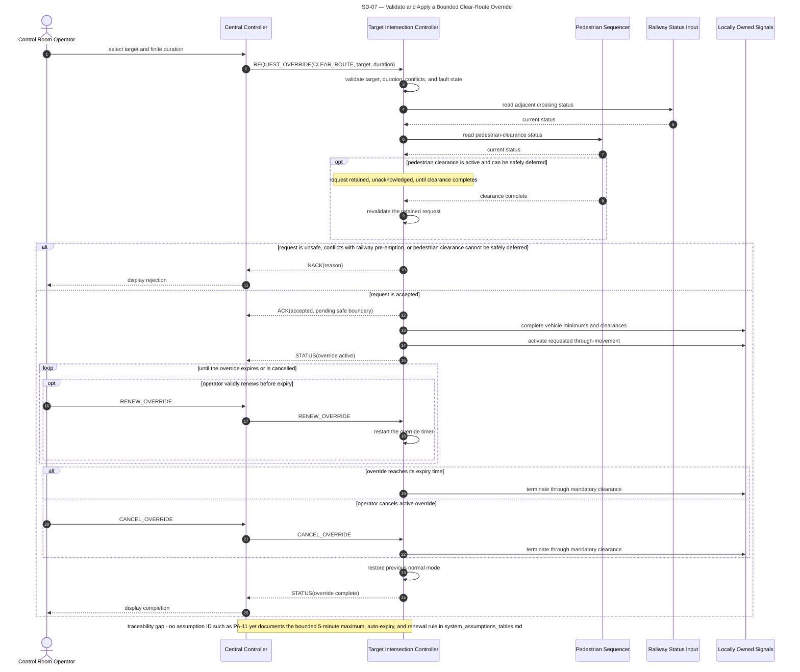
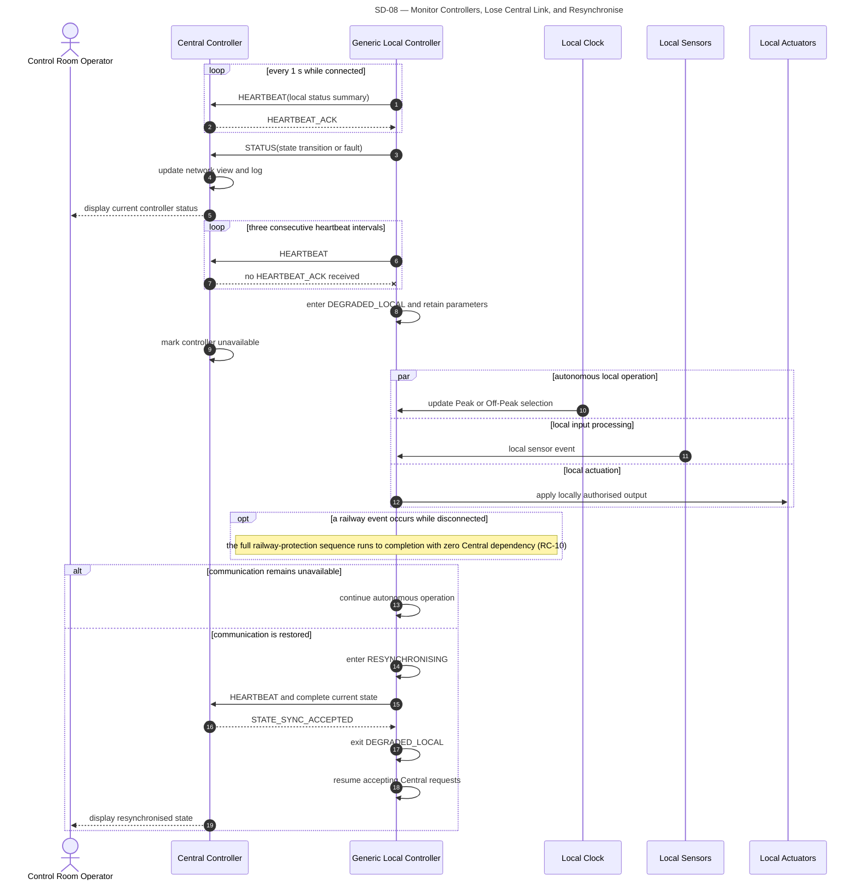

# 4.2 Behavioural Specifications

The following sequence diagrams show the chronological interactions that realise the principal use cases defined in Section 3.2. Eight diagrams cover all ten use cases because UC-03 and UC-07 share the same configuration-distribution interaction, while UC-09 and UC-10 form one continuous monitoring, disconnection, and reconnection sequence. State transitions internal to individual controllers are defined separately in Section 4.1.

## 4.2.1 SD-01 — Serve Off-Peak Vehicle Demand

This sequence shows how a generic intersection controller serves vehicle demand in `OFF_PEAK_SENSOR`. It includes demand latching, mandatory clearance intervals, bounded green extension, anti-starvation, and the arterial rest condition (`TL-01`, `TL-03`, `DP-04`, `DP-06`, `PA-04`). It realises UC-01.

## 4.2.2 SD-02 — Serve a Pedestrian Crossing Request

This sequence shows the complete lifecycle of one pedestrian request. The request is latched until a compatible phase is available, repeated presses are coalesced, and the full pedestrian clearance completes before a conflicting vehicle movement may begin (`TL-05`, `TL-06`, `PA-02`, `PA-03`). It realises UC-02 and the pedestrian-safety constraint used by UC-08.

## 4.2.3 SD-03 — Configure and Apply an Arterial Coordination Profile

This sequence shows Central distributing a validated timing profile to an arterial controller chain. Each local controller independently validates its assigned offset, returns `ACK` or `NACK`, applies an accepted profile only at a safe phase boundary, and reports its resulting state (`TC-01`–`TC-05`, `TL-04`, `PA-09`). The same interaction carries a `SET_MODE` request for UC-07. It realises UC-03 and UC-07.

## 4.2.4 SD-04 — Protect a Railway Crossing for an Approaching Train

This sequence shows the complete protection cycle at one railway crossing. The railway controller activates warnings locally, informs the adjacent intersections, requires physical gate-closed confirmation before displaying `PROCEED`, tracks overlapping train-occupancy windows, and confirms that the gates are open before ending the warning (`RC-01`–`RC-06`). It realises UC-04.

## 4.2.5 SD-05 — Suppress and Drain Road Traffic Around a Railway Closure

This sequence shows the behaviour independently executed by each of the two intersection controllers adjacent to a railway crossing. A controller safely suppresses its toward-crossing movement while the crossing is unavailable, then uses its own binary queue detector to run a drain phase in 4-second increments, capped at 60 seconds (`CC-01`–`CC-03`, `TL-01`). It realises UC-05.

## 4.2.6 SD-06 — Contain and Report a Railway Equipment Fault

This sequence shows a railway controller responding to an unverifiable gate condition. The train signal is forced to `STOP` locally while the fault is reported in parallel, ensuring that the safety response never depends on Central communication; normal operation resumes only after verified repair and an accepted fault-clear request (`RC-06`, `RC-09`, `RC-10`, `PA-09`, `PA-10`). It realises UC-06.

## 4.2.7 SD-07 — Validate and Apply a Bounded Clear-Route Override

This sequence shows a Central clear-route request being validated and executed by the target intersection controller. The local controller retains exclusive actuation authority, rejects unsafe requests, never truncates pedestrian clearance, and terminates an accepted override through the required vehicle-signal clearance sequence (`PA-09`, UC-08). It realises UC-08.

## 4.2.8 SD-08 — Monitor Controllers, Lose Central Link, and Resynchronise

This sequence combines routine Central monitoring with loss and restoration of communication. Each local controller enters `DEGRADED_LOCAL` after three missed heartbeat acknowledgements, continues its complete local control logic using retained parameters, and sends its current state to Central before accepting new commands after reconnection (`PA-07`, `PA-08`, `TC-04`, `RC-10`). It realises UC-09 and UC-10.

