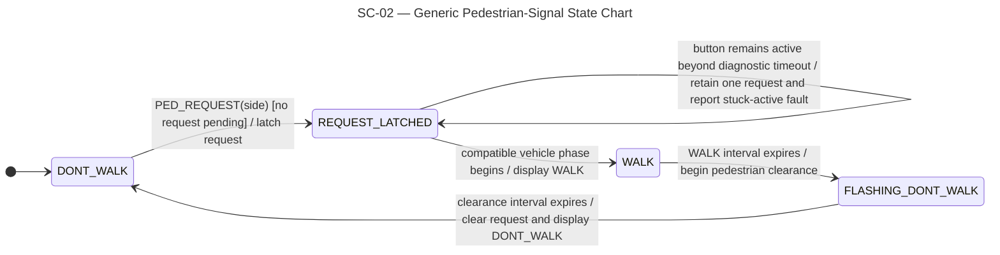
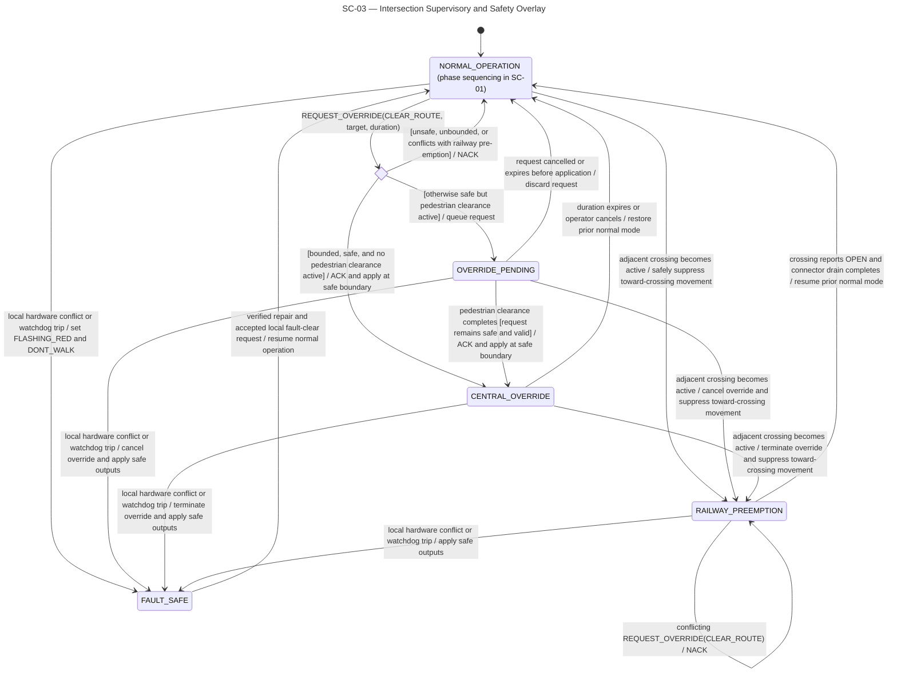
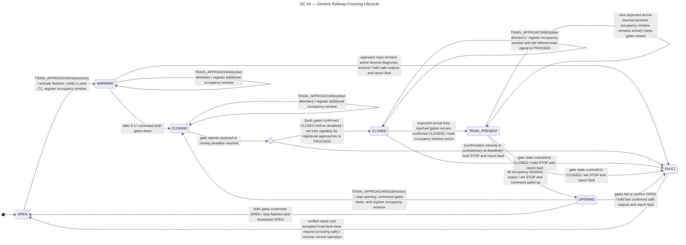

# 4.1 Intersection State Charts

The following state charts define the traffic-light, pedestrian, railway-crossing, and communication behaviour of the distributed traffic-control system. Generic charts are used because `L1–L6` share one configuration-driven intersection-controller design and `RL1–RL3` share one railway-controller design (`RC-07`). Together, the five charts cover normal operation, safety intervention, equipment faults, and loss of communication with Central.

## 4.1.1 SC-01 — Generic Intersection Vehicle-Signal Phase Sequencer

This state chart defines the normal vehicle-signal sequence used by all six intersection controllers. It shows the fixed 90-second cycle in `PEAK_FIXED`, the demand-responsive logic in `OFF_PEAK_SENSOR`, and the safe-boundary rule for changing between the two modes (`TL-01`–`TL-04`, `DP-06`). It supports UC-01 and UC-07.

```mermaid
---
title: SC-01 — Generic Intersection Vehicle-Signal Phase Sequencer
---
stateDiagram-v2
    accTitle: SC-01 Generic Intersection Vehicle-Signal Phase Sequencer
    accDescr: Normal two-phase vehicle-signal operation for intersection controllers L1 to L6 in Peak Fixed and Off-Peak Sensor modes.
    direction LR

    state initial_mode <<choice>>
    [*] --> initial_mode : initialise from local schedule and last validated configuration
    initial_mode --> PEAK_FIXED : [Peak schedule selected]
    initial_mode --> OFF_PEAK_SENSOR : [Off-Peak schedule selected]

    state "PEAK_FIXED" as PEAK_FIXED {
        state "ARTERIAL_GREEN" as P_ARTERIAL_GREEN
        state "ARTERIAL_YELLOW" as P_ARTERIAL_YELLOW
        state "ALL_RED_A_TO_B" as P_ALL_RED_A_TO_B
        state "CONNECTOR_GREEN" as P_CONNECTOR_GREEN
        state "CONNECTOR_YELLOW" as P_CONNECTOR_YELLOW
        state "ALL_RED_B_TO_A" as P_ALL_RED_B_TO_A
        [*] --> P_ARTERIAL_GREEN
        P_ARTERIAL_GREEN --> P_ARTERIAL_YELLOW : after 48 s / begin arterial clearance
        P_ARTERIAL_YELLOW --> P_ALL_RED_A_TO_B : after 4 s / set all approaches red
        P_ALL_RED_A_TO_B --> P_CONNECTOR_GREEN : after 2 s / release connector movement
        P_CONNECTOR_GREEN --> P_CONNECTOR_YELLOW : after 30 s / begin connector clearance
        P_CONNECTOR_YELLOW --> P_ALL_RED_B_TO_A : after 4 s / set all approaches red
        P_ALL_RED_B_TO_A --> P_ARTERIAL_GREEN : after 2 s / release arterial movement
    }

    state "OFF_PEAK_SENSOR" as OFF_PEAK_SENSOR {
        state "ARTERIAL_GREEN" as O_ARTERIAL_GREEN
        state "ARTERIAL_YELLOW" as O_ARTERIAL_YELLOW
        state "ALL_RED_A_TO_B" as O_ALL_RED_A_TO_B
        state "CONNECTOR_GREEN" as O_CONNECTOR_GREEN
        state "CONNECTOR_YELLOW" as O_CONNECTOR_YELLOW
        state "ALL_RED_B_TO_A" as O_ALL_RED_B_TO_A
        [*] --> O_ARTERIAL_GREEN
        O_ARTERIAL_GREEN --> O_ARTERIAL_GREEN : every 4 s [arterial demand persists and green < 40 s] / extend green by 4 s
        O_ARTERIAL_GREEN --> O_ARTERIAL_YELLOW : [green >= 8 s and connector demand pending and (no arterial demand or green = 40 s)] / begin arterial clearance
        O_ARTERIAL_YELLOW --> O_ALL_RED_A_TO_B : after 4 s / set all approaches red
        O_ALL_RED_A_TO_B --> O_CONNECTOR_GREEN : after 2 s / release connector movement
        O_CONNECTOR_GREEN --> O_CONNECTOR_GREEN : every 4 s [connector demand persists and green < 40 s] / extend green by 4 s
        O_CONNECTOR_GREEN --> O_CONNECTOR_YELLOW : [green >= 8 s and (no connector demand or green = 40 s)] / begin connector clearance
        O_CONNECTOR_YELLOW --> O_ALL_RED_B_TO_A : after 4 s / set all approaches red
        O_ALL_RED_B_TO_A --> O_ARTERIAL_GREEN : after 2 s / release arterial movement; rest here if no demand exists
    }

    PEAK_FIXED --> OFF_PEAK_SENSOR : pending Off-Peak selection [current phase and required clearances complete] / apply mode change
    OFF_PEAK_SENSOR --> PEAK_FIXED : pending Peak selection [current phase and required clearances complete] / apply mode change
```

## 4.1.2 SC-02 — Generic Pedestrian-Signal State Chart

This state chart defines the lifecycle of a pedestrian request at one crossing side. A button press is latched until a compatible vehicle phase becomes available, after which the complete `WALK → FLASHING_DONT_WALK → DONT_WALK` sequence runs without unsafe interruption (`TL-05`, `TL-06`, `PA-02`, `PA-03`). It supports UC-02 and the pedestrian-safety constraint in UC-08.

## 4.1.3 SC-03 — Intersection Supervisory and Safety Overlay

This state chart defines which supervisory condition controls an intersection above the normal phase sequencer in SC-01. Local fault protection has the highest authority, followed by railway pre-emption, a validated Central override, and normal Peak or Off-Peak operation. Every request is checked locally, and no Central command may bypass railway or pedestrian safety constraints (`PA-09`, `PA-10`). It supports UC-05–UC-08.

## 4.1.4 SC-04 — Generic Railway-Crossing Lifecycle

This state chart defines the railway-crossing sequence used by `RL1–RL3`, from approach detection and warning activation through gate closure, train occupancy, and reopening. A train signal may show `PROCEED` only after gate closure is physically confirmed; missing or contradictory confirmation produces an immediate local safe-side fault response (`RC-03`–`RC-07`, `RC-10`, `RC-11`). It supports UC-04 and UC-06.

## 4.1.5 SC-05 — Central Connectivity and Local Autonomy

This state chart defines how a local intersection or railway controller responds to changes in its connection with Central. After three missed heartbeats, the controller continues autonomously with its last validated parameters; after reconnection, it reports its complete current state before accepting new Central commands (`PA-07`, `PA-08`). It supports UC-09 and UC-10.

```mermaid
---
title: SC-05 — Central Connectivity and Local Autonomy
---
stateDiagram-v2
    accTitle: SC-05 Central Connectivity and Local Autonomy
    accDescr: Connected, autonomous degraded, and resynchronising communication states for a generic local controller.
    direction LR
    [*] --> CENTRAL_CONNECTED
    CENTRAL_CONNECTED --> DEGRADED_LOCAL : three consecutive 1 s heartbeats missed / retain parameters; disable Central coordination and overrides
    DEGRADED_LOCAL --> DEGRADED_LOCAL : local schedule changes / select Peak or Off-Peak mode locally
    DEGRADED_LOCAL --> RESYNCHRONISING : heartbeat link restored / send complete current state to C1
    RESYNCHRONISING --> CENTRAL_CONNECTED : C1 accepts complete state exchange / resume Central command handling
    RESYNCHRONISING --> DEGRADED_LOCAL : heartbeat lost before exchange completes / continue autonomous operation
```

