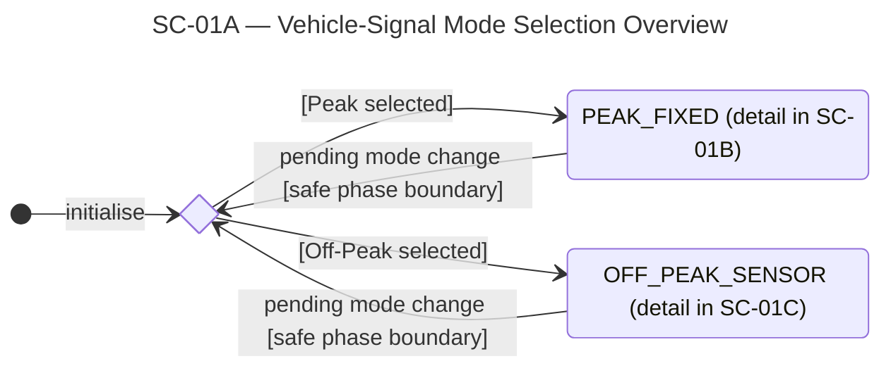
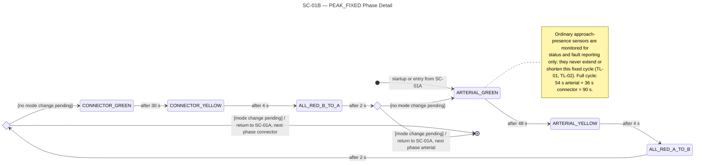
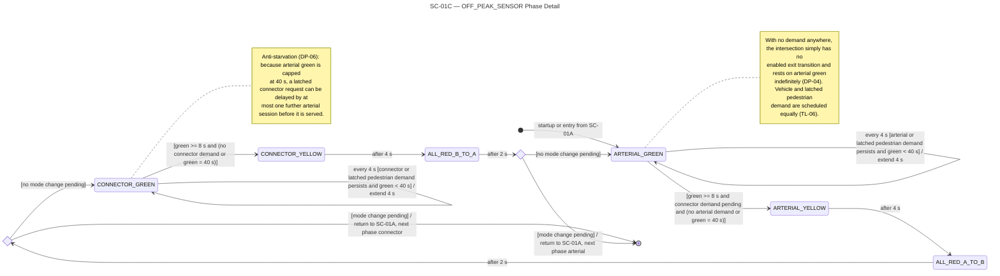
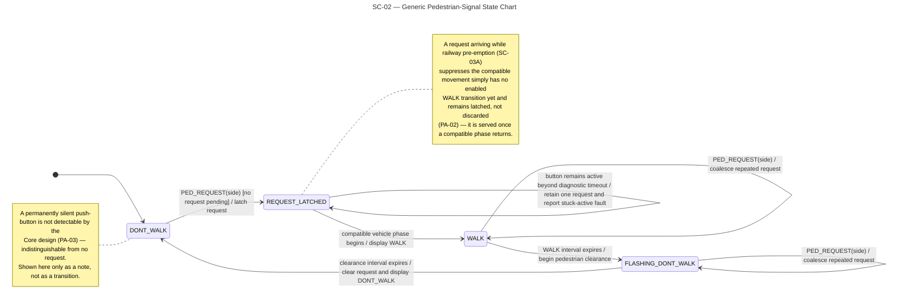
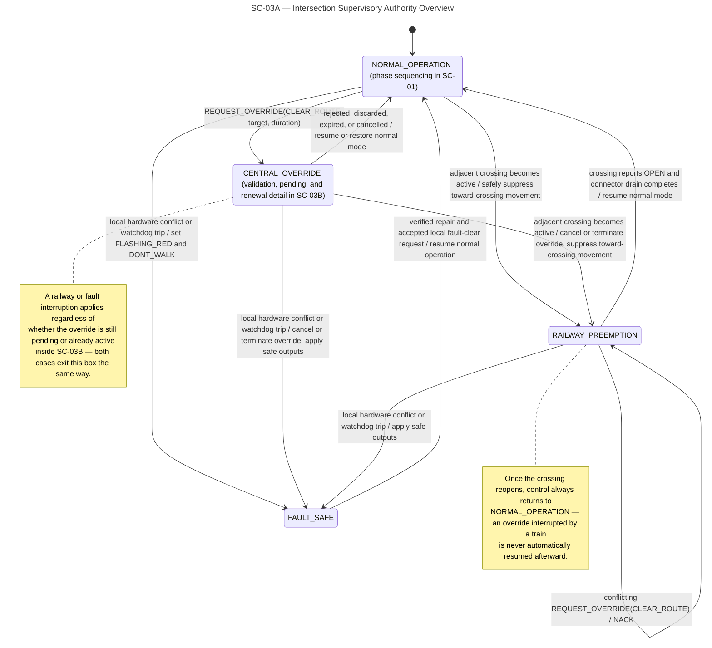
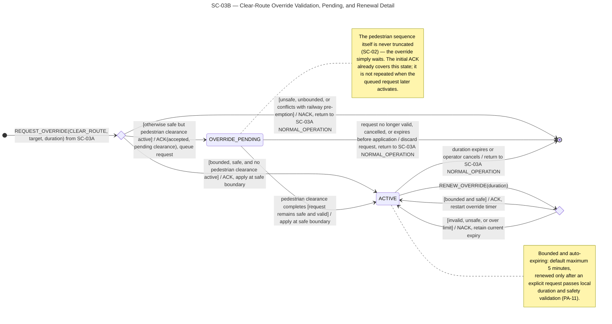
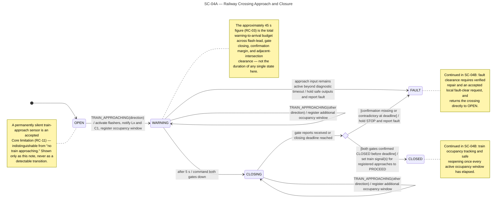
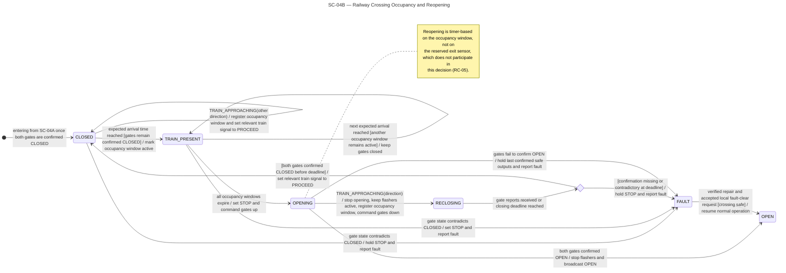
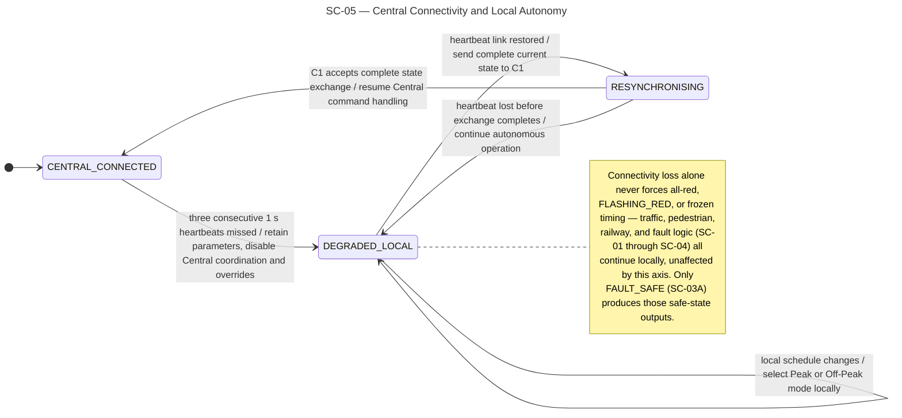

# 4.1 Intersection State Charts

The following state charts define the traffic-light, pedestrian, railway-crossing, and communication behaviour of the distributed traffic-control system. Generic charts are used because `L1–L6` share one configuration-driven intersection-controller design and `RL1–RL3` share one railway-controller design (`RC-07`). Together they cover normal operation, safety intervention, equipment faults, and loss of communication with Central.

Where a single state chart would otherwise be too dense to stay legible on an A4 page, it is split into lettered sub-diagrams (`SC-01A`/`B`/`C`, `SC-03A`/`B`, `SC-04A`/`B`) that hand off to each other at a named boundary state, in the same way a "master" diagram references a "detail" diagram for one of its composite states. Each sub-diagram says explicitly where control comes from and where it goes next.

## 4.1.1 SC-01A — Vehicle-Signal Mode Selection Overview

This overview shows how a generic intersection controller chooses between `PEAK_FIXED` and `OFF_PEAK_SENSOR`, without repeating either mode's phase-by-phase detail. A pending mode change — whether from the local clock or a Central `SET_MODE` — is only ever applied once the current phase and its clearances have completed (`TL-04`). See `SC-01B` for the `PEAK_FIXED` cycle and `SC-01C` for the `OFF_PEAK_SENSOR` cycle. It supports UC-01 and UC-07.

## 4.1.2 SC-01B — PEAK_FIXED Phase Detail

This state chart details the fixed 90-second two-phase cycle used while `PEAK_FIXED` is active. Ordinary approach sensors are monitored for status and fault reporting but do not alter the configured phase durations (`TL-01`, `TL-02`).

## 4.1.3 SC-01C — OFF_PEAK_SENSOR Phase Detail

This state chart details the demand-responsive cycle used while `OFF_PEAK_SENSOR` is active. Each green interval is bounded between 8 and 40 seconds and extends only while demand persists; the arterial cap ensures that a pending connector request is served after no more than one further arterial service opportunity (`TL-03`, `DP-04`, `DP-06`).

## 4.1.4 SC-02 — Generic Pedestrian-Signal State Chart

This state chart defines the lifecycle of a pedestrian request at one crossing side. A button press is latched until a compatible vehicle phase becomes available, after which the complete `WALK → FLASHING_DONT_WALK → DONT_WALK` sequence runs without unsafe interruption (`TL-05`, `TL-06`, `PA-02`, `PA-03`). It supports UC-02 and the pedestrian-safety constraint in UC-08.

## 4.1.5 SC-03A — Intersection Supervisory Authority Overview

This state chart defines which supervisory condition controls an intersection above the normal phase sequencer in `SC-01`. Local fault protection has the highest authority, followed by railway pre-emption, a validated Central override, and normal Peak or Off-Peak operation. Every request is checked locally, and no Central command may bypass railway or pedestrian safety constraints (`PA-09`, `PA-10`). The override's own validation, queueing, and active/renewal behaviour is detailed separately in `SC-03B`. It supports UC-05–UC-08.

## 4.1.6 SC-03B — Clear-Route Override Validation, Pending, and Renewal Detail

This state chart details the `CENTRAL_OVERRIDE` state introduced in SC-03A. It shows local validation, safe deferral behind an active pedestrian clearance, bounded activation, renewal, cancellation, and automatic expiry. A safely deferred request is acknowledged promptly, but it is activated only after pedestrian clearance completes and the request remains valid (`PA-09`, `PA-11`).

## 4.1.7 SC-04A — Railway Crossing Approach and Closure

This state chart defines the first part of the railway-crossing lifecycle shared by `RL1–RL3`. It covers train-approach detection, the flash-only warning interval, commanded gate closure, and sensor-confirmed closure before any train signal may display `PROCEED`; the lifecycle continues in SC-04B after the gates are confirmed `CLOSED` (`RC-03`, `RC-06`, `RC-11`).

## 4.1.8 SC-04B — Railway Crossing Occupancy and Reopening

This state chart defines the second part of the railway-crossing lifecycle, entered from SC-04A after gate closure is confirmed. The gates remain closed while any registered occupancy window is active, including windows created by additional trains from either direction, and all train signals return to `STOP` before the gates begin opening (`RC-04`, `RC-05`).

## 4.1.9 SC-05 — Central Connectivity and Local Autonomy

This state chart defines how a local intersection or railway controller responds to changes in its connection with Central. After three missed heartbeats, the controller continues autonomously with its last validated parameters; after reconnection, it reports its complete current state before accepting new Central commands (`PA-07`, `PA-08`). It supports UC-09 and UC-10.

