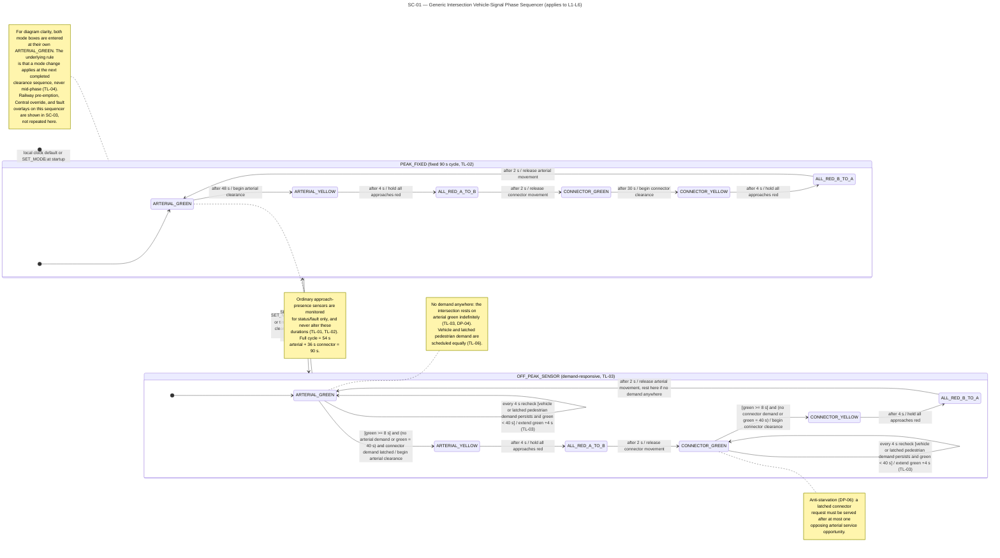
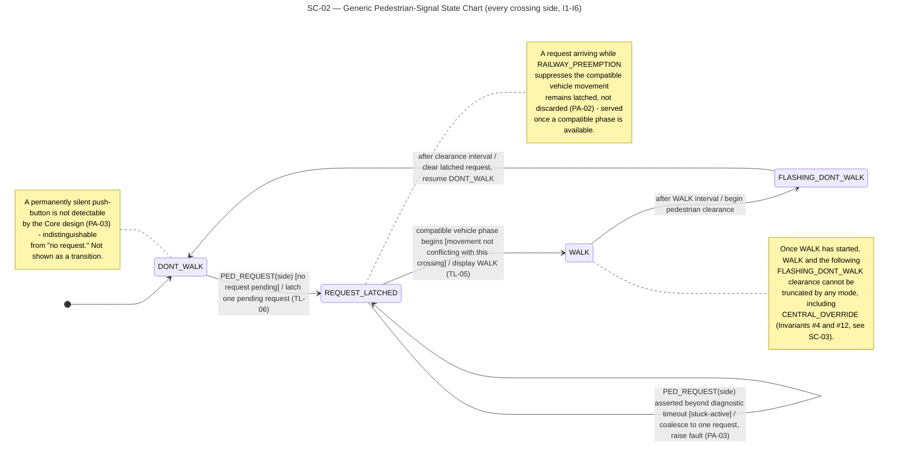
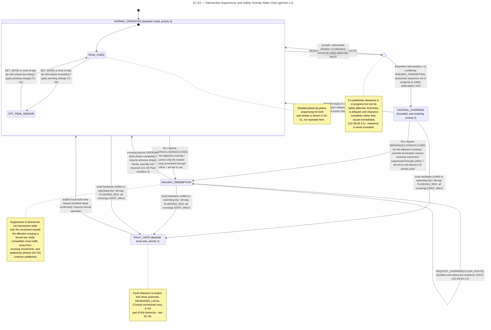
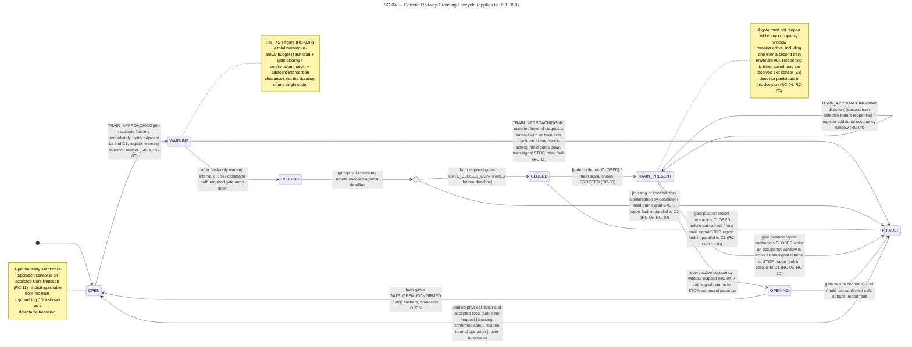
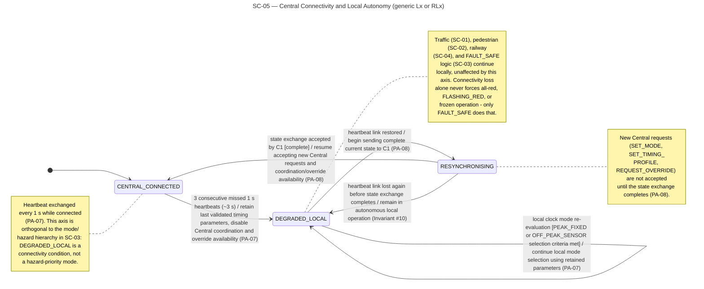

# Section 4.1 — Intersection State Charts

Companion to `PROJECT_SPECIFICATION.md`, `system_assumptions_tables.md`, and `scenarios_and_written_specifications.md`. Produced for the Initial Design Report requirement: *"Provide State Charts describing the lights' behavior at each intersection. You should include relevant State Chart(s) alongside your use cases."*

All charts use Mermaid `stateDiagram-v2` and render independently in the Mermaid Live Editor or any Markdown viewer with Mermaid support (e.g. GitHub, VS Code preview).

---

## 1. Coverage decision

Five diagrams are sufficient, and one generic `Lx` chart validly represents `L1–L6`, for two concrete reasons drawn from the spec rather than assumed:

- **Section 3 (Goal 5)** and **Section 8.2** require every `Lx` to run the *same* generic, config-driven controller binary — no `Lx`-specific behavioural branch exists anywhere in the spec.
- **Section 5's topology** puts every one of `I1–I6` on exactly one connector road that crosses the railway exactly once (`I1/I2↔RC1`, `I3/I4↔RC2`, `I5/I6↔RC3`). So *all six* intersections receive railway status and are subject to `RAILWAY_PREEMPTION` — there is no "railway-free" intersection that would need a different SC-03 shape.

Likewise, **RC-07** states `RL1–RL3` run *identical* logic, so one SC-04 chart covers all three, and **PA-07/PA-08** describe the connectivity axis generically for "the local controller," so one SC-05 chart covers both controller types. SC-01+SC-02+SC-03 together fully characterise any `Lx`; SC-04 fully characterises any `RLx`; SC-05 covers the connectivity axis shared by both — nothing required by the brief falls outside this set.

---

## 2. Assumptions or contradictions found

No hard contradictions. Three genuine gaps in use-case *narrative* coverage, none requiring an invented resolution because each is already dictated by an existing, decided rule — the transition is drawn and cited to what dictates it:

- **UC-08 has no dedicated ID in `system_assumptions_tables.md`.** Its own Business Rules (BR-4, BR-5) already cite `PROJECT_SPECIFICATION.md` Sections 8/18/22 directly instead of an assumption ID — this is a pre-existing, already-accepted pattern, not something new. SC-03 follows the same citation style for override-specific bullets.
- **`CENTRAL_OVERRIDE → RAILWAY_PREEMPTION`** (a train approach interrupting an active override) has no use-case alternative flow walking through it — UC-08's only interruption case (Alt 6.1) is a *fault*, not a railway event. The transition is nonetheless required by **Section 22's priority axis** (`RAILWAY_PREEMPTION` ranks above `CENTRAL_OVERRIDE`), and UC-08's own **Post-condition #2** ("returned to its prior normal mode unless a higher-priority state remains active") confirms the override does not resume afterward — that exact wording is used as the transition's action.
- **`RESYNCHRONISING → DEGRADED_LOCAL`** (link drops again before the state exchange finishes) isn't spelled out step-by-step in UC-10, but follows necessarily from **Invariant #10** ("every local controller must be able to run its full safety-relevant logic with `C1` unreachable" — applies at every instant, including mid-resync).

---

## 3. SC-01 — Generic Intersection Vehicle-Signal Phase Sequencer

*What this shows:* the six-state vehicle-light cycle every intersection runs (arterial green → yellow → all-red → connector green → yellow → all-red → repeat), drawn twice — once with `PEAK_FIXED`'s fixed 90 s timings, once with `OFF_PEAK_SENSOR`'s demand-driven extension logic — with the mode-switch boundary between the two boxes.

---

## 4. SC-02 — Generic Pedestrian-Signal State Chart

*What this shows:* the lifecycle of one pedestrian crossing side, from an idle `DONT_WALK`, through a latched request that waits for a compatible vehicle phase, to `WALK` and its uninterruptible clearance sequence back to `DONT_WALK` — including how repeated or stuck button presses are handled.

---

## 5. SC-03 — Intersection Supervisory and Safety Overlay State Chart

*What this shows:* the authority layer that sits above SC-01's phase cycle — which of `NORMAL_OPERATION`, `CENTRAL_OVERRIDE`, `RAILWAY_PREEMPTION`, or `FAULT_SAFE` is in charge at any moment, and the fixed priority order between them (fault beats railway, railway beats override, override beats normal).

---

## 6. SC-04 — Generic Railway-Crossing Lifecycle

*What this shows:* the full life of one railway crossing — from `OPEN`, through the train-approach warning, gate closing and sensor-confirmed closure, the train's occupancy window(s), reopening, and back to `OPEN` — with every unconfirmed or contradictory condition routing to a safe `FAULT` state.

---

## 7. SC-05 — Central Connectivity and Local Autonomy

*What this shows:* the heartbeat-driven link state between a local controller and Central — normal `CENTRAL_CONNECTED` operation, dropping into autonomous `DEGRADED_LOCAL` after three missed heartbeats, and `RESYNCHRONISING` on reconnection — kept deliberately separate from the hazard hierarchy in SC-03.

---

## 8. Use-case-to-state-chart mapping

- SC-01 → UC-01 (Serve Vehicle Demand), UC-07 (Configure Traffic Operating Parameters)
- SC-02 → UC-02 (Serve Pedestrian Crossing Request), UC-08 (Apply a Bounded Clear-Route Override)
- SC-03 → UC-05 (Manage Road Traffic During and After a Railway Closure), UC-06 (Respond to a Railway Equipment Fault), UC-07 (Configure Traffic Operating Parameters), UC-08 (Apply a Bounded Clear-Route Override)
- SC-04 → UC-04 (Protect a Railway Crossing for an Approaching Train), UC-06 (Respond to a Railway Equipment Fault)
- SC-05 → UC-09 (Monitor Network Status and Faults), UC-10 (Continue Local Operation During Central Link Loss)

The repository's current numbering (`UC-01`–`UC-10` in `scenarios_and_written_specifications.md`) already matches this mapping exactly — no renumbering discrepancy to report.

---

## 9. Final consistency check

1. Every state/transition traced above to a specific spec section or assumption ID — no invented states, timings, signals, sensors, or commands. ✔
2. Yellow + all-red clearance preserved in SC-01's core cycle; SC-03 explicitly routes `RAILWAY_PREEMPTION` and override termination "through yellow + all-red to red," never a direct green→red jump. ✔
3. `C1` never appears as an actuator anywhere — only as the source of `SET_MODE`/`SET_TIMING_PROFILE`/`REQUEST_OVERRIDE` events consumed by `Lx`'s own state machine, and as a passive report recipient in SC-04/SC-05. ✔
4. SC-04 has zero transition guarded on `C1` reachability; SC-05 shows railway/traffic/pedestrian logic (SC-01/02/04) continuing unaffected through `DEGRADED_LOCAL`. ✔
5. SC-04's `TRAIN_PRESENT` self-loop accumulates occupancy windows; `OPENING` is only reached when "every active occupancy window elapsed." ✔
6. SC-04's `CLOSED → TRAIN_PRESENT` (where `PROCEED` is issued) is guarded strictly on `gate confirmed CLOSED`; the `gate_confirm` choice routes anything else to `FAULT`. ✔
7. SC-02's `WALK → FLASHING_DONT_WALK → DONT_WALK` has no incoming interrupt edges; SC-03's `override_choice` explicitly defers/NACKs rather than truncating. ✔
8. SC-03 contains no reference to `DEGRADED_LOCAL`; it lives only in SC-05, with an explicit note marking the two hierarchies as orthogonal. ✔
9. No diagram models the advance/queue sensor `[Q]` as anything other than a binary trigger — SC-01/SC-05 don't reference it at all, keeping it out of scope for these five charts. ✔
10. Each diagram is a single flat or lightly-nested chart (one composite level, ≤2 composites per diagram) with concise event/guard/action labels, sized for A4 legibility. ✔
