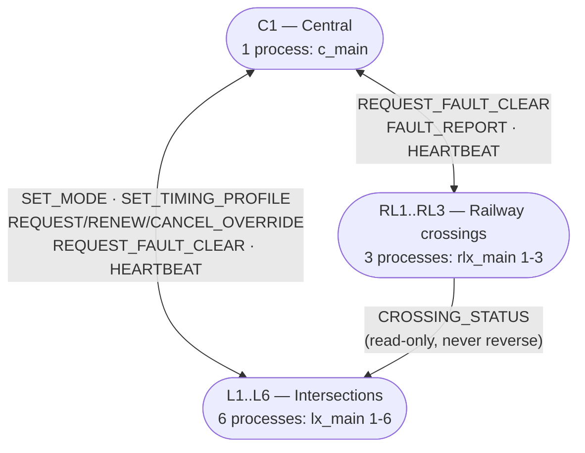
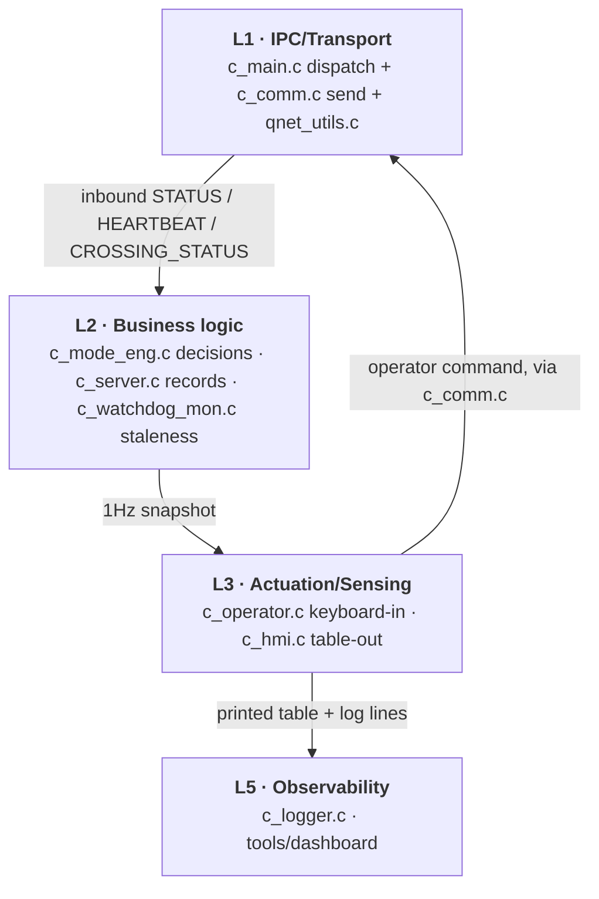
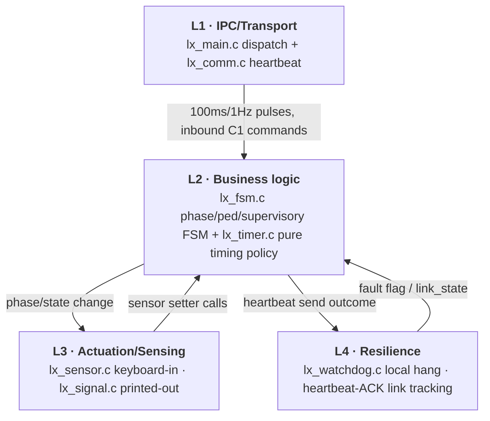
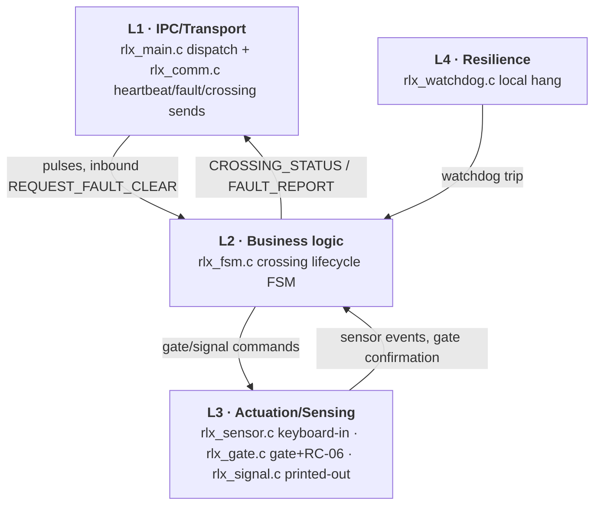

# Architecture Overview — System → Layer → Component → Feature

Entry point for `docs/flow-diagrams/`. One system diagram, then one internal
diagram per node type (Central / Intersection / Railway — they're not the
same shape), then an index of per-feature flow diagrams.

**Type key used everywhere in this doc set:** `UC-xx` = one of the 10
formally-specified use cases in `usecase.md` (has an official actor/business-rule
ID). `F-xx` = an infrastructure/cross-cutting mechanism found by tracing the
codebase — supports the UCs but isn't one of the 10 itself.

Not duplicated here: `SYSTEM_DIAGRAMS.md` (physical road/rail topology),
`SEQUENCE_DIAGRAMS.md` (message-level behavior, SD-01..08), `STATE_CHARTS.md`
(state machines, SC-01..05), `app/shared/README.md` (IPC design rationale).

---

## Diagram 1 — System: processes and Qnet traffic

3 source trees (`app/central`, `app/intersection`, `app/railway`) → 3
binaries → 10 processes; `argv[1]` picks identity (`lx_main 3` → `L3`, see
[`F-01`](F-01-node-startup-and-self-identification.md)). `app/shared` isn't
a 4th binary — it's the header/impl pair every process compiles against.
Every arrow is a Qnet `MsgSend`/`MsgReceive`/`MsgReply` round trip; no shared
memory, no sockets.

---

## The 5 layers (reference)

| # | Layer | Role |
|---|---|---|
| 1 | IPC / Transport | own the Qnet channel, threads, wire envelope |
| 2 | Business logic / FSM | pure state + decisions — no I/O of its own |
| 3 | Actuation & Sensing | turn decisions into output / input into setter calls |
| 4 | Resilience | detect local hangs + Central-link loss, report in — never decide |
| 5 | Observability | persist/expose what happened — never feeds back into control |

**Not every node has all 5** — that's the point of the three diagrams below.
Central has no Layer 4 of its own (it *watches* the other 9 controllers via
Layer 2's `c_watchdog_mon.c`, but nothing watches Central's own thread
health). Railway has no mode/schedule concept, so nothing in it resembles
`lx_fsm`'s DP-02 local-clock fallback.

---

## Diagram 2 — Inside Central (`c_main`)

## Diagram 3 — Inside an Intersection (`lx_main`)

## Diagram 4 — Inside a Railway Crossing (`rlx_main`)

All three sit on the same `app/shared` foundation (`sys_types.h`, `ipc_msg.h`,
`qnet_utils.c`) — that's Diagram 1's Qnet arrows, not repeated here.

---

## Feature index

### Use cases (`usecase.md` UC-01..UC-10)

| # | Use case | Flow doc |
|---|---|---|
| UC-01 | Serve Vehicle Demand | [→](UC-01-serve-vehicle-demand.md) |
| UC-02 | Serve Pedestrian Crossing Request | [→](UC-02-serve-pedestrian-crossing-request.md) |
| UC-03 | Coordinate Arterial Traffic Progression | [→](UC-03-coordinate-arterial-traffic-progression.md) |
| UC-04 | Protect a Railway Crossing | [→](UC-04-protect-railway-crossing.md) |
| UC-05 | Manage Traffic During/After Railway Closure | [→](UC-05-manage-traffic-during-railway-closure.md) |
| UC-06 | Respond to a Railway Equipment Fault | [→](UC-06-respond-to-railway-equipment-fault.md) |
| UC-07 | Configure Traffic Operating Parameters (SET_MODE) | [→](UC-07-configure-mode.md) |
| UC-08 | Apply a Bounded Clear-Route Override | [→](UC-08-clear-route-override.md) |
| UC-09 | Monitor Network Status and Faults | [→](UC-09-monitor-network-status.md) |
| UC-10 | Continue Local Operation During Central Link Loss | [→](UC-10-continue-local-operation-during-link-loss.md) |

### Infrastructure features (found by tracing the codebase, not in `usecase.md`)

*2 of the 18 found are covered elsewhere, not duplicated here: the demo
peak-hour override (`'d'`/`'a'` keys) is inside `UC-07`'s doc; the IPC
wire-format design rationale is in `app/shared/README.md`.*

| # | Feature | Flow doc |
|---|---|---|
| F-01 | Node Startup & Self-Identification | [→](F-01-node-startup-and-self-identification.md) |
| F-02 | Cross-Node Qnet Name Resolution (`TRAFFIC_NODE_MAP`) | [→](F-02-cross-node-name-resolution.md) |
| F-03 | Qnet Transport Internals (queue + timer/pulse dispatch) | [→](F-03-qnet-transport-internals.md) |
| F-04 | PA-10 Local Watchdog Self-Detection | [→](F-04-local-watchdog-self-detection.md) |
| F-05 | Operator Console Dispatch & `console_io_lock` | [→](F-05-operator-console-dispatch.md) |
| F-06 | Persistent Event Logging | [→](F-06-persistent-event-logging.md) |
| F-07 | Live Dashboard | [→](F-07-live-dashboard.md) |
| F-08 | Scripted Test-Automation Tooling | [→](F-08-test-automation-tooling.md) |
| F-09 | Build & Host-Syntax-Check Tooling | [→](F-09-build-and-syntax-check-tooling.md) |
| F-10 | Demo Fault-Injection: Railway Gate | [→](F-10-railway-gate-fault-injection.md) |
| F-11 | Green-Wave Phase-Realignment Math | [→](F-11-green-wave-offset-math.md) |
| F-12 | Fault-Safe Supervisory Override (SC-03A) | [→](F-12-fault-safe-supervisory-override.md) |

---

Every linked file cites real `file:function` locations grounded in the
current source — treat as a map, re-check against code if it's moved on.
