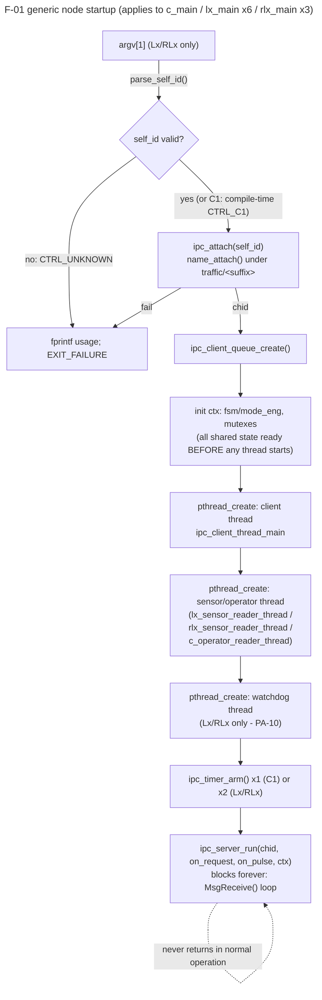

# F-01 — Node Startup, Self-Identification & Thread Bring-up: Function-Level Flow

## What this feature does

This is not one of `usecase.md`'s 10 formally-specified use cases — it is
the infrastructure every one of them silently depends on. Before any
`MsgSend()`/`MsgReceive()` round trip, an FSM tick, or a keypress can be
handled, each of the 10 processes (`c_main` x1, `lx_main` x6, `rlx_main`
x3) has to independently: figure out which physical location it *is* (Lx/
RLx only — C1 has no `argv`), register its own name on Qnet so peers can
find it, spawn its worker threads in the right shared-state order, arm its
recurring timers, and then block forever inside `ipc_server_run()`. This
document traces that one-time bring-up sequence, generically once and then
per-binary where the three `main()` functions actually diverge.

## Entry point

Each of the three binaries is a completely separate OS process with its
own `main()` — there is no shared "framework" `main()` that dispatches to
per-role code:

- `app/central/src/c_main.c`'s `main(void)` (around line 235) — **no**
  `argv` parsing; C1's identity is the compile-time constant `CTRL_C1`
  (`sys_types.h` line 18), since exactly one process is ever "the" Central
  controller.
- `app/intersection/src/lx_main.c`'s `main(int argc, char *argv[])` (around
  line 119) — identity comes from `argv[1]` via `parse_self_id()` (around
  line 105).
- `app/railway/src/rlx_main.c`'s `main(int argc, char *argv[])` (around
  line 91) — identity comes from `argv[1]` via its own `parse_self_id()`
  (around line 77).

## Function call chain

The generic shape (steps 1-7) is identical across all three binaries;
divergences are called out inline and summarised in the table after step 7.

1. **Self-identification (Lx/RLx only).** `lx_main.c`'s `parse_self_id()`
   (lines 105-117) and `rlx_main.c`'s `parse_self_id()` (lines 77-89) are
   near-identical but **not byte-identical** — same three-line shape
   (`argc < 2` check, `atoi(argv[1])`, range check), different constants:

   ```c
   /* lx_main.c, lines 105-117 */
   if (argc < 2)            return CTRL_UNKNOWN;
   n = atoi(argv[1]);
   if (n < 1 || n > 6)      return CTRL_UNKNOWN;
   return (controller_id_t)(CTRL_L1 + (n - 1));

   /* rlx_main.c, lines 77-89 */
   if (argc < 2)            return CTRL_UNKNOWN;
   n = atoi(argv[1]);
   if (n < 1 || n > 3)      return CTRL_UNKNOWN;
   return (controller_id_t)(CTRL_RL1 + (n - 1));
   ```

   Lx accepts `1-6` and offsets from `CTRL_L1`; RLx accepts `1-3` and
   offsets from `CTRL_RL1` — the only differences are the upper bound (`6`
   vs `3`) and the base enum constant. Both silently treat a non-numeric
   `argv[1]` the same way `atoi()` does (returns `0`, which then fails the
   lower-bound check and returns `CTRL_UNKNOWN` — there is no `strtol()`/
   `errno` validation, so `lx_main abc` is rejected the same way as
   `lx_main 0` or `lx_main 99`, but a garbage string like `lx_main 3abc`
   is silently accepted as `3` since `atoi()` stops at the first
   non-digit). Callers check the result immediately (`lx_main.c` line
   131, `rlx_main.c` line 105): `self_id == CTRL_UNKNOWN` prints a
   `usage:` line to `stderr` and exits `EXIT_FAILURE` before anything else
   happens — no channel, no threads, no timers.

2. **`ipc_attach()`** — `app/shared/src/qnet_utils.c` lines 204-238, called
   from `c_main.c` line 248 (`ipc_attach(CTRL_C1)`), `lx_main.c` line 138
   (`ipc_attach(self_id)`), `rlx_main.c` line 112 (`ipc_attach(self_id)`).
   Under the hood: `build_path()` (line 34) turns the `controller_id_t`
   into `"traffic/<suffix>"` (e.g. `"traffic/l3"`) via the
   `ATTACH_SUFFIX[]` table (lines 13-24), then calls
   `name_attach(NULL, path, NAME_FLAG_ATTACH_GLOBAL)` (line 230), falling
   back to `name_attach(NULL, path, 0)` (line 232) if the global name
   server isn't running. This is the one-time act of claiming a Qnet
   channel under a well-known name — every other process that later needs
   to reach this one calls `name_open()` on that exact string. On success
   the function returns `attach->chid`, the channel ID every subsequent
   `ipc_timer_arm()`/`ipc_server_run()` call in this process uses; on
   failure (`NULL` from both attempts) it returns `-1` and every `main()`
   treats that as fatal (`fprintf(stderr, ...); return EXIT_FAILURE;` —
   `c_main.c` line 250, `lx_main.c` line 140, `rlx_main.c` line 114).

3. **`ipc_client_queue_create()`** — `qnet_utils.c` lines 342-351, called
   immediately after a successful `ipc_attach()` in all three `main()`s
   (`c_main.c` line 254, `lx_main.c` line 144, `rlx_main.c` line 118).
   `calloc()`s an `ipc_client_queue_t` (a fixed 16-slot ring buffer plus a
   `pthread_mutex_t`/`pthread_cond_t` pair, lines 326-340) and returns it
   zeroed/initialised — this is the outbound-message mailbox every
   `c_comm_*()`/`lx_comm_*()`/`rlx_comm_*()` sender will later
   `ipc_client_post()` onto; nothing is sent yet, and no thread is reading
   it yet either.

4. **Context struct populated, in-process state initialised.** Before any
   `pthread_create()`, each `main()` fills in its own context struct and
   calls its FSM's init function on the *caller's* thread (not a spawned
   one): `c_mode_eng_init(&ctx.mode_eng)` (`c_main.c` line 260),
   `lx_fsm_init(&ctx.fsm, self_id)` (`lx_main.c` line 151),
   `rlx_fsm_init(&ctx.fsm, self_id)` + `rlx_gate_init()` (`rlx_main.c`
   lines 127-128). This ordering — init the shared state fully before any
   thread that will touch it exists — is what makes the following
   `pthread_create()` sequence order-independent (see "Does thread-creation
   order matter?" below). C1 additionally `pthread_mutex_init()`s
   `mode_eng_lock` and `console_io_lock` here (lines 261-262) and then
   calls `c_comm_set_console_io_lock(&ctx.console_io_lock)` (line 265) —
   this one call is explicitly commented "Must happen before the client
   thread starts below" (line 263), because `c_comm.c`'s
   `on_command_reply()` runs on the about-to-be-created client thread and
   needs that lock pointer to already be non-NULL the first time a reply
   arrives.

5. **`pthread_create()` sequence** — every node starts a **client thread**
   first, running `ipc_client_thread_main` (`qnet_utils.c` line 401),
   which only ever pulls jobs off the queue built in step 3 and calls the
   blocking `name_open()`/`MsgSend()`/`name_close()` (lines 424-441); it is
   the only code in the whole process allowed to call `MsgSend()`. What
   follows differs by binary:
   - **Central** (`c_main.c`): client thread (line 267) then **operator
     thread** (line 283, `c_operator_reader_thread`, blocking `stdin`
     reads for UC-03/UC-06/UC-07/UC-08 commands) — **3 threads total**
     counting the eventual server thread (main() itself, via
     `ipc_server_run()`).
   - **Lx** (`lx_main.c`): client thread (line 155), **sensor thread**
     (line 161, `lx_sensor_reader_thread`, blocking `stdin` reads for
     simulated vehicle/pedestrian input), **watchdog thread** (line 175,
     `lx_watchdog_thread`, PA-10 local hang detection polling
     `ctx.phase_tick_counter`) — **4 threads total** including the server
     thread.
   - **RLx** (`rlx_main.c`): client thread (line 130), sensor thread (line
     135, `rlx_sensor_reader_thread`), watchdog thread (line 142,
     `rlx_watchdog_thread`) — same **4-thread** shape as Lx, just RLx's
     own sensor/watchdog entry points.

   Every `pthread_create()` failure is handled identically: log to
   `stderr` and `return EXIT_FAILURE` immediately (no cleanup of
   already-started threads — a startup failure is treated as
   unrecoverable, not something to unwind gracefully).

6. **`ipc_timer_arm()` calls** — `qnet_utils.c` lines 240-276. Each call
   does a real `ConnectAttach(ND_LOCAL_NODE, 0, chid, _NTO_SIDE_CHANNEL,
   0)` to get a pulse-delivery connection back to this process's own
   channel, builds a `SIGEV_PULSE` `sigevent` carrying the requested pulse
   code at the calling thread's own scheduling priority, then
   `timer_create()`/`timer_settime()` with the given initial/period
   millisecond values. All timer-arm calls happen on the main
   thread, after every `pthread_create()` in that process, and before
   `ipc_server_run()`:
   - **Central**: one timer — `IPC_PULSE_HEARTBEAT_TICK` every 1000 ms
     (`c_main.c` line 289) — drives `c_watchdog_mon_tick()` (missed-
     heartbeat bookkeeping), the peak-hour auto-check, and the 1 Hz HMI
     refresh (all inside C1's `on_pulse()`).
   - **Lx**: two timers — `IPC_PULSE_PHASE_TIMER` every 100 ms (`lx_main.c`
     line 185, the phase sequencer tick) then `IPC_PULSE_HEARTBEAT_TICK`
     every 1000 ms (line 190, outbound heartbeat to C1).
   - **RLx**: two timers — `IPC_PULSE_HEARTBEAT_TICK` every 1000 ms
     (`rlx_main.c` line 148) then `IPC_PULSE_RAILWAY_WARNING` every 1000 ms
     (line 156, reused as the crossing FSM's single recurring tick — see
     the comment at `rlx_main.c` line 153 for why a second, separately-
     named occupancy pulse isn't armed).

7. **`ipc_server_run(chid, on_request, on_pulse, &ctx)`** —
   `qnet_utils.c` lines 278-320, called last, on the main thread, in all
   three `main()`s (`c_main.c` line 300, `lx_main.c` line 201, `rlx_main.c`
   line 168). This is an infinite `for (;;) MsgReceive(...)` loop — real
   messages get dispatched to `on_request()`/`MsgReply()`, pulses
   (including this process's own armed timers and the kernel's
   `_PULSE_CODE_DISCONNECT`) go to `on_pulse()`, and neither branch ever
   returns control to `main()` in normal operation. The `pthread_join()`
   calls immediately below this line in every `main()` (`c_main.c` lines
   302-303, `lx_main.c` lines 203-205, `rlx_main.c` lines 170-172) are
   consequently dead code on every normal run — they only execute if
   `ipc_server_run()` itself returns (`MsgReceive()` failing with
   something other than `EINTR`), which is the process's shutdown path,
   not something this feature's happy path ever reaches.

**Thread-count summary:**

| Binary | Threads spawned via `pthread_create()` | Plus the main/server thread | Total |
|---|---|---|---|
| `c_main` | client, operator | server (`main()` itself, in `ipc_server_run()`) | 3 |
| `lx_main` | client, sensor, watchdog | server | 4 |
| `rlx_main` | client, sensor, watchdog | server | 4 |

**Does the order of `pthread_create()` calls matter?** No — by
construction, not by luck. In every `main()`, every field the spawned
threads will touch (`ctx.fsm`/`ctx.mode_eng`, `ctx.client_queue`,
`ctx.phase_tick_counter`/`ctx.tick_counter`) is fully initialised *before*
the first `pthread_create()` call (step 4 above happens before step 5).
None of the client/sensor/watchdog/operator threads wait on each other to
start, signal each other at startup, or read a field only another
just-spawned thread would have set — they only ever communicate later,
at runtime, through the mutex-protected `fsm`/`mode_eng` struct or through
`ipc_client_queue_t`'s own condvar. The **one real exception** is Central's
`c_comm_set_console_io_lock()` call (step 4), which must run before the
client thread starts because `c_comm.c`'s reply-logging callback executes
on that thread and needs the lock pointer already set — but that is an
ordering constraint on a plain function call relative to a
`pthread_create()`, not a constraint between two `pthread_create()` calls
themselves. Swapping, say, Lx's sensor-thread and watchdog-thread creation
order would change nothing observable.

## Cross-node view

Each process only ever sets *itself* up — there is no coordinator process
that sequences the other 9. But `app/README.md`'s "Running" section (lines
64-66) is explicit that boot order across processes is not fully free:

> "Each binary needs to `name_attach()` under a unique Qnet name before any
> other node can reach it, so start `c_main` first, then the rest in any
> order."

The reason traces directly to `name_attach()`/`name_open()` semantics
described in `app/shared/README.md` (lines 198-224): a name only becomes
resolvable to peers *after* `ipc_attach()`'s `name_attach()` call
succeeds (step 2 above) — if some Lx/RLx calls `name_open("traffic/c1")`
before C1 has reached that line, `name_open()` simply returns `-1`, which
`ipc_client_thread_main()` treats as `send_ok = 0` (`qnet_utils.c` line
437 branch not taken) and silently drops that one job — no crash, no
retry of that specific call, but the *next* scheduled send (e.g. the next
1000 ms `IPC_PULSE_HEARTBEAT_TICK`) builds a fresh job and tries
`name_open()` again from scratch. So in this codebase a wrong boot order
is **self-healing within about one heartbeat period, not fatal** — the
README's ordering advice is about avoiding avoidable dropped-message noise
on a live demo (every Lx/RLx sends its very first `HEARTBEAT` moments
after boot), not a hard correctness requirement.

C1 is called out specifically because it is the only node every other
node needs to reach (`HEARTBEAT`/`STATUS`/`FAULT_REPORT`/
`CROSSING_STATUS` all flow *into* C1 from every Lx/RLx — see the
`00-ARCHITECTURE-OVERVIEW.md` Level-0 diagram). RLx also acts as a client
toward its two adjacent Lx for `MSG_CROSSING_STATUS`
(`rlx_comm_broadcast_crossing_status_if_changed()`), so in principle an
RLx starting before its neighboring Lx has the same one-tick "first send
drops" behavior — but the README doesn't call this out because it is one
of several many-degrees-of-freedom pairings (`Lx`/`RLx` adjacency is a
deployment-time concept, not something `qnet_utils.c` encodes), whereas
"every node talks to C1" is universal and worth stating once. Nothing in
`qnet_utils.c` enforces any ordering — `TRAFFIC_NODE_MAP` (same file,
lines 44-158) only affects which Qnet *node* a name is looked up on, not
*when*.

## System-level summary diagram



```text
Cross-process ordering constraint (not enforced in code, advised in
app/README.md):

    c_main            : name_attach("traffic/c1")  ----------------+
                                                                     |
    lx_main 1..6      : name_open("traffic/c1") --(HEARTBEAT,1s)--->|
    rlx_main 1..3      : name_open("traffic/c1") --(HEARTBEAT,1s)-->|

    If an Lx/RLx's name_open("traffic/c1") races ahead of c_main's
    name_attach(), that ONE send silently fails (send_ok=0); the next
    periodic timer tick (<=1000ms later) builds a fresh job and
    succeeds once c_main has attached. Hence "start c_main first" is
    a demo-cleanliness recommendation, not a hard dependency enforced
    by qnet_utils.c.
```
