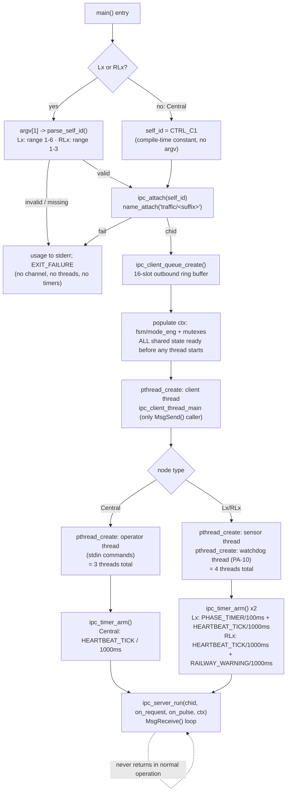

# F-01 — Node Startup, Self-Identification & Thread Bring-up

**Trigger:** each executable's own entry point — `c_main(void)` (no `argv`), `lx_main(int argc, char *argv[])`, `rlx_main(int argc, char *argv[])`
**Scope:** infrastructure underlying all 10 use cases, all 3 node types — Central ends up with **3 threads** (client, operator, server); Lx/RLx end up with **4** (client, sensor, watchdog, server)
**Spec:** F-01 infra feature, not a `usecase.md` UC — self-ID, `ipc_attach()`/`name_attach()`, thread bring-up, `ipc_timer_arm()` (incl. PA-10 watchdog tick, PA-07/`IPC_PULSE_HEARTBEAT_TICK` setup), then `ipc_server_run()`

`pthread_create()` order never matters: step G fully initialises every field the spawned threads touch *before* step H, so client/sensor/watchdog/operator threads never race each other at startup — the one exception is Central's `c_comm_set_console_io_lock()` (part of step G), which must precede the client thread because its reply-logging callback runs there.

## Code map

| Step | File : Function |
|---|---|
| Self-ID (Lx/RLx) | `lx_main.c` / `rlx_main.c` : `parse_self_id()` |
| Channel attach | `qnet_utils.c` : `ipc_attach()` → `name_attach()` |
| Outbound queue | `qnet_utils.c` : `ipc_client_queue_create()` |
| FSM/mode init | `c_main.c` : `c_mode_eng_init()` · `lx_main.c` : `lx_fsm_init()` · `rlx_main.c` : `rlx_fsm_init()` + `rlx_gate_init()` |
| Client thread | `qnet_utils.c` : `ipc_client_thread_main()` |
| Operator/sensor thread | `c_main.c` : `c_operator_reader_thread()` · `lx_main.c`/`rlx_main.c` : `*_sensor_reader_thread()` |
| Watchdog thread (Lx/RLx only) | `lx_main.c`/`rlx_main.c` : `*_watchdog_thread()` (PA-10 local hang detection) |
| Timer arm | `qnet_utils.c` : `ipc_timer_arm()` |
| Serve forever | `qnet_utils.c` : `ipc_server_run()` — dispatches `on_request()`/`on_pulse()` |

Failure handling is uniform: any failed step (`parse_self_id`, `ipc_attach`, `pthread_create`) logs to `stderr` and `return EXIT_FAILURE` immediately — no partial-startup cleanup, a boot failure is treated as unrecoverable.

## Cross-node view

`app/README.md` advises starting `c_main` before any Lx/RLx. Traced through `name_attach()`/`name_open()` semantics in `qnet_utils.c`: if an Lx/RLx's `name_open("traffic/c1")` races ahead of Central's `name_attach()`, that one send silently fails (`send_ok = 0`) and is dropped — no crash, no retry — but the *next* periodic job (e.g. the next 1000ms heartbeat) tries `name_open()` again and succeeds once Central has attached.

**Conclusion:** "start C1 first" is a demo-cleanliness convention (avoids one dropped first-heartbeat per node), not a hard correctness requirement — nothing in `qnet_utils.c` enforces node start order.
