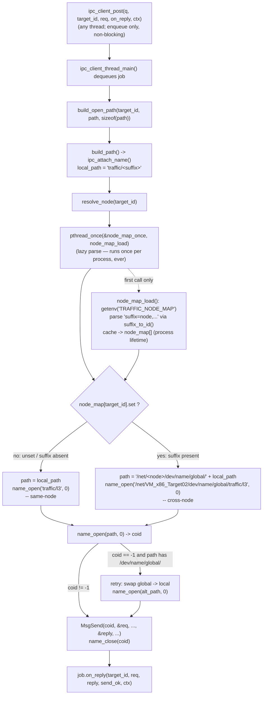

# F-02 — Cross-Node Qnet Name Resolution (TRAFFIC_NODE_MAP)

**Trigger:** first `resolve_node()` call in the process — the first job any client thread dequeues from `ipc_client_post()`, which fires the one-time `getenv("TRAFFIC_NODE_MAP")` read
**Scope:** one node's own client-thread decision (`ipc_client_thread_main()`, `app/shared/src/qnet_utils.c`) — but its output is what lets that node's outbound calls reach every other node
**Spec:** infrastructure feature, not one of the 10 UC-xx use cases — design rationale in `app/shared/README.md`'s cross-node worked example; underlies every use case once a deployment spans more than one Qnet node

## Code map

| Step | File : Function |
|---|---|
| Enqueue | `qnet_utils.c : ipc_client_post()` — non-blocking, never touches the map |
| Dequeue + dispatch | `qnet_utils.c : ipc_client_thread_main()` (dedicated thread, per node) |
| Path assembly | `qnet_utils.c : build_open_path()` → `build_path()` → `ipc_attach_name()`, same `ATTACH_SUFFIX[]` table the attach side reads |
| Node lookup | `qnet_utils.c : resolve_node()` — `pthread_once(&node_map_once, node_map_load)` |
| One-time env parse | `qnet_utils.c : node_map_load()` — `getenv("TRAFFIC_NODE_MAP")` → `suffix_to_id()` (reverse `ATTACH_SUFFIX[]` lookup) → `node_map[]` |
| Same-node open | `name_open("traffic/l3", 0)` — byte-for-byte the pre-feature behavior |
| Cross-node open | `name_open("/net/<node>/dev/name/global/traffic/l3", 0)` |
| Fallback retry | `ipc_client_thread_main()` swaps `global`→`local` in path if the cross-node open fails |

## Cross-node view

The entire feature is the branch at `resolve_node()`: queueing, `build_path()`'s suffix lookup, `name_open()`/`MsgSend()`/`name_close()`, and the global→local retry are identical on both sides — only the literal path string handed to `name_open()` differs. `TRAFFIC_NODE_MAP` is parsed once per process (`pthread_once`; all-zero table if unset), needs to be set only on the **calling** process, and only needs the suffixes that process actually targets — `ipc_attach()`'s `NAME_FLAG_ATTACH_GLOBAL` already makes every attach point reachable from other nodes regardless. No `TRAFFIC_NODE_MAP` → every entry unset → always the same-node branch → identical to the pre-existing single-machine setup, zero config change required.
