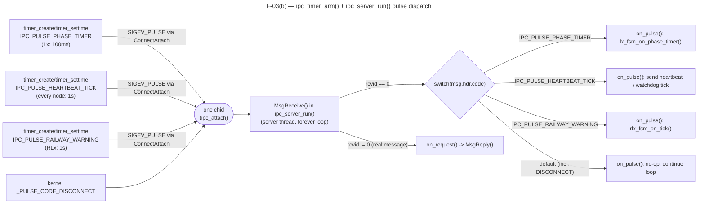

# F-03 — Qnet Transport Internals: Outgoing Queue + Timer/Pulse Dispatch: Function-Level Flow

## What this feature does

`app/shared/src/qnet_utils.c` gives every node (`c_main`, `lx_main`,
`rlx_main`) two low-level mechanisms every other feature in this codebase
sits on top of: (a) `ipc_client_post()` + `ipc_client_thread_main()`, a
producer/consumer queue that lets any thread hand off an outbound
`ipc_request_t` without ever blocking on `name_open()`/`MsgSend()` itself,
and (b) `ipc_timer_arm()` + `ipc_server_run()`'s pulse dispatch, which lets
one Qnet channel and one `MsgReceive()` loop serve an arbitrary number of
independent periodic timers by multiplexing them through `msg.hdr.code`.
This is infrastructure, not a use case: `usecase.md` never names it, but
every `MSG_*` send in UC-01..UC-10 and every 1 s/100 ms tick in the system
goes through exactly these two pieces of code.

## Entry point

Two independent entry points, traced separately below:

- **(a) Outgoing queue** — any caller anywhere in a node's process calling
  `ipc_client_post(q, target_id, &req, on_reply, ctx)`
  (`app/shared/includes/qnet_utils.h:141-142`, implemented
  `app/shared/src/qnet_utils.c:365-393`). Per the header's own doc comment
  (line 139-140), this is "the ONLY sanctioned way to originate an outgoing
  request anywhere in a node" — called from `on_request()`/`on_pulse()`
  callbacks running on the server thread (e.g. `rlx_main.c:62`'s
  `rlx_comm_broadcast_crossing_status_if_changed()`), or from a separate
  FSM/sensor/operator thread (e.g. `c_operator.c`'s command handlers).
- **(b) Timer/pulse setup** — each node's `main()` calling
  `ipc_timer_arm(chid, pulse_code, initial_ms, period_ms, &timer_id)`
  (`qnet_utils.h:95`, implemented `qnet_utils.c:240-276`) once per
  concurrent timer purpose it needs, all against the *same* `chid` returned
  by `ipc_attach()`. Concretely: `rlx_main.c:148` and `:156` (two calls),
  `lx_main.c:185` and `:190` (two calls), `c_main.c:289` (one call) — see
  "Cross-node view" below for exactly which codes each node type arms.

## Function call chain

### (a) Outgoing queue: producer enqueues -> consumer thread dequeues -> `name_open()`/`MsgSend()`/`name_close()` -> reply callback

The queue itself, `qnet_utils.c:326-340`:

```c
struct ipc_client_queue {
    ipc_client_job_t jobs[IPC_CLIENT_QUEUE_CAPACITY];  /* 16 slots, fixed array */
    int              head;
    int              count;
    pthread_mutex_t  lock;
    pthread_cond_t   not_empty;
    int              stopping;
};
```

This is a **fixed-capacity circular array (ring buffer) guarded by one
mutex + one condvar** — not a linked list, not a dynamically-growing
queue. `IPC_CLIENT_QUEUE_CAPACITY` is 16 (line 324). Each slot,
`ipc_client_job_t` (line 326-331), holds the target controller id, a copy
of the whole `ipc_request_t`, and the caller's `on_reply` callback +
opaque `ctx` pointer.

1. **Producer side — `ipc_client_post()` (`qnet_utils.c:365-393`), runs on
   whichever thread calls it (server thread, FSM thread, operator thread —
   never the client thread itself):**
   - `pthread_mutex_lock(&q->lock)` (line 374).
   - If `q->stopping` or the ring is full (`count == 16`), unlocks and
     returns `-1` immediately (line 376-379) — **this is the only way the
     call can fail; it never blocks waiting for space.**
   - Otherwise computes `tail = (head + count) % 16` (line 381), copies
     `*req` into `jobs[tail]` by value, forces `req.hdr.type`/`subtype` to
     0 "to keep out of the `_IO_*` reserved range" (line 384-385 — see
     part (b) below for why that range matters), stores `on_reply`/`ctx`,
     increments `count`.
   - `pthread_cond_signal(&q->not_empty)` then
     `pthread_mutex_unlock(&q->lock)` (lines 390-391).
   - **The caller never blocks beyond this short critical section** — no
     `MsgSend()`, no waiting on a reply, matching `qnet_utils.h:135-140`'s
     documented contract ("Non-blocking... Returns immediately").

2. **Consumer side — `ipc_client_thread_main()` (`qnet_utils.c:401-449`),
   the node's one dedicated client thread, started once in `main()` via
   `pthread_create(&client_tid, NULL, ipc_client_thread_main, client_queue)`
   (e.g. `rlx_main.c:130`):**
   - Loop body: `pthread_mutex_lock(&q->lock)` (line 411), then
     `while (q->count == 0 && !q->stopping) pthread_cond_wait(&q->not_empty, &q->lock)`
     (line 412-414) — the thread sleeps on the condvar whenever the queue
     is empty, using zero CPU, and wakes exactly on the producer's
     `pthread_cond_signal()`.
   - If woken because `stopping` was set and the queue is now empty, it
     unlocks and returns `NULL`, ending the thread (line 415-418) — this
     is the drain-then-exit shutdown path `ipc_client_queue_destroy()`'s
     doc comment (`qnet_utils.h:130-133`) expects the caller to
     `pthread_join()` first.
   - Otherwise dequeues by value from `jobs[head]`, advances
     `head = (head + 1) % 16`, decrements `count` (lines 419-421), then
     **releases the lock before doing any I/O** (line 422) — the mutex is
     never held across `name_open()`/`MsgSend()`.
   - `build_open_path()` (line 428 -> helper at line 165-202) resolves the
     target's Qnet path, consulting `TRAFFIC_NODE_MAP` for cross-node
     deployments (`resolve_node()`, line 151-158) or falling back to the
     plain same-node `"traffic/<suffix>"` path.
   - `coid = name_open(path, 0)` (line 429). **Retry/fallback logic on
     `name_open()` failure:** if it fails *and* the path was a
     `/dev/name/global/...` cross-node path, the code rewrites it in place
     to the equivalent `/dev/name/local/...` path and retries once (lines
     430-436) — a fallback for the case where the target registered under
     `NAME_FLAG_ATTACH_GLOBAL` failed at `ipc_attach()` time and fell back
     to a local-namespace `name_attach()` (see `ipc_attach()`,
     `qnet_utils.c:226-237`, which itself tries `NAME_FLAG_ATTACH_GLOBAL`
     first, then flags `0`). If `name_open()` still fails, `coid == -1` and
     `send_ok` stays 0 — no further retry, no blocking wait, the job is
     simply dropped after the reply callback fires with failure.
   - On a successful `name_open()`, calls
     `MsgSend(coid, &job.req, sizeof(job.req), &reply, sizeof(reply))`
     (line 438) — **this is the only `MsgSend()` call site in the entire
     codebase**, exactly as `qnet_utils.h:67-68` mandates ("This is the
     ONLY code in the process allowed to call `MsgSend()`"). `send_ok` is
     set to 1 iff `MsgSend()` did not return `-1`. Either way,
     `name_close(coid)` runs immediately after (line 439).
   - **Reply callback invocation** (lines 443-445):
     `job.on_reply(job.target_id, &job.req, send_ok ? &reply : NULL, send_ok, job.reply_ctx)`
     — runs synchronously on the **client thread**, never the server
     thread (`qnet_utils.h:122-124`'s documented contract). `reply` is
     passed as `NULL` whenever `send_ok` is 0, so callbacks must always
     check `send_ok` before touching `reply` — see
     `rlx_comm.c:10-16`'s `on_reply_log_failure()`, which does exactly
     that (`if (!send_ok) { ...log... }`), and `lx_comm.c:15-23`'s variant
     that additionally checks `reply->result == RESULT_ACK` only when
     `send_ok` is true.
   - Loops back to `pthread_mutex_lock(&q->lock)` for the next job.

**Lock/condvar summary:** one `pthread_mutex_t` (`q->lock`) protects the
ring buffer's `head`/`count`/`jobs[]`/`stopping` fields; one
`pthread_cond_t` (`q->not_empty`) is how the producer wakes a sleeping
consumer. The producer (`ipc_client_post()`) never blocks beyond the
mutex's own short critical section — it does not wait on the condvar. The
consumer (`ipc_client_thread_main()`) is the only thread that ever waits
on `not_empty`, and it releases the mutex entirely before the blocking
`name_open()`/`MsgSend()`/`name_close()` sequence.

### (b) Timer/pulse dispatch: `timer_create()`/`timer_settime()` with `SIGEV_PULSE` -> `ConnectAttach()` -> pulse lands in `ipc_server_run()`'s `MsgReceive()` -> code dispatch -> `on_pulse()`

1. **`ipc_timer_arm()` (`qnet_utils.c:240-276`), called from `main()`,
   once per timer purpose, all targeting the same `chid`:**
   - `coid = ConnectAttach(ND_LOCAL_NODE, 0, chid, _NTO_SIDE_CHANNEL, 0)`
     (line 247) — opens a connection **back to the node's own channel**
     (`ND_LOCAL_NODE`, the same `chid` `ipc_attach()` returned), which is
     what lets a pulse the kernel generates land in this same process's
     own `MsgReceive()` loop.
   - Builds a `struct sigevent` with `sigev_notify = SIGEV_PULSE`,
     `sigev_coid = coid`, `sigev_priority` taken from the calling thread's
     current scheduling priority (`pthread_getschedparam()`, line 252),
     and `sigev_code = pulse_code` — the caller-supplied code that
     identifies *which* timer this is (lines 254-257).
   - `timer_create(CLOCK_REALTIME, &event, out_timer_id)` (line 259)
     creates the kernel timer object bound to that pulse event; on
     failure, detaches the connection and returns `-1` (line 260-262).
   - Builds an `itimerspec` from `initial_ms` (first fire delay) and
     `period_ms` (recurring interval; `0` means one-shot) and calls
     `timer_settime(*out_timer_id, 0, &spec, NULL)` (lines 264-269),
     rolling back (`timer_delete()` + `ConnectDetach()`) on failure
     (line 270-272).
   - Each call to `ipc_timer_arm()` produces its own independent
     `timer_t`/connection pair, but all of them deliver into the **same**
     `chid` — this is what "multiple concurrent timer purposes on one
     channel" means concretely: e.g. `rlx_main.c` arms
     `IPC_PULSE_HEARTBEAT_TICK` (line 148) and
     `IPC_PULSE_RAILWAY_WARNING` (line 156) as two separate `timer_t`s
     against the one `chid` from `ipc_attach(self_id)` (line 112).

2. **When a timer fires**, the kernel delivers the pulse to `chid` exactly
   as if another thread had called `MsgSendPulse()` on it. The **only**
   receiver of that channel is the server thread's call to
   `MsgReceive(chid, &msg, sizeof(msg), NULL)`
   (`ipc_server_run()`, `qnet_utils.c:285`), running in `main()`'s
   `ipc_server_run(chid, on_request, on_pulse, &ctx)` call
   (e.g. `rlx_main.c:168`).

3. **Dispatch in `ipc_server_run()` (`qnet_utils.c:278-320`):**
   - `rcvid = MsgReceive(...)` (line 285). A genuine error other than
     `EINTR` returns `-1` from the whole function (line 287-292);
     `EINTR` just retries the loop.
   - **`rcvid == 0` means a pulse** (line 294) — this is exactly how the
     code tells a pulse apart from a real client message: `MsgReceive()`
     returns 0 specifically for pulses, non-zero for a message needing a
     reply. The comment at line 295-296 spells out the two kinds of pulse
     that can land here: "kernel-generated (`_PULSE_CODE_DISCONNECT`) or
     one of our own `IPC_PULSE_*` timer codes." The function calls
     `on_pulse(msg.hdr.code, ctx)` (line 298) and — critically —
     **`continue`s the loop without ever calling `MsgReply()`** (line 300,
     also stated in the comment "Never `MsgReply()` a pulse"), because a
     pulse has no sender waiting for a reply.
   - **Telling `_PULSE_CODE_DISCONNECT` apart from an application timer
     pulse:** both arrive with `rcvid == 0`; the *only* thing that
     distinguishes them is the numeric value in `msg.hdr.code`, which
     `on_pulse()` itself switches on. `_PULSE_CODE_DISCONNECT` is a
     kernel-reserved code below `_PULSE_CODE_MINAVAIL`; every
     `IPC_PULSE_*` application code is defined starting exactly at
     `_PULSE_CODE_MINAVAIL` (`qnet_utils.h:80-85`) specifically so the two
     ranges never collide. Every node's `on_pulse()` implements this as a
     plain `switch (code) { case IPC_PULSE_...: ...; default: break; }` —
     e.g. `c_main.c:144-233`'s `on_pulse()` handles
     `IPC_PULSE_HEARTBEAT_TICK` explicitly and falls through to
     `default:`, whose comment (line 229-230) says outright: "Includes the
     kernel's `_PULSE_CODE_DISCONNECT` — no action needed." `qnet_utils.c`
     itself never special-cases `_PULSE_CODE_DISCONNECT` — it is left
     entirely to each node's own `on_pulse()` to ignore it via the
     `default` branch.
   - **`rcvid != 0` means a real message.** `ipc_server_run()` handles two
     reserved ranges before touching application payload: an `_IO_CONNECT`
     type gets an immediate `MsgReply(rcvid, EOK, NULL, 0)` (line
     305-308); a type in `_IO_BASE.._IO_MAX` gets `MsgError(rcvid, ENOSYS)`
     (line 309-312) — this is exactly why `ipc_client_post()` forces
     `req.hdr.type = 0`/`subtype = 0` before enqueueing (part (a), step 1
     above): every application-level request must fall outside both
     reserved ranges. Otherwise, `on_request(&msg, &reply, ctx)` runs
     (line 316) and `ipc_server_run()` itself calls
     `MsgReply(rcvid, EOK, &reply, sizeof(reply))` (line 318) — the caller
     (`on_request`) only ever fills the reply struct, never calls
     `MsgReply()` itself.

4. **The matching `on_pulse()` callback in that node's own `main.c`**
   receives `msg.hdr.code` and runs the matching case entirely inline on
   the **server thread** (the same thread that just called `MsgReceive()`)
   — for example `rlx_main.c:46-75`'s `on_pulse()` calls
   `rlx_fsm_on_tick(&ctx->fsm)` for `IPC_PULSE_RAILWAY_WARNING` and
   `rlx_comm_send_heartbeat(...)` for `IPC_PULSE_HEARTBEAT_TICK`; both are
   non-blocking per `qnet_utils.h:107`'s contract ("Same non-blocking
   constraint as `on_request`") — any outbound send from inside `on_pulse`
   goes through `ipc_client_post()` from part (a), never a direct
   `MsgSend()`.

## Cross-node view

`ipc_timer_arm()` and `ipc_server_run()`'s dispatch are what let **one
Qnet channel per node** carry every concurrent periodic purpose that node
needs — there is no per-timer channel. `qnet_utils.h:80-85` defines the
full set of application pulse codes, all starting at
`_PULSE_CODE_MINAVAIL`:

```c
enum {
    IPC_PULSE_PHASE_TIMER = _PULSE_CODE_MINAVAIL, /* Lx: yellow/all-red/green step, 4 s demand-extension recheck (TL-01, TL-03) */
    IPC_PULSE_HEARTBEAT_TICK,                     /* every node: 1 s heartbeat cadence (PA-07) */
    IPC_PULSE_RAILWAY_WARNING,                    /* RLx: 45 s warning-to-arrival budget (RC-03) */
    IPC_PULSE_RAILWAY_OCCUPANCY                   /* RLx: 20 s per-direction occupancy window (RC-04); re-arm per active window */
};
```

Which node type arms which codes, traced from each `main()`:

| Node | Codes actually armed via `ipc_timer_arm()` | Period | Notes |
|---|---|---|---|
| **C1** (`c_main.c:289`) | `IPC_PULSE_HEARTBEAT_TICK` | 1000 ms | Only one timer. Drives missed-heartbeat bookkeeping (`c_watchdog_mon_tick()`), the DP-01/DP-02 peak-hour auto-check, and the 1 Hz HMI redraw — all three inline in one `on_pulse()` case (`c_main.c:149-226`). |
| **Lx** (`lx_main.c:185`, `:190`) | `IPC_PULSE_PHASE_TIMER` (100 ms), `IPC_PULSE_HEARTBEAT_TICK` (1000 ms) | Two independent timers, two independent `timer_t`s, same `chid` | `IPC_PULSE_PHASE_TIMER` drives `lx_fsm_on_phase_timer()` every 100 ms; `IPC_PULSE_HEARTBEAT_TICK` drives the heartbeat send + `lx_fsm_local_clock_mode_check()` every 1 s. Distinguished purely by `msg.hdr.code` in `lx_main.c:80-103`'s `switch`. |
| **RLx** (`rlx_main.c:148`, `:156`) | `IPC_PULSE_HEARTBEAT_TICK` (1000 ms), `IPC_PULSE_RAILWAY_WARNING` (1000 ms, reused as the FSM's general 1 s tick) | Two timers armed | `IPC_PULSE_RAILWAY_OCCUPANCY` is **defined but never armed** in this implementation — `rlx_main.c:64-68`'s `case IPC_PULSE_RAILWAY_OCCUPANCY:` is an explicit no-op, with a comment noting the single `IPC_PULSE_RAILWAY_WARNING` tick (driving `rlx_fsm_on_tick()`) already covers both the RC-03 warning/closing chain and the RC-04 occupancy countdown internally, so a second physical timer was judged unnecessary. |

So in practice, at most **two** concurrent application timers share one
channel on any given node (C1 has only one), but the mechanism itself
places no hard limit — `ipc_timer_arm()` can be called any number of
times against the same `chid`, and `ipc_server_run()`'s `switch` on
`msg.hdr.code` scales to any number of `case`s.

The outgoing-queue mechanism (part (a)) is the plumbing underneath *every*
cross-node send in this codebase — every `MSG_STATUS`, `MSG_HEARTBEAT`,
`MSG_CROSSING_STATUS`, `MSG_FAULT_REPORT`, `MSG_SET_MODE`,
`MSG_SET_TIMING_PROFILE`, `MSG_REQUEST_OVERRIDE`/`MSG_RENEW_OVERRIDE`/
`MSG_CANCEL_OVERRIDE`, and `MSG_REQUEST_FAULT_CLEAR` send traced in
UC-01..UC-10's flow docs ultimately calls `ipc_client_post()` on that
node's `client_queue` — there is no other code path to `MsgSend()`
anywhere in `app/central`, `app/intersection`, or `app/railway`.

## System-level summary diagram

Outgoing queue — one producer/consumer hazard, resolved with one mutex +
one condvar:

```mermaid
---
title: F-03(a) — ipc_client_post() producer/consumer queue
---
sequenceDiagram
    accTitle: Outgoing queue producer/consumer flow
    accDescr: Any thread posts a job onto a 16-slot ring buffer guarded by a mutex and condvar; the dedicated client thread dequeues, does the blocking name_open/MsgSend/name_close, then invokes the reply callback on itself.
    autonumber

    participant P as Producer thread<br/>(server thread on_pulse/on_request,<br/>or FSM/sensor/operator thread)
    participant Q as ipc_client_queue_t<br/>(ring buffer, q->lock, q->not_empty)
    participant C as Client thread<br/>(ipc_client_thread_main)
    participant N as Target node (Qnet)

    P->>Q: lock(); enqueue job; cond_signal(not_empty); unlock()
    Note over P: returns immediately - never blocks on I/O
    Q-->>C: wakes from cond_wait(not_empty)
    C->>Q: lock(); dequeue job; unlock()
    C->>C: build_open_path() (TRAFFIC_NODE_MAP lookup)
    C->>N: name_open(path)
    alt name_open fails on /global/ path
        C->>N: retry name_open() on /local/ path
    end
    C->>N: MsgSend(coid, &req, &reply)
    N-->>C: reply (or send_ok=0 on failure)
    C->>N: name_close(coid)
    C->>P: job.on_reply(target_id, req, reply, send_ok, ctx)
    Note over C: reply callback runs ON THE CLIENT THREAD
```

Timer/pulse dispatch — N independent timers, one channel, one
`MsgReceive()` loop, code-based fan-out:



Both mechanisms are per-node singletons: one `ipc_client_queue_t` +
one client thread, and one `chid` shared by every `timer_t` that node
arms — every other feature's cross-node behavior is built by calling into
these two pieces of plumbing, never around them.
