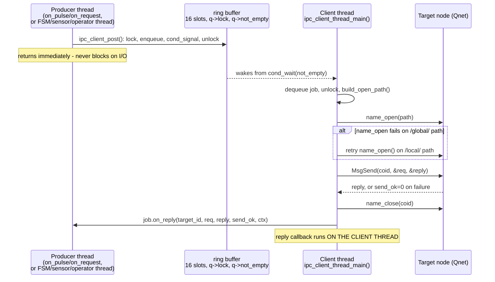
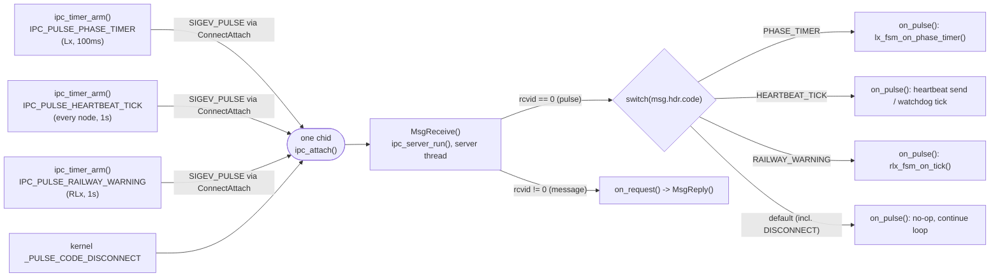

# F-03 — Qnet Transport Internals

**Trigger:** any thread calling `ipc_client_post()` (outbound request) · each node's `main()` calling `ipc_timer_arm()` at startup (periodic pulse)
**Scope:** infrastructure shared by every node (`c_main`, `lx_main`, `rlx_main`) — not itself a use case; every `MSG_*` send and every tick in UC-01..UC-10 goes through this
**Spec:** `qnet_utils.h` / `qnet_utils.c` — F-03 infrastructure feature (not named in `usecase.md`)

## (a) Outgoing queue: producer enqueues → consumer thread dequeues → send → reply

`IPC_CLIENT_QUEUE_CAPACITY=16` (fixed array, not a growable list). Full queue or `stopping` ⇒ `ipc_client_post()` returns `-1` immediately, never blocks. `qnet_utils.c:384-385` zeroes `req.hdr.type`/`subtype` before enqueueing so it can never collide with the reserved `_IO_*` ranges handled below.

## (b) Timer/pulse dispatch: N `ipc_timer_arm()` calls → one channel → code-based fan-out in `ipc_server_run()`

Application pulse codes start at `_PULSE_CODE_MINAVAIL` (`qnet_utils.h:80-85`), so they never collide with the kernel's own reserved codes (e.g. `_PULSE_CODE_DISCONNECT`). A pulse (`rcvid==0`) is never `MsgReply()`'d; a real message always is.

## Code map

| Step | File : Function |
|---|---|
| Enqueue job | `qnet_utils.c : ipc_client_post()` (365-393) — ring buffer, never blocks |
| Dequeue + send | `qnet_utils.c : ipc_client_thread_main()` (401-449) — `name_open`/`MsgSend`/`name_close`, lock released before I/O |
| Reply callback | runs on client thread — `rlx_comm.c : on_reply_log_failure()`, `lx_comm.c`'s variant (also checks `RESULT_ACK`) |
| Arm one timer | `qnet_utils.c : ipc_timer_arm()` (240-276) — `timer_create`/`timer_settime` + `SIGEV_PULSE` via `ConnectAttach(ND_LOCAL_NODE, ..., chid, ...)` |
| Receive + dispatch | `qnet_utils.c : ipc_server_run()` (278-320) — `MsgReceive()`; `rcvid==0` → `on_pulse()`; else → `on_request()` → `MsgReply()` |
| Pulse handling | each node's own `on_pulse()` — `lx_main.c`, `rlx_main.c`, `c_main.c` |

## Cross-node view

| Node | `ipc_timer_arm()` calls | Codes armed |
|---|---|---|
| **C1** (`c_main.c:289`) | 1 | `IPC_PULSE_HEARTBEAT_TICK` (1000ms) |
| **Lx** (`lx_main.c:185,190`) | 2 | `IPC_PULSE_PHASE_TIMER` (100ms), `IPC_PULSE_HEARTBEAT_TICK` (1000ms) |
| **RLx** (`rlx_main.c:148,156`) | 2 | `IPC_PULSE_HEARTBEAT_TICK` (1000ms), `IPC_PULSE_RAILWAY_WARNING` (1000ms, doubles as FSM tick) |

`IPC_PULSE_RAILWAY_OCCUPANCY` exists but is never armed — `rlx_main.c`'s `on_pulse()` treats it as a no-op since `IPC_PULSE_RAILWAY_WARNING`'s tick already drives both RC-03 and RC-04 internally. Every node shares one `chid` across all its timers and one `ipc_client_queue_t` across all its outbound sends — both mechanisms are per-node singletons that every other feature builds on, never around.
