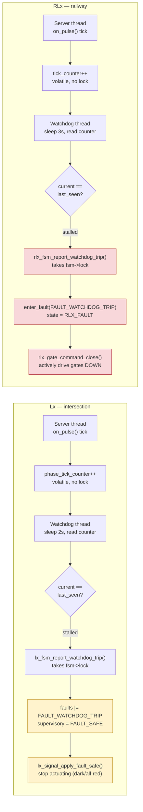

# F-04 — PA-10 Local Watchdog Self-Detection

**Trigger:** watchdog thread's periodic poll of a tick counter the server thread bumps every timer pulse — `lx_watchdog_thread()` (`lx_watchdog.c`) on Lx, `rlx_watchdog_thread()` (`rlx_watchdog.c`) on RLx
**Scope:** single-node/local by design, per PA-10 — no message crosses the wire for the detection step itself
**Spec:** `system_assumptions_tables.md` PA-10 · infrastructure feature F-04 (not one of the 10 `usecase.md` use cases)

Divergence: Lx only **sets a fault flag** (`supervisory = FAULT_SAFE`) and lets the next `lx_fsm_check_fault_locked()` call notice it; RLx's `enter_fault()` **forces the FAULT state and physical actuation immediately**, with no defer step.

## Code map

| Node | Step | File : Function |
|---|---|---|
| Lx | Tick increment | `lx_main.c : on_pulse()` (`IPC_PULSE_PHASE_TIMER`, 100ms) → `ctx->phase_tick_counter++` |
| Lx | Watchdog poll | `lx_watchdog.c : lx_watchdog_thread()` — sleeps `LX_WATCHDOG_CHECK_INTERVAL_S` (2s) |
| Lx | Fault action | `lx_fsm.c : lx_fsm_report_watchdog_trip()` → `faults \|= FAULT_WATCHDOG_TRIP`, `supervisory = SUPERVISORY_FAULT_SAFE` → `lx_signal_apply_fault_safe()` |
| RLx | Tick increment | `rlx_main.c : on_pulse()` (`IPC_PULSE_RAILWAY_WARNING`, 1000ms) → `ctx->tick_counter++` |
| RLx | Watchdog poll | `rlx_watchdog.c : rlx_watchdog_thread()` — sleeps `RLX_WATCHDOG_CHECK_INTERVAL_S` (3s) |
| RLx | Fault action | `rlx_fsm.c : rlx_fsm_report_watchdog_trip()` → `enter_fault(fsm, FAULT_WATCHDOG_TRIP)` → `state = RLX_FAULT` + `rlx_gate_command_close()` |

Both increment and read sides are plain unlocked accesses to a `volatile uint32_t` — no mutex, no IPC; only the fault-forcing step takes `fsm->lock`. Both watchdog threads run forever (never exit), so a stall that later clears keeps being monitored normally.

**Why the severity differs:** a road signal's safe state (dark/all-red) is reached just by *not actuating*, so Lx flagging the fault for the next FSM call to notice is enough. A level-crossing gate left up or mid-motion is unsafe, so RLx's `enter_fault()` must drive the physical gate down immediately, not merely wait for something else to notice the flag.

## Cross-node view

Detection is entirely local — neither `lx_watchdog.c` nor `rlx_watchdog.c` imports `qnet_utils.h` or calls `ipc_client_post()`, matching PA-10's "affects only the owning location."

The resulting fault does surface outward, riding each node's *existing* reporting path (no dedicated wire verb):

| Node | Outward path |
|---|---|
| RLx | `enter_fault()` sets `fault_report_pending = 1` → next `IPC_PULSE_RAILWAY_WARNING` tick calls `rlx_comm_send_fault_report()` → `MSG_FAULT_REPORT` to C1 |
| Lx | no separate verb — `fsm->faults` rides inside the next `MSG_HEARTBEAT`'s `status_report_payload_t`, filled by `lx_fsm_fill_status()` |

Caveat: both outward paths run on the same **server thread** whose stall triggered the watchdog. The local safe-state action (Lx's flag, RLx's gate-close) is forced by the watchdog thread itself and does not wait for the server thread — but the remote `MSG_FAULT_REPORT`/`MSG_HEARTBEAT` only ships once that server thread manages to run its next pulse.
