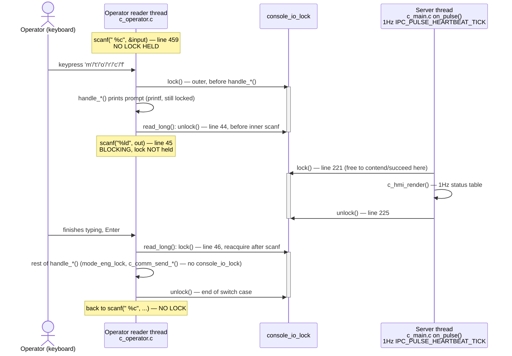

# F-05 — Operator Console Dispatch & Terminal-Output Serialization

**Trigger:** `c_operator_reader_thread()`'s blocking `scanf(" %c", &input)` loop (C1, dedicated 4th thread)
**Scope:** single-node — C1 only, no IPC/Qnet in the dispatch loop itself
**Spec:** F-05 infrastructure feature — shared entry point behind UC-03/06/07/08's operator commands

**The fix, in one line:** `console_io_lock` is held across a handler's whole *output* sequence, but always released around the *blocking wait for a digit* (`read_long()`'s inner `scanf`) so `on_pulse()`'s 1 Hz render can't be starved by an operator who pauses mid-type.

## Code map

| Step | File : Function |
|---|---|
| Outer read, no lock | `c_operator.c : c_operator_reader_thread()` — `scanf(" %c", &input)` (line 459) |
| Dispatch + outer lock | `c_operator.c` — `switch(input)` → `lock(console_io_lock)` → `handle_*()` (lines 477-529) |
| Inner read — the fix | `c_operator.c : read_long()` — `unlock()` (line 44) → `scanf("%ld", out)` (line 45) → `lock()` (line 46) |
| Competing render | `c_main.c : on_pulse()` `IPC_PULSE_HEARTBEAT_TICK` → `lock(console_io_lock)` → `c_hmi_render()` → `unlock()` (lines 221-225) |
| Lock ordering | `console_io_lock` always OUTER, `mode_eng_lock` always INNER — both threads, never reversed (`c_operator.h`, `c_operator.c`, `c_main.c` all state this) |
| `'q'` / unrecognised key | No lock taken at all — single `printf()`, loop back to step 1 |

Two threads, one lock: the **operator reader thread** owns every `handle_*()` (UC-07 `'m'`, UC-03 `'t'`, UC-08 `'o'/'r'/'c'`, UC-06 alt 7.1 `'f'`); the **server thread**'s `on_pulse()` only ever wants the lock for `c_hmi_render()`. Consistent lock ordering (`console_io_lock` before `mode_eng_lock`, everywhere) rules out AB-BA deadlock; the unlock/relock around the inner `scanf()` is what rules out starving the server thread for the seconds it takes a human to type a number.

## Cross-node view

Single-node/local to C1 — no `MsgSend()`, no `ipc_client_post()` anywhere in this dispatch loop; `console_io_lock`/`mode_eng_lock` are plain `pthread_mutex_t` fields in `central_context_t`, never shared across Qnet. Once a `handle_*()` finishes validation and calls `c_comm_send_set_mode()` / `c_comm_broadcast_timing_profile()` / `c_comm_send_request_override()` / `c_comm_send_renew_override()` / `c_comm_send_cancel_override()` / `c_comm_send_request_fault_clear()` (all with no lock held), *that* is where the message actually crosses the wire — traced in `UC-07-configure-mode.md`, `UC-03-coordinate-arterial-traffic-progression.md`, and `UC-08-clear-route-override.md`. This doc stops at the dispatch mechanism common to all of them.
