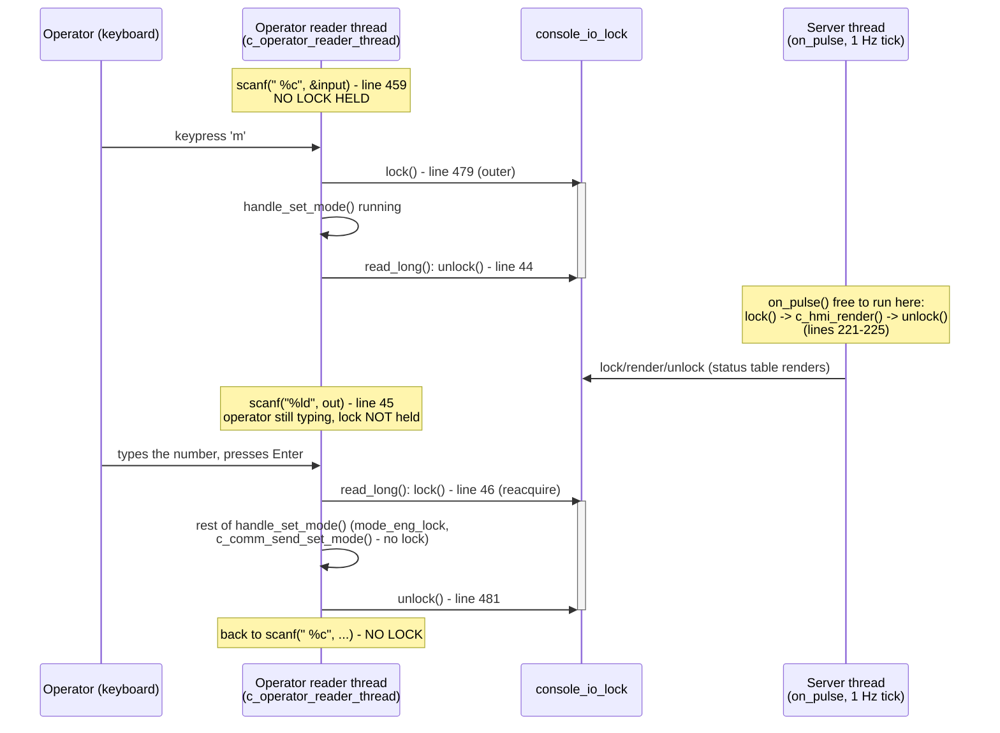

# F-05 — Central Operator Console Dispatch & Terminal-Output Serialization: Function-Level Flow

## What this feature does

`c_operator_reader_thread()` (`app/central/src/c_operator.c` around line 451-534) is the single
shared entry mechanism behind every operator-originated command on C1 — the `'m'`/`'t'`/`'o'`/`'r'`/
`'c'`/`'f'` keypresses that respectively kick off UC-07's `SET_MODE`, UC-03's
`SET_TIMING_PROFILE`, and UC-08's `REQUEST_OVERRIDE`/`RENEW_OVERRIDE`/`CANCEL_OVERRIDE`, plus
UC-06 alt-flow 7.1's `REQUEST_FAULT_CLEAR`. This document is not about what any one of those
commands does on the wire (see their own UC flow docs for that) — it is about the console loop
itself: how it reads a command letter without blocking anything else, how `console_io_lock` keeps
every handler's printed prompts/results from being spliced apart by the concurrent 1 Hz status
table, and the specific bug (real, from earlier this session) where holding that lock across a
*second*, inner blocking read froze the whole terminal until the operator finished typing.

## Entry point

`c_operator_reader_thread()`'s `for (;;)` loop (`c_operator.c` around line 458), specifically the
blocking `scanf(" %c", &input)` at line 459 that reads one command-letter keystroke at a time on
C1's dedicated fourth thread (never the server or client thread — `c_operator.h`'s header comment
around line 10-21, `app/shared/README.md`'s "Threading pattern").

## Function call chain

### Side A — the operator-console reader thread (this file's main subject)

1. `c_operator_reader_thread()`'s loop body (`c_operator.c` around line 458-464) blocks in
   `scanf(" %c", &input)` (line 459) with **no lock held at all**. This is deliberate: an operator
   who has not pressed a key yet is not "using" the console, so nothing about this wait should be
   able to stall `c_hmi_render()`'s 1 Hz table or a concurrent broadcast — see the in-line comment
   at lines 466-476 explaining exactly this.
2. Once a character arrives, the `switch (input)` (line 477) takes over. For every recognised
   command letter, the pattern is identical — `pthread_mutex_lock(args->console_io_lock)`
   immediately before the call, the matching `handle_*()` call, then
   `pthread_mutex_unlock(args->console_io_lock)` immediately after:
   - `'m'` (lines 478-482) → `handle_set_mode()` (UC-07)
   - `'t'` (lines 483-487) → `handle_timing_profile()` (UC-03)
   - `'o'` (lines 488-492) → `handle_request_override()` (UC-08)
   - `'r'` (lines 493-497) → `handle_renew_override()` (UC-08)
   - `'c'` (lines 498-502) → `handle_cancel_override()` (UC-08)
   - `'f'` (lines 503-507) → `handle_request_fault_clear()` (UC-06 alt 7.1)
   - `'d'`/`'a'` (lines 508-517) → `handle_demo_hour()` / `handle_resume_automatic()` (DP-01/DP-02
     demo aids)
   - `'h'`/`'?'` (lines 518-523) → `print_help()`
   - `'q'` (lines 524-526) and the unrecognised-key `default` (lines 527-529) are the two cases
     that **do not** take `console_io_lock` at all — `'q'` just prints one line and returns,
     `default` just prints one line and loops back to step 1; neither has a multi-step prompt
     sequence worth protecting.
3. Inside whichever `handle_*()` was called, `console_io_lock` is already held as the **outer**
   lock for that handler's *entire* execution — every `printf()` prompt, every validation-failure
   message, every `c_logger_log()` call the handler makes is covered by the single lock/unlock
   pair from step 2, so `c_hmi_render()`'s status table can never interleave mid-command
   (`c_operator.h` around line 39-44: "serialises this thread's stdout/stdin ... against
   `c_hmi_render()`'s 1 Hz status-table print").
4. **The fix this document exists to trace**: every `handle_*()` that needs a number from the
   operator (an Lx index, a mode, a duration, an hour) calls the shared `read_long()` helper
   (`c_operator.c` around line 25-63) — e.g. `handle_set_mode()` at line 140 and again at line 147.
   `read_long()` itself contains a *second*, nested blocking read
   (`rc = scanf("%ld", out)` at line 45), and this is exactly where the original bug lived:
   `console_io_lock` was already held from step 2/3 when this inner `scanf()` blocked, so an
   operator who paused mid-digit-entry held the lock indefinitely and froze the 1 Hz status table
   for as long as they took to type. The fix, traced precisely:
   - Line 29-30: `printf("%s", prompt)` + `fflush(stdout)` — the prompt text itself is still
     printed *while holding* `console_io_lock` (it is short, non-blocking output, no different
     from any other line the handler prints).
   - Line 44: `pthread_mutex_unlock(console_io_lock)` — **released immediately before** the
     blocking read, specifically because (per the comment at lines 32-43) "an indefinite wait for
     operator input is not 'output' — holding the lock here would freeze the 1 Hz status table for
     as long as the operator takes to type an answer, and could delay an in-flight broadcast (e.g.
     the peak-hour auto-switch in `c_main.c`'s `on_pulse()`) that is blocked waiting for the same
     lock just to log a line."
   - Line 45: `rc = scanf("%ld", out)` — the actual blocking read, now happens with the lock
     **not held**, so `c_hmi_render()` (or `on_pulse()`'s auto-switch log line) can freely acquire
     `console_io_lock` and make progress while the operator is still typing.
   - Line 46: `pthread_mutex_lock(console_io_lock)` — **reacquired immediately after** `scanf()`
     returns, before `read_long()` does anything else (checking `rc == EOF`, printing
     "not a number", draining the rest of the line with `getchar()`), so the rest of the calling
     handler's output resumes being atomic against the status table exactly as before.
   - The comment at lines 40-41 also records *why* this release/reacquire is always safe to nest
     this way: "No handler takes `mode_eng_lock` before calling `read_long()`, so releasing
     `console_io_lock` here is never nested the wrong way round" — i.e. no handler holds the inner
     lock (`mode_eng_lock`) across a `read_long()` call, so releasing the outer lock
     (`console_io_lock`) inside `read_long()` can never leave `mode_eng_lock` held without its
     required outer lock.
5. Handler finishes (validation, any `mode_eng_lock`-protected bookkeeping update, the
   `c_comm_send_*()`/`c_comm_broadcast_*()` call — all outside `console_io_lock`'s concern, traced
   in the relevant UC doc). Control returns to the `switch` in step 2, which unlocks
   `console_io_lock` once, and the loop returns to step 1's un-held `scanf(" %c", ...)`.

### Side B — the server thread's competing acquisition of the same lock

6. Independently of anything the operator does, C1's server thread runs `on_pulse()`
   (`c_main.c` around line 144-233) once a second, driven by the `IPC_PULSE_HEARTBEAT_TICK` timer
   armed in `main()` (line 289). Inside the `IPC_PULSE_HEARTBEAT_TICK` case (line 149-227), after
   the missed-heartbeat check and the DP-01/DP-02 auto-switch block (each of which takes and
   releases `console_io_lock`/`mode_eng_lock` for their own short, separate purposes — see UC-07's
   flow doc for the auto-switch half), the case ends with:
   - Line 221: `pthread_mutex_lock(&ctx->console_io_lock)`
   - Line 222: `pthread_mutex_lock(&ctx->mode_eng_lock)`
   - Line 223: `c_hmi_render(&ctx->mode_eng)` — the actual 1 Hz status-table print
   - Line 224: `pthread_mutex_unlock(&ctx->mode_eng_lock)`
   - Line 225: `pthread_mutex_unlock(&ctx->console_io_lock)`
7. `c_hmi_render()` itself does no I/O waiting — it is a bounded sequence of `printf()` calls over
   already-buffered `mode_eng` state, so this critical section is always short. It never calls
   anything like `read_long()`; there is no blocking read on this side of the contention.

### Why the two sides cannot deadlock — the lock-ordering invariant

8. Both the operator thread (step 3, `console_io_lock` outer / `mode_eng_lock` inner inside each
   `handle_*()`) and the server thread (step 6, same nesting order) acquire `console_io_lock`
   strictly **before** `mode_eng_lock`, never the reverse. This is stated three times in the
   source, deliberately redundantly:
   - `c_operator.h` around line 44-46: "Always acquired OUTSIDE (before) `mode_eng_lock`, never the
     reverse — see `c_main.c`'s `on_pulse()` for why that ordering is a hard requirement, not
     stylistic."
   - `c_operator.c` around line 466-471: "`console_io_lock` is always the OUTER lock relative to
     `mode_eng_lock` ... to avoid an AB-BA deadlock between this thread and the 1 Hz heartbeat-tick
     thread."
   - `c_main.c` around line 215-220: "`console_io_lock` is always acquired BEFORE `mode_eng_lock`,
     never the reverse ... nesting them the other way here would risk an AB-BA deadlock the first
     time a status tick and an operator command race."
9. Because a *reversed* ordering never occurs anywhere in the codebase, the two threads can only
   ever contend for `console_io_lock` first — whichever thread gets there first simply makes the
   other wait, and once the winner also needs `mode_eng_lock` it is guaranteed to get it (nothing
   else holds `mode_eng_lock` while waiting on `console_io_lock`, since every acquirer already
   holds `console_io_lock` first). Step 4's release-around-`scanf()` pattern is what keeps this
   correct *ordering* from turning into a practical *liveness* problem — without it, the operator
   thread could hold `console_io_lock` (correctly, per the ordering rule) for an unbounded time
   simply because a human hadn't finished typing, starving `on_pulse()`'s step 6 out of the same
   lock every second.

## Cross-node view

This entire mechanism is single-node, local to C1 — there is no IPC verb, no `MsgSend()`, no
`ipc_client_post()` call anywhere in the dispatch loop itself. `console_io_lock` and
`mode_eng_lock` are plain `pthread_mutex_t` values inside `central_context_t`
(`c_main.c` around line 37-64), never shared across the Qnet boundary. Once a `handle_*()` finishes
its own validation/bookkeeping and calls out to `c_comm_send_set_mode()` /
`c_comm_broadcast_timing_profile()` / `c_comm_send_request_override()` /
`c_comm_send_renew_override()` / `c_comm_send_cancel_override()` / `c_comm_send_request_fault_clear()`
(all in `c_comm.c`, all called with no lock held), *that* is where the real cross-node message
gets built and posted — traced in full in `UC-07-configure-mode.md` (`SET_MODE`),
`UC-03-coordinate-arterial-traffic-progression.md` (`SET_TIMING_PROFILE`), and
`UC-08-clear-route-override.md` (`REQUEST_OVERRIDE`/`RENEW_OVERRIDE`/`CANCEL_OVERRIDE`). This
document deliberately does not re-trace those sends; it only covers the console-dispatch
mechanism that is common to all of them, upstream of any wire activity.

## System-level summary diagram



```text
console_io_lock always OUTER, mode_eng_lock always INNER - never reversed:

  Operator reader thread                    Server thread (on_pulse)
  ----------------------                    -------------------------
  switch(input) { case 'm':
    lock(console_io_lock)      <---contend-->  lock(console_io_lock)   (line 221)
      handle_set_mode() {
        read_long():
          unlock(console_io_lock)  <-- releases so the server thread's
          scanf("%ld", ...)            lock(console_io_lock) above can
          lock(console_io_lock)        succeed WHILE the operator is
                                        still typing - this is the fix.
        lock(mode_eng_lock)                     lock(mode_eng_lock)     (line 222)
        ...bookkeeping...                       c_hmi_render()          (line 223)
        unlock(mode_eng_lock)                   unlock(mode_eng_lock)   (line 224)
      }
    unlock(console_io_lock)                   unlock(console_io_lock)  (line 225)
  }
```

The key property both diagrams capture: `console_io_lock` is held across a *handler's* whole
output sequence so the status table can't splice into it, but it is never held across the
*blocking wait for a keystroke* — neither the outer `scanf(" %c", ...)` in the main loop nor the
inner `scanf("%ld", ...)` inside `read_long()`. The outer one simply never takes the lock at all;
the inner one takes it, drops it specifically around the blocking read, and picks it back up
immediately after — which is the exact fix for the freeze bug this feature documents.
