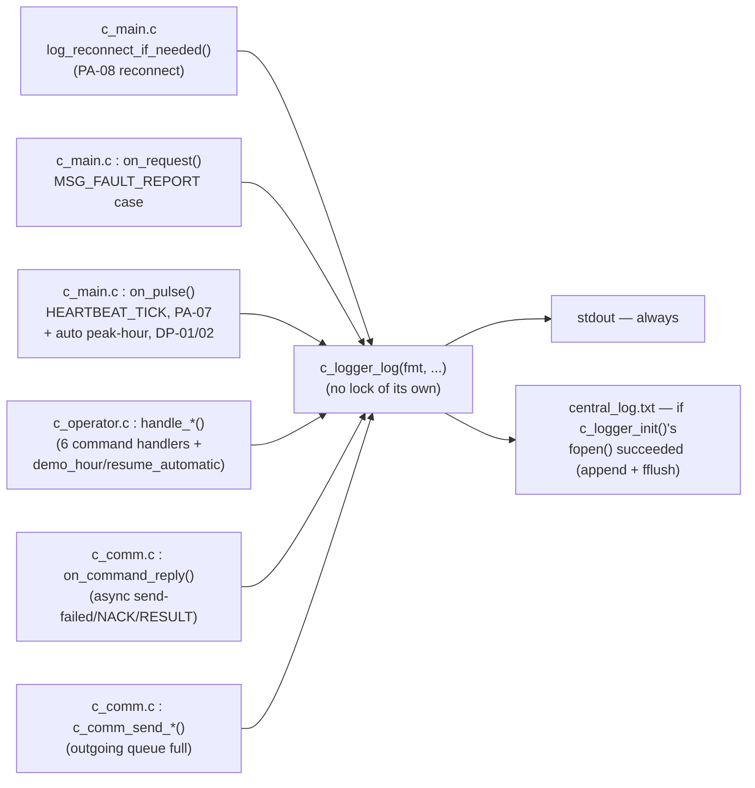

# F-06 — Persistent Event Logging

**Trigger:** `c_logger_init()` at C1 startup (`c_main.c`, before `ipc_attach()`)
**Scope:** single-node — Central (C1) only; infrastructure feature (Layer 5 — Observability), not one of `usecase.md`'s 10 use cases
**Spec:** F-06 infrastructure feature · `00-ARCHITECTURE-OVERVIEW.md` Layer 5

`c_logger_log()` takes no lock itself — every call site above is responsible
for already holding `console_io_lock` (the same mutex serialising
`c_hmi_render()`'s status table and the operator prompts), otherwise two
threads logging at once could interleave their output.

## Call sites

| File : function | What it logs | Locked at this call site? |
|---|---|---|
| `c_main.c` : `main()` | *(not a log call)* `c_logger_init()` opens `central_log.txt` | n/a |
| `c_main.c` : `log_reconnect_if_needed()` | `Controller %d reconnected (PA-08)` | Yes — explicit `console_io_lock` |
| `c_main.c` : `on_request()`, `MSG_FAULT_REPORT` | fault code/severity/detail from inbound `FAULT_REPORT` | Yes — explicit `console_io_lock` |
| `c_main.c` : `on_pulse()`, `HEARTBEAT_TICK` / PA-07 | each newly-`UNAVAILABLE` controller | Yes — explicit `console_io_lock` |
| `c_main.c` : `on_pulse()`, auto peak-hour / DP-01/DP-02 | `Auto peak-hour switch: hour=%u -> mode=%s` | Yes — `console_io_lock` held across **both** the log line and the following `c_comm_broadcast_set_mode()` call (fixed — see note below) |
| `c_operator.c` : `handle_set_mode` / `handle_timing_profile` / `handle_request_override` / `handle_renew_override` / `handle_cancel_override` / `handle_request_fault_clear` | operator command submitted (or pre-check rejection) | Yes, indirectly — reader thread's switch holds `console_io_lock` around the whole handler |
| `c_operator.c` : `handle_demo_hour` / `handle_resume_automatic` | demo peak-hour hour forced/resumed | Yes, indirectly — same reader-thread switch |
| `c_comm.c` : `on_command_reply()` | send failed / `NACK reason=...` / `-> RESULT` | Yes — explicit `g_console_io_lock` (module-static, set via `c_comm_set_console_io_lock()`); runs on the client thread |
| `c_comm.c` : `c_comm_send_*` / `c_comm_broadcast_*` | "dropped — outgoing queue full" | No lock of its own — relies on caller already holding `console_io_lock`; now true at **every** call site, including the `on_pulse()` broadcast path |

**Previously-flagged gap — now fixed.** `on_pulse()`'s DP-01/DP-02 auto
peak-hour path used to release `console_io_lock` before calling
`c_comm_broadcast_set_mode()`, leaving that broadcast's inner
`c_comm_send_set_mode()` → "queue full" log path unprotected. The current
code (`c_main.c`, `on_pulse()`) holds `console_io_lock` across the log line
*and* the broadcast call, closing that gap — matching every other call site
in the table.

## Cross-node view

Single-node, C1-only — `c_logger_log()` is not an IPC mechanism and carries
nothing across the Qnet boundary. Every event it records has already either
arrived over IPC (`on_request()` / `on_pulse()` / `on_command_reply()`) or
been generated locally by the operator console; this module only turns those
already-decided events into a durable, timestamped record. Lx and RLx have no
equivalent — they only `printf()` locally through their own signal/sensor
layers.
