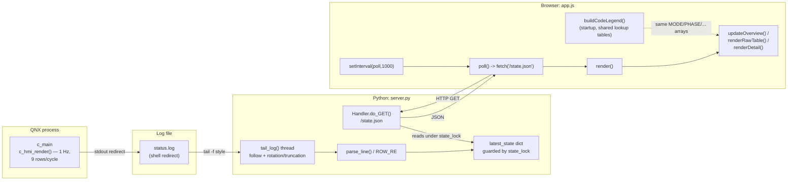

# F-07 — Live Dashboard: Function-Level Flow

**Trigger:** two independent, unrelated triggers — (a) dashboard-process startup, `main()` in `tools/dashboard/server.py`; (b) browser's periodic poll, `poll()` in `static/app.js`, every 1000ms via `setInterval`
**Scope:** outside the QNX process boundary — no Qnet channel, no `MsgSend`/`MsgReceive`, strictly read-only (no `do_POST` anywhere)
**Spec:** F-07 infrastructure/tooling feature, not a control-loop use case. UC-09's own flow doc covers the C-side heartbeat/staleness mechanism that decides what `c_main` prints; this doc covers only the dashboard tool's own internals, downstream of that stdout.

## Code map

| Step | File : Function |
|---|---|
| Print status | `c_hmi.c : c_hmi_render()` — 1 Hz, one row per `Lx`/`RLx` |
| stdout -> file | shell redirect, e.g. `c_main > status.log 2>&1` |
| Follow file | `server.py : tail_log()` — starts at byte 0 (backfill); reseeks to 0 on shrink (rotation/truncation) |
| Parse row | `server.py : parse_line()` / `ROW_RE` — `None` for header/banner lines |
| Hold state | `server.py : latest_state` dict, all access under `state_lock` |
| Spawn tailer + serve | `server.py : main()` — one daemon `tail_log` thread + `httpd.serve_forever()` on main thread |
| Serve snapshot | `server.py : Handler.do_GET()` — exact path `/state.json`, else static files |
| Poll | `app.js : poll()` — `fetch('/state.json', {cache:'no-store'})` every 1000ms |
| Render | `app.js : render()` → `updateOverview()` (SVG map) / `renderRawTable()` (decoded table) / `renderDetail()` (per-node panel) |
| Legend | `app.js : buildCodeLegend()` — same `MODE_NAMES`/`PHASE_NAMES`/... arrays feed both legend and table |

Threads sharing `state_lock`: one long-lived tailer (writer) + N short-lived per-request handler threads (readers). Never more than one tailer.

## Cross-node view

This tool has **no IPC relationship to the QNX system** — it is not in `qnet_utils.h`'s `TRAFFIC_NODE_MAP`, opens no channel. Its only input is a **log file**, not a wire message.

- `ROW_RE` and `c_hmi_render()`'s `printf` format are coupled **by convention only**, not a shared header (unlike every C-to-C verb, pinned by `ipc_msg.h`).
- **Practical implication:** if a column in `c_hmi_render()` is ever added, reordered, or reformatted, `ROW_RE` must be hand-updated or `parse_line()` silently returns `None` for every row — the dashboard freezes on the last good state ("stale", never "crashed"), with no error surfaced anywhere.
- Same hand-mirroring risk applies to `app.js`'s `MODE_NAMES`/`PHASE_NAMES`/`SUPERVISORY_NAMES`/`CROSSING_NAMES`/`FAULT_BITS`/`SENSOR_BITS` vs. the enums in `sys_types.h` — a second independent copy to keep in sync by hand.
- Confirmed read-only end to end: no `do_POST`, no mutating `fetch()` — the dashboard cannot reach `c_operator.c` or affect the control loop.
