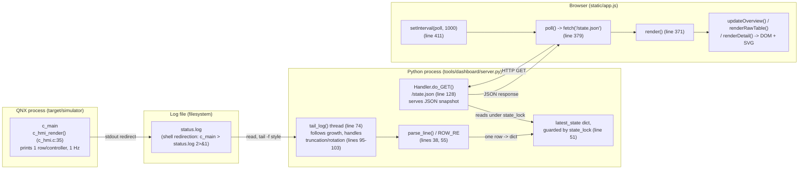

# F-07 — Live Dashboard: Function-Level Flow

## What this feature does

`tools/dashboard/` is a standalone Python 3 tool (stdlib only, no pip
install) that turns `c_main`'s existing 1 Hz status-table `printf` output
(`c_hmi_render()`, `app/central/src/c_hmi.c` line 35) into a live
browser page: an SVG network map, a raw decoded table, and a per-node
detail panel. It is **not part of the QNX system** — it never links
against any QNX SDP code, never opens a Qnet channel, and never runs on
target hardware; it only reads a text log file that `c_main`'s stdout
happens to have been redirected into, entirely outside the QNX process
boundary (see `docs/flow-diagrams/00-ARCHITECTURE-OVERVIEW.md`'s Layer 5).

## Entry point

Two independent entry points, in two different processes/languages:

- **(a) Dashboard-process startup** — `main()` in `tools/dashboard/server.py`
  (line 146), invoked as `python3 tools/dashboard/server.py --log status.log
  --port 8080` per the module docstring's usage note (lines 14-17). This is
  the whole Python process's lifetime, not a request handler.
- **(b) Browser poll loop** — once `static/index.html` loads `app.js`, the
  bottom of the file (lines 408-411) calls `buildOverviewOnce()`,
  `buildCodeLegend()`, `poll()` once immediately, then
  `setInterval(poll, 1000)` (line 411) to re-invoke `poll()` (line 379)
  every second for as long as the tab stays open. There is no WebSocket and
  no push from the server — every update is the browser asking again.

## Function call chain

### (a) Server-side: log file -> in-memory state

1. **`main()` (`server.py` line 146)** parses `--log`/`--port`, seeds
   `latest_state["log_path"]` (line 152), then spawns exactly one daemon
   thread running `tail_log(args.log)` (line 153) before starting the HTTP
   server on the main thread (line 157) — see "Threading" below.

2. **`tail_log(path)` (line 74)** follows the file like `tail -f`:
   - If `path == "-"` (line 82), it instead loops on `sys.stdin.readline()`
     — for piping `c_main`'s stdout directly into the dashboard without an
     intermediate file.
   - Otherwise it busy-waits for the file to exist (line 95), then opens it
     and **starts reading from byte 0**, not the end (lines 97, 74-81
     docstring) — deliberately, so a dashboard started after `c_main` has
     already been running for a while immediately backfills every node's
     most recent row instead of showing blanks until the next 1 Hz print.
   - Each loop iteration (lines 99-121) calls `Path(path).stat().st_size`
     and compares it against the file handle's current `f.tell()` (line
     101): if the file has shrunk — log rotation or truncation — it seeks
     back to 0 and discards the pending partial-line buffer (`buf = ""`,
     lines 101-103), so a rotated log is picked up from its own beginning
     rather than raising an exception or reading garbage at a stale offset.
   - `f.read()` (line 106) pulls whatever new bytes exist; if none, it
     sleeps 100ms and retries (lines 107-109) — this is the "follow" part
     of tailing a growing file.
   - New bytes are appended to `buf`, then `buf.split("\n")` (line 111)
     splits complete lines off the front, leaving any trailing partial line
     in `buf` for the next iteration — so a line is never parsed until it
     is fully written.

3. **`parse_line(line)` (line 55)**, called once per complete line inside
   `tail_log()`'s loop (line 114), matches the line against `ROW_RE` (line
   38) and returns `None` for anything that doesn't match — this is what
   lets the tailer safely ignore `c_hmi_render()`'s banner/header lines
   (`"---- C1 network status ----"`, the column-header row, and the
   trailing dashed line, `c_hmi.c` lines 39-41/77) and any other stdout
   noise, keeping only the 9 data rows it prints per cycle (`c_hmi.c` line
   43's `for (i = 0; i < 9; i++)`, one row per `Lx`/`RLx` — `C1` itself is
   never one of these rows, it is the process writing the log).
   `ROW_RE` decodes each field positionally to match `c_hmi_render()`'s
   `printf` format string exactly (`c_hmi.c` line 65:
   `"%-5s %-13s %-9u %-6s %-16s %-12u %#-8x %-9s %-8u %-12s\n"`), including
   the `-` placeholder for `PHASE`/`CROSSING_STATE`/`SENSOR` on
   roles those columns don't apply to (`c_hmi.c` lines 49-63) and the
   `AVAILABLE`/`UNAVAILABLE` string produced by `c->marked_unavailable`
   (`c_hmi.c` line 75). `parse_line()` converts everything to native
   Python types (`int(..., 16)` for the hex `faults`/`sensor` fields, `None`
   for `-`, `bool` for `override_active`) and returns a plain `dict`.

4. Back in `tail_log()` (lines 116-118), each parsed row is written into
   the module-level `latest_state["nodes"][row["id"]]` dict, and
   `latest_state["last_update_ts"]` is bumped to `time.time()` (lines
   120-121) if anything changed this pass — **every mutation of
   `latest_state` happens under `state_lock`** (`threading.Lock()`, line
   51), since this write happens on the tailer thread while the HTTP
   server thread(s) may be reading it concurrently.

### (b) Client-side: browser poll -> rendered DOM

5. **`Handler.do_GET()` (`server.py` line 128)**, a
   `http.server.SimpleHTTPRequestHandler` subclass instantiated per request
   by `socketserver.ThreadingTCPServer` (line 157 — one handler thread per
   connection, separate from the single `tail_log()` thread). For the exact
   path `/state.json` (line 129) it takes `state_lock` (line 130), does
   `json.dumps(latest_state)` while holding it, releases the lock, and
   writes the JSON out with `Cache-Control: no-store` and a wildcard CORS
   header (lines 132-138) — plain, uncached, cross-origin-readable JSON,
   nothing bespoke. Any other path (line 140) falls through to the base
   class's `do_GET()`, which serves static files out of `STATIC_DIR`
   (`tools/dashboard/static/`, set via the `directory=` kwarg in
   `__init__`, line 126) — this is how `index.html`/`app.js`/CSS are
   served with zero custom routing code.

6. **`poll()` (`app.js` line 379)**, invoked every 1000ms by the
   `setInterval` set up at module load (line 411), does
   `fetch("/state.json", { cache: "no-store" })` (line 381), stores the
   parsed JSON into the module-level `lastState` (line 383), and calls
   `render()` (line 384). It also derives a connection-freshness label from
   `state.last_update_ts` (lines 386-397): `"LIVE"` if updated within the
   last 5 seconds, `"stale (Ns...)"` otherwise, or `"dashboard server
   unreachable"` if the `fetch` itself throws (line 398-401, e.g. the
   Python process isn't running).

7. **`render()` (line 371)**, only if `lastState` is already populated,
   fans out to three independent redraw functions, all operating on the
   same cached JSON snapshot:
   - **`updateOverview(state)`** (line 142) lazily builds the SVG topology
     once via `buildOverviewOnce()` (line 57 — draws `C1`, the 6 `Lx`
     boxes, the 3 `RLx` boxes at positions from the static `LAYOUT` table,
     lines 37-46, plus the `C1`-to-everything and `RLx`-to-its-2-adjacent-
     `Lx` connecting lines from the `ADJACENCY` table, line 35), then on
     every call just recolors each node's `<rect>` via `colorClassFor()`
     (line 111 — green/amber/red/purple/grey by `crossing_state` or
     `supervisory`) and updates its sub-label via `subLabelFor()` (line
     134), plus a freshness check on `C1` itself using the same
     `last_update_ts` staleness rule as `poll()` (line 145).
   - **`renderRawTable(state)`** (line 217) reproduces `c_hmi_render()`'s
     own column layout (`ID ROLE MODE PHASE CROSSING_STATE SUPERVISORY
     FAULTS SENSOR OVERRIDE AVAILABILITY`, line 223) as an HTML `<table>`,
     one row per `Lx`/`RLx`, decoding every numeric/hex field inline via
     `fmtEnum()`/`fmtBits()` (lines 169-182) against the same
     `MODE_NAMES`/`PHASE_NAMES`/`SUPERVISORY_NAMES`/`CROSSING_NAMES`/
     `FAULT_BITS`/`SENSOR_BITS` arrays (lines 5-28) that `buildCodeLegend()`
     (line 189) uses to render the collapsible legend panel once at
     startup — one lookup table feeds both, so the legend can't drift out
     of sync with the table.
   - **`renderDetail(state)`** (line 272) fills the per-node detail panel
     for whichever `id` was last clicked (`selectedId`, set by
     `selectNode()`, line 265), including a tiny hand-drawn SVG
     (`drawDetailDiagram()`, line 324) of a crossing's gate arms or an
     intersection's signal heads/pedestrian buttons, colored from the same
     decoded fields.

## Threading (server.py's `main()`)

`main()` (line 146) starts exactly one background thread —
`threading.Thread(target=tail_log, args=(args.log,), daemon=True)` (line
153) — and then blocks the **main thread** in
`httpd.serve_forever()` (line 161) on a `socketserver.ThreadingTCPServer`,
which itself spawns one additional short-lived thread per inbound HTTP
connection. So there are effectively three roles sharing `state_lock`: the
one long-lived tailer thread (writer), and N short-lived per-request
handler threads (readers via `do_GET()`) — never more than one tailer, no
matter how many browsers are polling.

## Cross-node view

This tool has **no IPC relationship to the QNX system at all** — it never
calls `MsgSend()`/`MsgReceive()`, never opens a Qnet channel, and is not
listed in `app/shared/includes/qnet_utils.h`'s `TRAFFIC_NODE_MAP`. Its only
input is a **log file** that some out-of-band shell redirection
(`./build/bin/c_main > status.log 2>&1 &`, per the module docstring, line
15) happens to populate. Consequences of that:

- It has **zero visibility into anything `c_main` doesn't already print to
  its own stdout**. It cannot see `Lx`/`RLx` state directly, only what `C1`
  chose to record about them in `c_mode_eng_t` and render via
  `c_hmi_render()`. If `c_main` crashes or the log stops growing, the
  dashboard can only infer staleness from `last_update_ts` (`app.js` lines
  387-397) — it has no separate liveness signal of its own.
- It is **confirmed read-only**: `Handler` (server.py line 124) only
  overrides `do_GET()`; there is no `do_POST()`/`do_PUT()` anywhere in the
  file, and `app.js` never issues a `fetch()` with a non-default (i.e.
  mutating) method. The dashboard cannot send an operator command, cannot
  reach `c_operator.c`, and has no path back into the control loop.
- `ROW_RE` (server.py line 38) and `c_hmi_render()`'s `printf` format
  (`c_hmi.c` line 40/65) are **coupled by convention, not by a shared
  header** — unlike every C-to-C wire verb in this repo, which is pinned
  down by `app/shared/includes/ipc_msg.h`. If a column is ever added,
  reordered, or its width/format changed in `c_hmi_render()`, `ROW_RE` must
  be hand-updated to match or `parse_line()` (line 56) silently returns
  `None` for every row — the dashboard would show `AVAILABLE` boxes frozen
  at whatever their last successfully-parsed state was ("stale", never
  "crashed"), with no error surfaced anywhere. Likewise, `app.js`'s
  `MODE_NAMES`/`PHASE_NAMES`/`SUPERVISORY_NAMES`/`CROSSING_NAMES`/
  `FAULT_BITS`/`SENSOR_BITS` arrays (lines 5-28) are hand-mirrored copies of
  the enums in `app/shared/includes/sys_types.h` — a third, independent
  place those meanings must be kept in sync by hand.
- This doc intentionally does not re-describe how `c_main` decides what to
  put in that table in the first place (missed-heartbeat staleness,
  `marked_unavailable`, `CROSSING_STATUS` recording) — that belongs to
  UC-09's own C-side flow doc; this file only covers what happens to that
  output once it leaves `c_main`'s stdout.

## System-level summary diagram

Four distinct layers, four different failure/coupling boundaries: the QNX
process (authoritative, but only observable through what it prints), the
log file (an ordinary OS file, subject to rotation/truncation that
`tail_log()` must defend against), the Python process (a single in-memory
snapshot behind `state_lock`, exposed over plain HTTP), and the browser
(a client-side poll loop with no persistent connection — closing the tab
stops all rendering but has zero effect on anything upstream).
