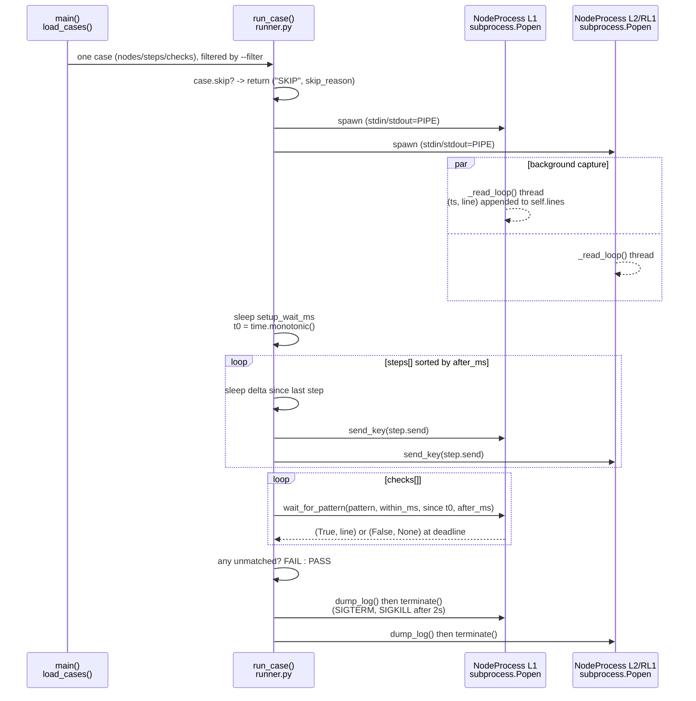

# F-08 — Scripted Test-Automation Tooling: Function-Level Flow

**Trigger:** `runner.py`'s `main()` → `load_cases()` → one JSON case's `nodes`/`steps`/`checks`
**Scope:** spawns real binaries (`c_main`/`lx_main`/`rlx_main`) as ordinary OS subprocesses on **one machine** — not real cross-VM Qnet
**Spec:** `tools/test-automation/README.md` · module doc comment `runner.py` lines 13-14 (environments A-D) · `docs/test-plan/04-timing-assumptions.md`, `06-concurrency-race.md`

`mock_node.py` is not a real node: a ~19-line `stdin`-echo stand-in (prints `"mock_node ready"`, reacts to `'a'`/`'w'`/`'q'`) used only to validate `runner.py`'s own mechanics (spawn/`send_key`/`wait_for_pattern`/log-dump) without a QNX build. Never referenced by a real case's `"binary"` field.

## Code map

| Step | File : Function |
|---|---|
| Load & filter cases | `runner.py : load_cases()`, `main()` |
| Skip check (env C/D cases) | `runner.py : run_case()` — `case.get("skip")`, never a silent pass |
| Spawn one process per node | `runner.py : NodeProcess.__init__()` → `subprocess.Popen()` |
| Capture timestamped output | `runner.py : NodeProcess._read_loop()` (daemon thread, `self.lines` under `self.lock`) |
| Anchor shared clock | `runner.py : run_case()` — `sleep(setup_wait_ms)`, `t0 = time.monotonic()` |
| Scripted keystrokes | `runner.py : run_case()` steps loop → `NodeProcess.send_key()` |
| Pattern/window check | `runner.py : NodeProcess.wait_for_pattern()` (`after_ms`/`within_ms` anchored to `t0`) |
| Verdict + persistence | `runner.py : run_case()` → `NodeProcess.dump_log()` |
| Cleanup (always) | `runner.py : NodeProcess.terminate()` in `finally` — SIGTERM, then SIGKILL after 2s |
| Repeat for race cases | `runner.py : run_case_repeated()` — own `run-<i>/` dir per attempt, stops at first non-PASS |
| Runner self-test fixture | `mock_node.py` — not part of the traffic-control system under test |

## Cross-node view

`runner.py` launches every node a case needs as subprocesses of **one Python process on one machine** — this is environment **(B) multi-node-same-machine**: several binaries running locally satisfy Qnet's same-node name resolution (no `TRAFFIC_NODE_MAP` needed), so `L1`/`L2`/`RL1` talk to each other over real Qnet IPC as one OS's local transport.

It does **not** exercise environment **(C) cross-VM** or **(D) test_client-only** — real multi-machine Qnet messaging. Those cases are marked `"skip": true` with a `skip_reason` and surface as `SKIP`, never a silent pass.

In short: this tool proves the node binaries' local IPC/state machines behave correctly under scripted timing — it does not prove multi-machine Qnet transport correctness.
