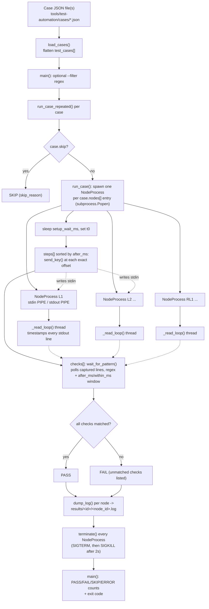

# F-08 — Scripted Test-Automation Tooling: Function-Level Flow

## What this feature does

`tools/test-automation/runner.py` replaces a human at a keyboard (and a human
with a stopwatch, per `docs/test-plan/04-timing-assumptions.md`) with
millisecond-precise scripted keystrokes and automated log-pattern checks. It
requires no change to the QNX C code at all — it launches the already-built
`c_main`/`lx_main`/`rlx_main` binaries as ordinary OS subprocesses and writes
to their `stdin` exactly what a person would have typed, at exact offsets far
tighter than a human can reproduce by hand (this matters for
`docs/test-plan/06-concurrency-race.md`'s sub-second race windows).

## Entry point

`main()` (`tools/test-automation/runner.py` around line 241) parses
`--binary-dir`/`--cases`/`--filter`, then calls `load_cases()` (around line
229), which reads one JSON case file (or every `*.json` in a directory) and
flattens each file's `test_cases` array into one list, tagging each case dict
with `_source_file`. Each case's `"nodes"`, `"steps"`, and `"checks"` arrays
(schema documented in `tools/test-automation/README.md` around lines 48-70)
are what actually drives one run — e.g. a case launching `lx_main 1` as node
`L1`, sending `"a"` at `after_ms: 0`, and checking for pattern
`ARTERIAL.*YELLOW` on `L1` within `9000` ms.

## Function call chain

Tracing one case's full lifecycle through `run_case()` (around line 127),
called per-case from `main()`'s loop via `run_case_repeated()`:

1. **Skip check.** `run_case()` first checks `case.get("skip")` (line 137) —
   if true (an out-of-scope environment-C/D case), it returns `("SKIP",
   skip_reason)` immediately without spawning anything. A skipped case is
   never silently treated as a pass.

2. **Spawn one `NodeProcess` per required binary.** For each entry in
   `case["nodes"]` (line 145), `run_case()` resolves `binary_dir/n["binary"]`,
   errors out with `"ERROR"` if the binary doesn't exist (line 148 — it never
   builds binaries itself, only runs pre-built ones), and otherwise
   constructs a `NodeProcess(n["node_id"], binary_path, n.get("args", []))`
   (line 149). `NodeProcess.__init__` (line 46) calls `subprocess.Popen()`
   (lines 50-57) with `stdin=PIPE`, `stdout=PIPE`, `stderr=STDOUT`,
   `text=True`, `bufsize=1` (line-buffered), then immediately starts a daemon
   background thread running `self._read_loop` (lines 58-59). This is what
   lets several node binaries — e.g. `L1`, `L2`, `RL1` — run concurrently as
   plain OS processes on the single machine running the test.

3. **Background capture thread.** `_read_loop()` (lines 61-67) blocks
   iterating `self.proc.stdout` and, for every line the child process prints,
   appends `(time.monotonic(), line.rstrip("\n"))` to `self.lines` under
   `self.lock` (line 64-65). This runs the entire time the node subprocess is
   alive, independent of whatever the main thread is doing — it is what makes
   every printed line timestamped and later queryable without racing the
   step-execution loop below.

4. **Let nodes attach.** Back in `run_case()`, after all `NodeProcess`
   objects exist, it sleeps `case.get("setup_wait_ms", 500)` ms (line 151) —
   giving each node's Qnet `name_attach`/channel setup time to complete
   before any scripted input arrives — then records `t0 = time.monotonic()`
   (line 152) as the case's single shared time-zero, used to anchor every
   step's `after_ms` and every check's `after_ms`/`within_ms` window.

5. **Execute scripted steps in time order.** `case.get("steps", [])` is
   sorted by `after_ms` (line 154). The loop (lines 155-164) tracks
   `elapsed_ms` and, for each step, sleeps only the *delta* since the last
   step (`step["after_ms"] - elapsed_ms`, line 157) rather than sleeping the
   absolute offset each time — so steps at `after_ms: 0` and `after_ms: 9000`
   cost one 9-second sleep total, not two. It looks up the target
   `NodeProcess` by `step["node_id"]` (erroring if unknown, line 163) and
   calls `target.send_key(step["send"])` (line 164). `send_key()` (line 69)
   writes the string directly to `self.proc.stdin` and flushes (lines 78-79)
   — no newline is added automatically, so a case targeting
   `lx_sensor.c`/`rlx_sensor.c`'s `scanf(" %c", ...)` loops sends a bare
   single character, while one targeting `c_operator.c`'s `scanf("%ld", ...)`
   prompts must include its own `"\n"` in the JSON `"send"` value (per the
   README's "send values" section). Because `stdin` here is a pipe, not a
   real tty, there's no canonical-mode line buffering to fight — the bytes
   are visible to the child's next `read()` the instant they're written and
   flushed.

6. **Evaluate checks against captured output.** For each entry in
   `case.get("checks", [])` (line 167), `run_case()` looks up the target node
   and calls `target.wait_for_pattern(check["pattern"], check["within_ms"],
   since_monotonic=t0, after_ms=check.get("after_ms", 0))` (lines 172-174).
   `wait_for_pattern()` (line 87) computes `earliest_ts = since_monotonic +
   after_ms/1000` and `deadline_monotonic = since_monotonic + (after_ms +
   within_ms)/1000` — both anchored to the case's `t0`, not to whenever this
   particular check happens to start polling (line 94-98's comment is
   explicit about this, so that several checks in one case don't drift
   relative to each other). It then loops (lines 100-107): under `self.lock`,
   scan `self.lines` for any line with `ts >= earliest_ts` whose text matches
   the compiled regex; if found, return `(True, line)` immediately; if
   `time.monotonic()` has passed `deadline_monotonic`, return `(False,
   None)`; otherwise sleep 20 ms and poll again. The `after_ms` lower bound
   is what lets a case distinguish an identical line's *first* occurrence
   from its *second* one cycle later (e.g. two "commanding gates DOWN"
   prints for an original close vs. a reclose) instead of always matching
   whichever occurrence comes first chronologically.

7. **Decide PASS/FAIL, dump logs, clean up.** Any unmatched check appends a
   message to `failures` (lines 175-179). After a `cleanup_wait_ms` sleep
   (line 181) and a defensive re-`mkdir` of the results directory (line 190,
   guarding against an ephemeral filesystem reclaiming an empty directory
   during a long-running case), `run_case()` calls `n.dump_log(case_result_dir
   / f"{node_id}.log")` for every node (lines 191-192). `dump_log()` (line
   121) joins every captured line under `self.lock` and writes it to disk —
   one log file per node, regardless of PASS or FAIL, for post-mortem
   debugging. `run_case()` returns `("FAIL", "; ".join(failures))` if
   anything failed, else `("PASS", "")` (lines 194-196). A `finally` block
   (lines 199-201) unconditionally calls `n.terminate()` on every spawned
   `NodeProcess` — `terminate()` (line 109) closes `stdin`, sends
   `SIGTERM` via `self.proc.terminate()`, waits up to 2 s, and escalates to
   `self.proc.kill()` if the process hasn't exited — so a case that errors
   mid-run never leaks a live subprocess.

8. **Repetition for race cases.** `run_case_repeated()` (around line 204)
   wraps the above: if `case.get("repeat", 1)` is an int `> 1`, it calls
   `run_case()` that many times, each with its own `results/<id>/run-<i>/`
   subdirectory (line 220) so repeats don't overwrite each other's logs,
   short-circuiting on the first non-`PASS` result (an early `SKIP` is never
   repeated, since it would just report `SKIP` again every time). This
   exists for `docs/test-plan/06-concurrency-race.md`'s cases, which need
   several attempts to have good odds of actually landing inside a narrow
   race window — something a human re-running a manual test by hand won't do
   consistently.

**`mock_node.py`'s role.** `tools/test-automation/mock_node.py` is *not* part
of the real system and is never referenced by any real case file's
`"binary"` field. It is a ~19-line stand-in for `lx_main`/`rlx_main`'s input
loop: it prints `"mock_node ready"`, then reads one character at a time from
`stdin` (mirroring the real nodes' `scanf(" %c", &input)` pattern) and prints
a fixed reaction string for a couple of hardcoded keys (`'a'` -> `"SIGNAL ->
ARTERIAL GREEN"`, `'w'` -> `"SIGNAL -> ARTERIAL YELLOW"`, `'q'` to quit). Its
only purpose is to let someone validate `runner.py`'s own mechanics — process
spawning, `send_key()` timing, `wait_for_pattern()`'s window logic, log
dumping — on a machine that has no real QNX build available. It is the
runner's own self-test fixture, not a functional part of the traffic-control
system under test.

## Cross-node view

`runner.py` spawns every node a case needs as **ordinary subprocesses of one
Python process on one machine** — this is explicitly what the tool's own
module doc comment (`runner.py` lines 13-14) calls "environment (B)
multi-node-same-machine": several binaries running locally satisfy Qnet's
same-node name resolution with no `TRAFFIC_NODE_MAP` needed, so `L1`, `L2`,
and `RL1` can all be launched by one `run_case()` call and talk to each other
over the real Qnet IPC exactly as they would on real hardware. It does **not**
exercise real cross-VM Qnet messaging — environment "(C) cross-VM" and
"(D) test_client-only" cases (per the same doc comment and
`README.md` lines 10-19) are explicitly out of scope for this tool and are
marked `"skip": true` with a `skip_reason` in their case files, surfaced as
`SKIP` (never a silent pass) by `run_case()`'s line-137 check. In other
words: this tool proves the *node binaries and their local IPC/state
machines* behave correctly under scripted timing; it does not, by itself,
prove multi-machine Qnet transport correctness.

## System-level summary diagram

