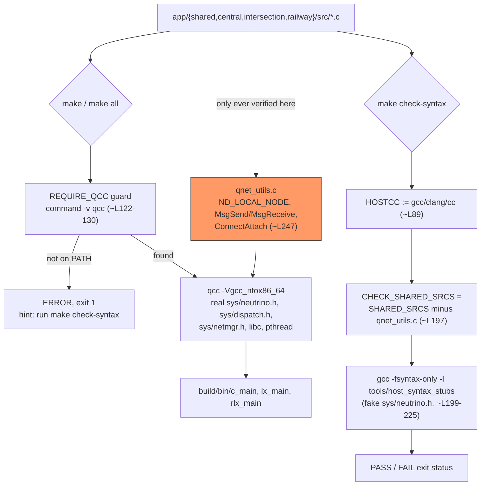

# F-09 — Build & Host-Syntax-Check Tooling

**Trigger:** `make` / `make all` (real QNX build) vs `make check-syntax` (host stand-in) — always invoked explicitly by a developer or CI, never chained automatically
**Scope:** build-time only, zero runtime IPC — no process spawn, no channel, no pulse, no Qnet byte ever crosses the wire in either path
**Spec:** infrastructure/tooling feature, not one of the 10 UC-xx cases in `usecase.md` — defined entirely in the root `Makefile`

`qnet_utils.c` is excluded from `check-syntax` because it's the one file that
genuinely calls QNX kernel primitives the stubs don't fake. Proof this gap is
real, not theoretical: commit `6fd82b7` added `#include <sys/netmgr.h>` to
that file because `ND_LOCAL_NODE` isn't declared by `<sys/neutrino.h>` —
`check-syntax` would have reported `PASS` the whole time, since it never
compiles this file at all.

## Code map

| Path | Target : File | What it does |
|---|---|---|
| A — real build | `Makefile : all/central/intersection/railway` (~L135) | depends on `$(BIN_DIR)/c_main` etc. |
| A — guard | `Makefile : REQUIRE_QCC` (~L122-131) | `command -v qcc`, else error + exit 1 |
| A — compile/link | `Makefile` compile/link rules (~L159-187) | `$(QCC) $(QNX_TARGET_SPEC) ...` |
| B — host compiler | `Makefile : HOSTCC` (~L89) | `gcc \|\| clang \|\| cc` |
| B — file filter | `Makefile : CHECK_SHARED_SRCS` (~L197) | `SHARED_SRCS` minus `qnet_utils.c` |
| B — recipe | `Makefile : check-syntax` (~L199-225) | `-fsyntax-only -I tools/host_syntax_stubs`, loops all lists, `exit $$status` |
| B — fake headers | `tools/host_syntax_stubs/sys/neutrino.h` | stubs only what non-`qnet_utils.c` files need to parse |
