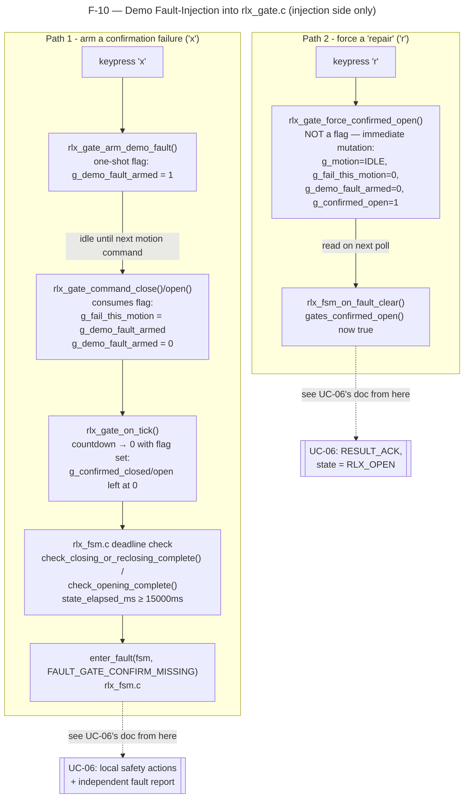

# F-10 — Demo Fault-Injection: Railway Gate Confirmation Failure

**Trigger:** keypress `x` (arm next gate motion to fail confirmation) / `r` (force confirmed-open, simulate repair) — both in `rlx_sensor.c : rlx_sensor_reader_thread()`
**Scope:** single-node — RLx only, **injection side only**; see `UC-06-respond-to-railway-equipment-fault.md` for the response side (from `enter_fault()` onward)
**Spec:** F-10 demo/testing feature — RC-06 (arm fault), RC-09/RC-10 (fault-clear demo)

Deadlines (`rlx_timer.h`): `RLX_CLOSING_DEADLINE_MS=15000` · `RLX_OPENING_DEADLINE_MS=15000` · motion tick = `RLX_GATE_MOTION_MS=3000`.
Third key `f` (`rlx_sensor.c`) calls `rlx_fsm_on_fault_clear()` directly — a demo shortcut for UC-06's *clearance* half (skips the IPC round trip), not part of this injection feature; not traced here.

## Code map

| Step | File : Function |
|---|---|
| Arm keypress | `rlx_sensor.c : rlx_sensor_reader_thread()` (`x`) → `rlx_gate.c : rlx_gate_arm_demo_fault()` |
| Flag consumed | `rlx_gate.c : rlx_gate_command_close()` / `rlx_gate_command_open()` — copies `g_demo_fault_armed` into `g_fail_this_motion` |
| Countdown misses confirm | `rlx_gate.c : rlx_gate_on_tick()` — `g_confirmed_closed`/`g_confirmed_open` stay 0 |
| Deadline → real fault | `rlx_fsm.c : check_closing_or_reclosing_complete()` / `check_opening_complete()` → `enter_fault()` |
| Repair keypress | `rlx_sensor.c : rlx_sensor_reader_thread()` (`r`) → `rlx_gate.c : rlx_gate_force_confirmed_open()` |
| Repair consumed | `rlx_fsm.c : rlx_fsm_on_fault_clear()` — `gates_confirmed_open()` reads true → `RESULT_ACK` |

Both keys run on the RLx sensor thread with **no `fsm->lock` held** — `rlx_gate.c`'s own `g_gate_lock` is always the innermost/leaf lock, so there's no lock-ordering hazard with `rlx_fsm.c`. `rlx_gate_arm_demo_fault()` is a bare, idempotent latch; `rlx_gate_force_confirmed_open()` is the odd one out — it never touches `rlx_fsm_t` and mutates gate state immediately instead of waiting to be consumed.

## Cross-node view

Single-node by construction. Injection touches only `rlx_gate.c`'s process-local statics (`g_motion`, `g_remaining_ms`, `g_fail_this_motion`, `g_demo_fault_armed`, `g_confirmed_closed`, `g_confirmed_open`) under `g_gate_lock` — no `MsgSend()`/`ipc_client_post()` anywhere in either path. Cross-node wire traffic (`MSG_FAULT_REPORT`, `MSG_CROSSING_STATUS`, `MSG_REQUEST_FAULT_CLEAR`) only begins *after* the handoff into `enter_fault()` (Path 1) or `rlx_fsm_on_fault_clear()` (Path 2) — both covered in `UC-06-respond-to-railway-equipment-fault.md`'s own Cross-node view.
