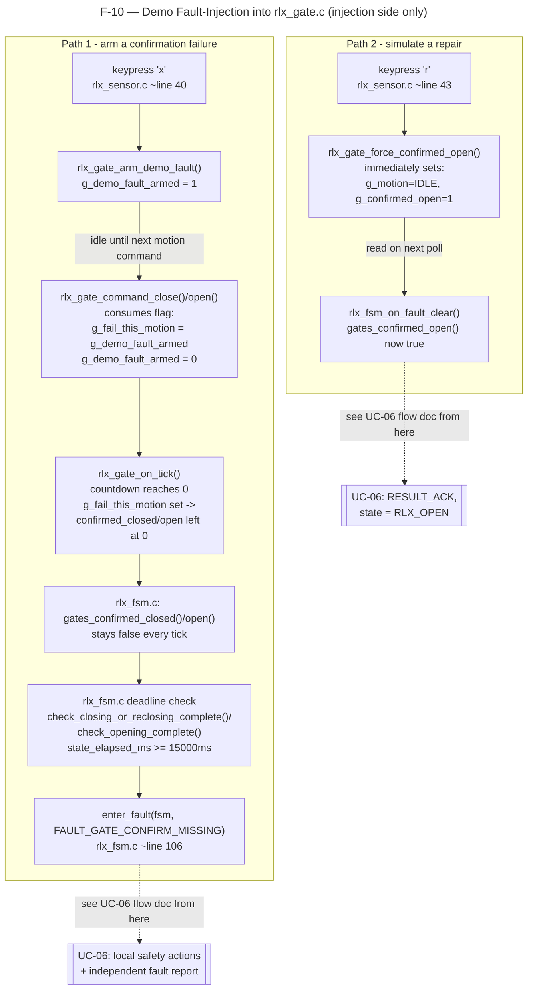

# F-10 — Demo Fault-Injection: Railway Gate Confirmation Failure: Function-Level Flow

## What this feature does

No real gate hardware exists for this PoC (`rlx_gate.c`'s own header comment, around line 6-9), so
`rlx_gate.c` simulates gate travel time and confirmation with a small internal state machine. This
feature is the keyboard-driven mechanism the demo/test team uses to make that simulated motion
*fail to confirm* on purpose (arming a one-shot fault) and, separately, to simulate a technician
physically repairing the gate afterwards. This document is the **injection** side only — it stops
the instant a real fault gets latched into the FSM; `UC-06-respond-to-railway-equipment-fault.md`
covers everything that happens once `enter_fault()` runs.

## Entry point

Two keys in the RLx keyboard-sensor thread, `rlx_sensor_reader_thread()` in
`app/railway/src/rlx_sensor.c` (around line 25-67), documented in that file's own `print_help()`
(around line 15-23):

- **`x`** — "arm next gate motion to FAIL confirmation (RC-06 demo)" — handled at around line 40-41,
  calls `rlx_gate_arm_demo_fault()` directly.
- **`r`** — "simulate gate mechanism physically repaired/confirmed OPEN (RC-09/RC-10 fault-clear demo)"
  — handled at around line 43-44, calls `rlx_gate_force_confirmed_open()` directly.

Both calls happen straight from the sensor thread's `switch` statement, with **no `fsm->lock` held**
— `rlx_gate.c`'s header comment (around line 13-19) explains why this is safe: the gate module keeps
its own internal `g_gate_lock` and is always the innermost/leaf lock, so there is no lock-ordering
hazard with `rlx_fsm.c`'s `fsm->lock`.

A third key, **`f`** (around line 46-53 — "DEMO-ONLY local fault-clear trigger (bypasses the real
`MSG_REQUEST_FAULT_CLEAR` path)"), also lives in this same file and calls `rlx_fsm_on_fault_clear()`
directly. It is **not** part of this feature: it's a demo shortcut for the *clearance* half of
UC-06 (skipping Central's IPC round trip), not for injecting a fault. It's mentioned here only so
the three demo keys aren't confused with each other; it is not traced further in this document.

## Function call chain

### Path 1 — arming a confirmation failure (`x`)

1. **Keypress `x`** in `rlx_sensor_reader_thread()` (`rlx_sensor.c` around line 40-41) calls
   `rlx_gate_arm_demo_fault()` with no arguments.

2. **`rlx_gate_arm_demo_fault(void)`** — `app/railway/src/rlx_gate.c` around line 115-121. Under
   `g_gate_lock`, unconditionally sets the module-static `g_demo_fault_armed = 1` (line 118), then
   prints `"[DEMO] Next gate motion armed to fail confirmation (RC-06 fault path)"`. This is a bare
   latch: it does not inspect the crossing's current state, does not require a motion to already be
   in progress, and is idempotent if pressed again before being consumed.

3. **The flag sits idle** until whichever of `rlx_gate_command_close()` (line 45-56) or
   `rlx_gate_command_open()` (line 58-69) is called *next* — both consume it identically:
   `g_fail_this_motion = g_demo_fault_armed;` followed by `g_demo_fault_armed = 0;` (lines 53-54 for
   close, 66-67 for open). Nothing about arming targets "the next close" specifically — it is
   genuinely "the next gate-motion command of either direction." In the real FSM these commands are
   issued by `rlx_fsm.c`'s own transition helpers: `enter_closing()` (around line 162-167),
   `enter_reclosing()` (around line 169-176), `enter_opening()` (around line 198-204), or
   `enter_fault()`'s own unconditional `rlx_gate_command_close()` (around line 115) if a fault is
   already being entered for an unrelated reason.

4. **`rlx_gate_on_tick(void)`** — `app/railway/src/rlx_gate.c` around line 71-95. Called
   unconditionally exactly once per `rlx_fsm_on_tick()` invocation (`rlx_fsm.c` line 335, before the
   FSM's own `switch` on `fsm->state`). Each call decrements `g_remaining_ms` by 1000 ms
   (`RLX_GATE_MOTION_MS` = 3000 ms, `rlx_gate.h` line 24, so a motion takes 3 ticks). On the tick
   where `g_remaining_ms` would hit zero (the `else` branch, line 77-92):
   - If `g_fail_this_motion` is set: prints `"RLx: gate FAILED TO CONFIRM (simulated fault) -
     rlx_fsm.c's own deadline will raise FAULT_GATE_CONFIRM_MISSING"` (line 80) and **deliberately
     leaves both `g_confirmed_closed` and `g_confirmed_open` at 0** (the comment at line 81-84 is
     explicit: this module never raises the fault itself, it only withholds confirmation).
   - Either way, `g_motion` is reset to `GATE_IDLE` and `g_remaining_ms` to 0 (lines 90-91). Note
     `g_fail_this_motion` itself is **not** reset here — it is left at 1 until the next
     `rlx_gate_command_close()`/`open()` unconditionally overwrites it from `g_demo_fault_armed`
     (which is already back to 0 by then), so this has no observable effect on the next motion.

5. From this point, `rlx_gate_poll_closed()` / `rlx_gate_poll_open()` (lines 97-113) — and therefore
   `rlx_fsm.c`'s wrappers `gates_confirmed_closed()` / `gates_confirmed_open()` (around line 64-72)
   — return 0 forever, for every remaining tick, until either a *later* successful (unarmed) motion
   completes or `rlx_gate_force_confirmed_open()` is invoked (Path 2 below). Gate confirmation
   **never becomes true** on its own after an armed failure.

6. **The deadline check that turns this into a real fault** — still inside `rlx_fsm_on_tick()`'s
   per-state `switch` (`rlx_fsm.c` lines 337-413), running every tick after step 4:
   - While `fsm->state` is `RLX_CLOSING` or `RLX_RECLOSING` (lines 365-369): `state_elapsed_ms +=
     1000u`, then `check_closing_or_reclosing_complete(fsm)` (around line 124-142) is called. Since
     `gates_confirmed_closed()` is false, its `else if` branch fires once `fsm->state_elapsed_ms >=
     RLX_CLOSING_DEADLINE_MS` (15000 ms — `rlx_timer.h` line 16 — 5 ticks after the fault was armed
     and a close motion started), calling **`enter_fault(fsm, FAULT_GATE_CONFIRM_MISSING)`** at
     `rlx_fsm.c` line 140.
   - While `fsm->state` is `RLX_OPENING` (lines 402-404): the same shape via
     `check_opening_complete(fsm)` (around line 151-160), deadline `RLX_OPENING_DEADLINE_MS` (15000
     ms, `rlx_timer.h` line 22), calling `enter_fault(fsm, FAULT_GATE_CONFIRM_MISSING)` at
     `rlx_fsm.c` line 158.
   - (A third, related path — `check_gate_contradiction_closed()`, called every tick while
     `RLX_CLOSED`/`RLX_TRAIN_PRESENT`, around line 144-148 — reacts the moment
     `gates_confirmed_closed()` goes false rather than waiting on a deadline; an armed failure during
     a *reclose* triggered from that state would surface through this path instead, still calling
     `enter_fault()`.)

   **This is the exact handoff point. `enter_fault()` at `rlx_fsm.c` around line 106-121 is where
   this document stops — see `UC-06-respond-to-railway-equipment-fault.md`'s "Function call chain
   (a)" from here, starting at its trigger-sites list, for the synchronous local-safety branch and
   the independently-drained fault-report branch that `enter_fault()` forks into.**

### Path 2 — forcing a confirmed-open "repair" (`r`)

7. **Keypress `r`** in `rlx_sensor_reader_thread()` (`rlx_sensor.c` around line 43-44) calls
   `rlx_gate_force_confirmed_open()` with no arguments.

8. **`rlx_gate_force_confirmed_open(void)`** — `app/railway/src/rlx_gate.c` around line 123-134. This
   is **not** a one-shot flag consumed later like `rlx_gate_arm_demo_fault()` — it is an immediate,
   synchronous mutation of the gate module's live state, under `g_gate_lock`, regardless of whatever
   motion was in progress:
   - `g_motion = GATE_IDLE;` (line 126) — cancels any in-flight motion outright.
   - `g_remaining_ms = 0;` (line 127)
   - `g_fail_this_motion = 0;` and `g_demo_fault_armed = 0;` (lines 128-129) — this also clears a
     still-armed-but-not-yet-consumed `x` press, so pressing `r` after `x` (before any gate command
     fires) cancels the pending arm too.
   - `g_confirmed_closed = 0;` / `g_confirmed_open = 1;` (lines 130-131) — the gate is now reported
     confirmed open, unconditionally.
   - Prints `"[DEMO] Gate mechanism simulated as physically repaired - now confirmed OPEN
     (RC-09/RC-10 fault-clear demo path)"` (line 133).

9. Unlike Path 1, this function never touches `rlx_fsm_t` and never calls into `rlx_fsm.c`. Its
   effect is inert until something next polls `rlx_gate_poll_open()`. The header comment on
   `rlx_gate_force_confirmed_open()` (`rlx_gate.h` around line 34-45) records exactly why this key
   exists: a test-design pass found that nothing in `rlx_fsm.c` ever calls
   `rlx_gate_command_open()` while `fsm->state == RLX_FAULT` (every fault-entry path only ever
   closes the gate — see `enter_fault()` line 115), so `gates_confirmed_open()` could never become
   true again on its own once faulted, making `MSG_REQUEST_FAULT_CLEAR`'s `RESULT_ACK` branch
   unreachable by any other demo key. `r` is the manual substitute for a technician's physical
   repair confirmation.

10. The one real consumer is `rlx_fsm_on_fault_clear()` (`rlx_fsm.c` around line 297-326, called
    either from the real `MSG_REQUEST_FAULT_CLEAR` cross-node path or from `rlx_sensor.c`'s local
    `f`-key shortcut noted above): its `gates_confirmed_open()` check at line 308 now reads true, so
    the `RESULT_ACK` branch (lines 309-318) can be taken instead of always falling into
    `RESULT_NACK`/`NACK_REASON_FAULT_ACTIVE` (line 320-321). **That consumption, and everything
    after it, is UC-06 territory** (its step 9) — not re-traced here, since this document is scoped
    to how the gate module's simulated state gets manipulated for the demo, not the FSM's reaction
    to it.

## Cross-node view

None. Both `x` and `r` are handled entirely on the RLx sensor thread and mutate only
`rlx_gate.c`'s process-local static state (`g_motion`, `g_remaining_ms`, `g_fail_this_motion`,
`g_demo_fault_armed`, `g_confirmed_closed`, `g_confirmed_open`), guarded by that module's own
`g_gate_lock`. No `ipc_client_post()`, `MsgSend()`, or any other cross-node call happens anywhere in
either path traced above — the injection mechanism itself is single-node, local to whichever RLx
process the demo operator is typing into. Cross-node traffic (`MSG_FAULT_REPORT`,
`MSG_CROSSING_STATUS`, `MSG_REQUEST_FAULT_CLEAR`) only begins *after* the handoff into
`enter_fault()` (Path 1, step 6) or into `rlx_fsm_on_fault_clear()` (Path 2, step 10) — both of
which are covered in `UC-06-respond-to-railway-equipment-fault.md`'s own "Cross-node view".

## System-level summary diagram

