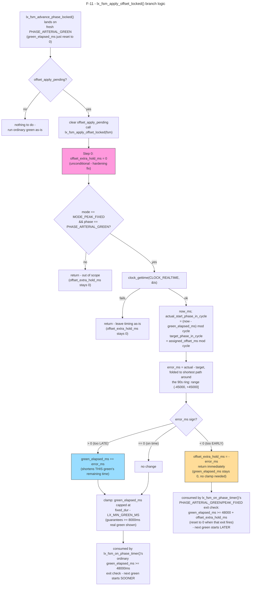

# F-11 — Green-Wave Phase-Realignment Math: Function-Level Flow

## What this feature does

`lx_fsm_apply_offset_locked()` (`app/intersection/src/lx_fsm.c`, around line 572) is the
arithmetic core that makes UC-03's arterial green-wave actually line up in real time. A
fresh `PHASE_ARTERIAL_GREEN` on a given Lx starts whenever that Lx's own six-phase cycle
happens to land there — nothing synchronises the exact wall-clock instant across
independently-running Lx processes. That start can therefore be slightly early or slightly
late relative to the coordinated offset (`fsm->assigned_offset_ms`) that C1 assigned this
controller via `MSG_SET_TIMING_PROFILE` (see `UC-03-coordinate-arterial-traffic-
progression.md`). This function reads the real wall clock once, computes the signed error
between where this green actually started and where the plan says it should have started,
and nudges the timing of *this* green so the *next* one drifts toward the assigned offset —
never by truncating time already shown.

## Entry point

The one and only call site is inside `lx_fsm_advance_phase_locked()`
(`app/intersection/src/lx_fsm.c`, around line 228), specifically its shared tail after the
big phase-transition `switch` has already decided the new `fsm->phase` and reset
`fsm->green_elapsed_ms = 0` (around line 339):

```c
fsm->green_elapsed_ms = 0;
if (fsm->phase == PHASE_ARTERIAL_GREEN && fsm->offset_apply_pending) {
    fsm->offset_apply_pending = 0;
    lx_fsm_apply_offset_locked(fsm);
}
```

(around lines 339–346). This guard fires exactly once per accepted profile: it only runs
when the phase the state machine just landed on is `PHASE_ARTERIAL_GREEN` **and** a profile
is still waiting to be applied. `offset_apply_pending` is set exactly once, by
`lx_fsm_on_set_timing_profile()` (around line 686) when C1's offset is accepted, and cleared
here, immediately before the call, so a second fresh arterial green later in the same run
does not re-apply a stale correction. Because `green_elapsed_ms` has already been reset to 0
on this exact line before the call, this is provably a "safe phase boundary" — the function
can never observe or touch a green phase that has already shown real time to traffic. This
is why the fix is described as deferred in both functions' doc comments: an earlier version
called the offset math directly from `lx_fsm_on_set_timing_profile()`, which could nudge
(or nearly zero out) the *remaining* time of whatever green happened to already be running.

## Function call chain / algorithm trace

All of the following happens inside one call, under `fsm->lock` (already held by the
caller — `lx_fsm_apply_offset_locked()` takes no lock itself and is `static`, callable only
from within this file).

**Step 0 — unconditional reset (the hardening fix).** The very first line of the function,
before any other check, is:

```c
fsm->offset_extra_hold_ms = 0;
```

(around line 587). The doc comment above the function calls this out explicitly as an
"audit hardening" fix: it is reset here, before either of the two early returns below, so
that "no stale `offset_extra_hold_ms` can ever survive a call to this function" is a real
invariant of *this function*, not an accident of how its one current caller happens to
sequence things today. Without this, a value set by a previous "started too early"
correction could theoretically survive into a later, unrelated green if some future code
path called this function again without an intervening consumption — the reset makes that
impossible by construction, regardless of call order elsewhere.

**Step 1 — scope guard.** (around line 589)

```c
if (fsm->mode != MODE_PEAK_FIXED || fsm->phase != PHASE_ARTERIAL_GREEN) {
    return;
}
```

Green-wave offsets are only meaningful for the fixed 90 s `MODE_PEAK_FIXED` cycle —
`MODE_OFF_PEAK_SENSOR` has no fixed cycle length for an offset to be relative to, by
explicit scope decision. The `phase` check is defensive (always true at the one call site
today, since the caller just tested the same condition) rather than load-bearing.

**Step 2 — read the wall clock.** (around line 592)

```c
if (clock_gettime(CLOCK_REALTIME, &ts) != 0) {
    return; /* no clock available - leave timing exactly as-is */
}
```

This is `CLOCK_REALTIME`, deliberately not `CLOCK_MONOTONIC` — the doc comment explains why:
independently-started Lx processes only share a common time reference through the epoch; a
monotonic clock's zero point is per-process/per-boot and useless for comparing across nodes.
Per the task's cross-check: this is the only `clock_gettime()` call anywhere in
`app/intersection`/`app/railway`. A second wall-clock *read* now exists in the same file —
`lx_fsm_local_clock_mode_check()` (around line 1257, DP-02's local-clock-fallback mode
selection, added this session) — but it uses a different API, `time(NULL)` +
`localtime_r()` (around lines 1272–1273), to get calendar hour-of-day for the peak/off-peak
schedule check, not `clock_gettime()`. So the codebase now has exactly two wall-clock read
call sites in these two trees, using two different POSIX time APIs for two different
purposes: `clock_gettime(CLOCK_REALTIME, ...)` here for sub-second offset arithmetic,
`time()`/`localtime_r()` there for hour-granularity schedule selection.

**Step 3 — reconstruct this green's actual start, mod the cycle.** (around lines 596–603)

```c
now_ms = (uint64_t)ts.tv_sec * 1000ULL + (uint64_t)(ts.tv_nsec / 1000000);
target_phase_in_cycle = (uint32_t)(fsm->assigned_offset_ms % LX_CYCLE_LENGTH_MS);
actual_start_phase_in_cycle =
    (uint32_t)(((now_ms % LX_CYCLE_LENGTH_MS) + LX_CYCLE_LENGTH_MS -
                (fsm->green_elapsed_ms % LX_CYCLE_LENGTH_MS)) % LX_CYCLE_LENGTH_MS);
```

`LX_CYCLE_LENGTH_MS` is `90000` (`app/intersection/includes/lx_timer.h`, around line 94:
48000 arterial-green + 4000 arterial-yellow + 2000 all-red + 30000 connector-green + 4000
connector-yellow + 2000 all-red, derived from the same constants used everywhere else so it
can never silently drift from them). `now_ms` is the current epoch time in whole
milliseconds. The general form this green's start is `now - green_elapsed_ms`; because
`green_elapsed_ms` is guaranteed to be `0` at the one real call site, this reduces to just
`now_ms` today, but the comment notes the general subtraction is kept "in case a future
caller applies this mid-phase again under some other safe condition." The extra `+
LX_CYCLE_LENGTH_MS` before the final `%` is there purely so the subtraction can never go
negative before the modulo is applied — the code deliberately avoids relying on unsigned
wraparound arithmetic "being correct" for a value that's about to be reinterpreted as a
signed error in the next step.

**Step 4 — signed, shortest-path-around-cycle error.** (around lines 605–610)

```c
error_ms = (int32_t)actual_start_phase_in_cycle - (int32_t)target_phase_in_cycle;
if (error_ms > (int32_t)(LX_CYCLE_LENGTH_MS / 2)) {
    error_ms -= (int32_t)LX_CYCLE_LENGTH_MS;
} else if (error_ms < -(int32_t)(LX_CYCLE_LENGTH_MS / 2)) {
    error_ms += (int32_t)LX_CYCLE_LENGTH_MS;
}
```

Both `actual_start_phase_in_cycle` and `target_phase_in_cycle` are positions on a 90 s
*ring*, not points on a line — position `89000` and position `1000` are only `2000 ms`
apart going "forward through zero," even though a naive subtraction would say `88000 ms`
apart. "Shortest-path-around-cycle" means: after the plain subtraction, if the result is
more than half a cycle (`45000 ms`) in either direction, it is folded back the other way
around the ring by adding or subtracting one full `LX_CYCLE_LENGTH_MS`. The result,
`error_ms`, is always in `(-45000, +45000]` and its *sign* is the actual verdict: positive
means this green's actual start was measured *after* (later than) the planned position on
the ring; negative means it was *before* (earlier than) planned.

**Step 5a — "started too late" branch.** (around lines 612–615)

```c
if (error_ms > 0) {
    fsm->green_elapsed_ms += (uint32_t)error_ms;
}
```

If this green started late, its remaining show time is directly shortened by the same
amount it was late by — added straight onto `green_elapsed_ms`, the exact same
tick-accumulator that `lx_fsm_on_phase_timer()` already compares against
`lx_timer_peak_green_duration_ms(PHASE_ARTERIAL_GREEN)` (`48000 ms`) every 100 ms tick (the
doc comment stresses this reuses the existing mechanism rather than adding a second timing
path). The correction is "spent" exactly once, here — not re-applied on every subsequent
tick. Making this green end sooner means the phase after it (yellow → all-red → connector
→ ... → the *next* arterial green) also starts sooner, pulling the next green's start
earlier, toward the plan.

**Step 5b — "started too early" branch (the documented past bug/fix).** (around lines
616–634)

```c
} else if (error_ms < 0) {
    fsm->offset_extra_hold_ms = (uint32_t)(-error_ms);
    return; /* nothing to clamp below - green_elapsed_ms is still 0 */
}
```

This is where the function's own comment documents a real, previously-shipped bug. The
symmetric-looking fix would be "subtract the delay from `green_elapsed_ms`" — but
`green_elapsed_ms` is `uint32_t` (unsigned) and is *always* `0` at this function's one call
site (just reset by the caller). `0 - delay` cannot represent negative elapsed time; the old
code's attempted subtraction always hit an implicit "clamp to 0" and was therefore a
complete no-op — every "started too early" case was silently uncorrectable, and only "too
late" ever actually worked. The fix: instead of trying to fake negative elapsed time on
*this* green, hold this green open `delay` ms *past* its ordinary `48000 ms` duration, via
a new field, `fsm->offset_extra_hold_ms` (`app/intersection/includes/lx_fsm.h`, around lines
222–233). That field is consumed exactly once, later, by `lx_fsm_on_phase_timer()`'s
`PHASE_ARTERIAL_GREEN` / `MODE_PEAK_FIXED` exit check:

```c
if (fsm->green_elapsed_ms >= lx_timer_peak_green_duration_ms(fsm->phase) + fsm->offset_extra_hold_ms) {
    fsm->offset_extra_hold_ms = 0;
    lx_fsm_advance_phase_locked(fsm);
}
```

(`app/intersection/src/lx_fsm.c`, around lines 1049–1052) — the exit threshold is the
ordinary fixed duration *plus* the extra hold, and the field is zeroed the moment that exit
actually fires, so it can only ever affect the one green it was computed for. This branch
also `return`s immediately (around line 633) — there is nothing to clamp in Step 6 below,
since `green_elapsed_ms` is still `0` in this branch by construction.

**Step 6 — `LX_MIN_GREEN_MS` floor-clamp (too-late branch only).** (around lines 636–654)

```c
fixed_dur = lx_timer_peak_green_duration_ms(fsm->phase);
if (fixed_dur > 0) {
    uint32_t max_elapsed_after_correction =
        (fixed_dur > LX_MIN_GREEN_MS) ? (fixed_dur - LX_MIN_GREEN_MS) : 0;
    if (fsm->green_elapsed_ms > max_elapsed_after_correction) {
        fsm->green_elapsed_ms = max_elapsed_after_correction;
    }
}
```

`error_ms` in the "too late" branch can be as large as just under half the cycle
(`~45000 ms`), which — added straight onto `green_elapsed_ms` — could push it to within a
second or two of the fixed `48000 ms` duration, technically correct per the wall-clock math
but leaving almost no real green time visible before the very next 100 ms tick fires the
exit. This clamp guarantees at least `LX_MIN_GREEN_MS` (`8000 ms`,
`app/intersection/includes/lx_timer.h`, around line 31 — the same floor OFF_PEAK_SENSOR
already uses for its own minimum-green guard, re-purposed here as a universal "never show a
token green" floor) of real green always remains after any correction is applied. Note this
clamp is unreachable in the "too early" branch, which already returned above with
`green_elapsed_ms` untouched at `0`.

## Cross-node view

This function makes no IPC call and crosses no Qnet boundary itself — it is pure, local
arithmetic over already-in-memory FSM state, running under `fsm->lock` on whichever thread
called `lx_fsm_advance_phase_locked()` (the server thread, via the phase-timer pulse path).
The one external input it depends on, `fsm->assigned_offset_ms`, was written earlier and
separately by `lx_fsm_on_set_timing_profile()` (around line 680) when a
`MSG_SET_TIMING_PROFILE` request from C1 was accepted — see
`UC-03-coordinate-arterial-traffic-progression.md` steps 9–11 for the full cross-node trace
of how that offset got here (chain lookup, `c_mode_eng_build_timing_profile()`, the
`MSG_SET_TIMING_PROFILE` wire message, `PA-09`'s `offset_ms >= LX_CYCLE_LENGTH_MS` bound
check). This document picks up exactly where that one only mentions the offset math in
passing (its step 13), and does not repeat any of the IPC/broadcast material already
covered there.

## System-level summary diagram


