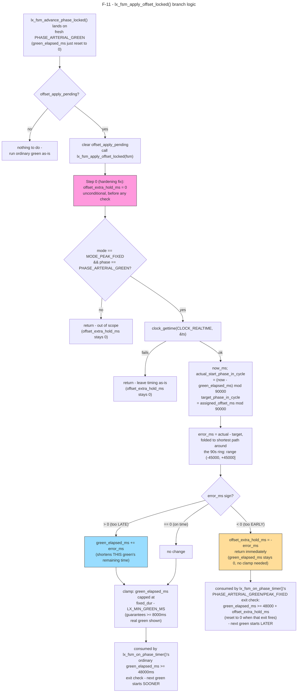

# F-11 — Green-Wave Phase-Realignment Math

**Trigger:** fresh `PHASE_ARTERIAL_GREEN` entry inside `lx_fsm_advance_phase_locked()`, when `offset_apply_pending` is set
**Scope:** single-node, pure arithmetic in `lx_fsm_apply_offset_locked()` under `fsm->lock` — no IPC; consumes an offset previously delivered by UC-03
**Spec:** F-11 deep-dive · `app/intersection/src/lx_fsm.c` around line 572 · rules TC-02, TC-03

## Code map

| Step | File : Function |
|---|---|
| Guard + call site | `lx_fsm.c : lx_fsm_advance_phase_locked()` (~line 339) |
| Offset math (this doc) | `lx_fsm.c : lx_fsm_apply_offset_locked()` (~line 572, static, no lock of its own) |
| Offset producer | `lx_fsm.c : lx_fsm_on_set_timing_profile()` (~line 686) — sets `assigned_offset_ms` + `offset_apply_pending` on accepted `MSG_SET_TIMING_PROFILE` |
| Extra-hold consumer | `lx_fsm.c : lx_fsm_on_phase_timer()` (~line 1049) |
| Cycle/floor constants | `lx_timer.h` — `LX_CYCLE_LENGTH_MS` (~line 94), `LX_MIN_GREEN_MS` (~line 31) |

## Key fields

| Field | Type | Role |
|---|---|---|
| `fsm->assigned_offset_ms` | `uint32_t` | Target ring position (mod 90000), set by C1 via UC-03 |
| `fsm->offset_apply_pending` | flag | One-shot: apply correction on the next fresh arterial green only |
| `fsm->green_elapsed_ms` | `uint32_t` | Tick accumulator; directly shortened in the "too late" branch |
| `fsm->offset_extra_hold_ms` | `uint32_t` | One-shot extra hold for the "too early" branch; unconditionally zeroed at function entry (hardening fix) |
| `LX_CYCLE_LENGTH_MS` | const = 90000 | Full `MODE_PEAK_FIXED` cycle length (ring size for the error calc) |
| `LX_MIN_GREEN_MS` | const = 8000 | Floor clamp — minimum real green guaranteed after any "too late" correction |

## Cross-node view

Single-node and IPC-free: everything above runs on one thread, under `fsm->lock`,
as pure arithmetic over state already in memory. The only external input,
`fsm->assigned_offset_ms`, was written earlier by `lx_fsm_on_set_timing_profile()`
when C1's `MSG_SET_TIMING_PROFILE` was accepted — see
`UC-03-coordinate-arterial-traffic-progression.md` (steps 9–11) for that IPC trace.
This document starts exactly where that one leaves off.
