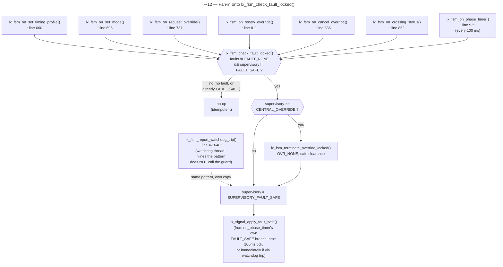
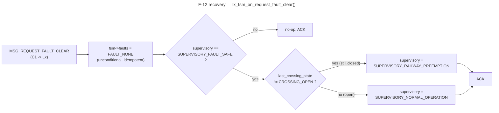

# F-12 — Intersection Local Fault-Safe Supervisory Override (SC-03A): Function-Level Flow

## What this feature does

`STATE_CHARTS.md` SC-03A (section 4.1.5) defines four supervisory
conditions at an intersection — `NORMAL_OPERATION`, `CENTRAL_OVERRIDE`,
`RAILWAY_PREEMPTION`, `FAULT_SAFE` — and states plainly that "local fault
protection has the highest authority, followed by railway pre-emption, a
validated Central override, and normal Peak or Off-Peak operation." Every
one of SC-03A's three `--> FAULT_SAFE` edges (from `NORMAL_OPERATION`,
`CENTRAL_OVERRIDE`, and `RAILWAY_PREEMPTION`) collapses, in code, onto one
guard function — `lx_fsm_check_fault_locked()` (`app/intersection/src/lx_fsm.c`
around line 60) — called at the top of essentially every event this FSM
can receive. `system_assumptions_tables.md` PA-10 is the higher-level
promise this guard exists to keep: "a controller or supervised-process
fault affects only the owning location, whose watchdog forces the
documented safe outputs" — one local failure must not cascade, and it must
win immediately, not eventually. This is infrastructure, not one of the 10
formally-specified use cases: `usecase.md` never names it directly, but
UC-05 through UC-08 (and, via the phase timer, every use case at all) are
all subject to it.

## Entry point

Not a single entry point. `lx_fsm_check_fault_locked()` is a **guard**
invoked from inside nearly every `lx_fsm_on_*()` verb handler and the
phase-timer pulse handler, always as the first statement after
`pthread_mutex_lock(&fsm->lock)`. Grepping `lx_fsm.c` for
`lx_fsm_check_fault_locked(fsm)` finds exactly **7 call sites**, each the
first line of its function body:

| # | Calling function | Call site (`lx_fsm.c`) | Triggering verb / pulse |
|---|---|---|---|
| 1 | `lx_fsm_on_set_timing_profile()` | around line 660 | `MSG_SET_TIMING_PROFILE` (TC-02/TC-03) |
| 2 | `lx_fsm_on_set_mode()` | around line 695 | `MSG_SET_MODE` (UC-07) |
| 3 | `lx_fsm_on_request_override()` | around line 737 | `MSG_REQUEST_OVERRIDE` (UC-08) |
| 4 | `lx_fsm_on_renew_override()` | around line 811 | `MSG_RENEW_OVERRIDE` (SC-03B) |
| 5 | `lx_fsm_on_cancel_override()` | around line 836 | `MSG_CANCEL_OVERRIDE` (SC-03B) |
| 6 | `lx_fsm_on_crossing_status()` | around line 852 | `MSG_CROSSING_STATUS` from an `RLx` (UC-04/UC-05/UC-06) |
| 7 | `lx_fsm_on_phase_timer()` | around line 935 | `IPC_PULSE_PHASE_TIMER`, every 100 ms (every use case, continuously) |

Two functions deliberately do **not** call it, and are not miscounted
call sites:

- **`lx_fsm_report_watchdog_trip()`** (`lx_fsm.c` around lines 473-485,
  called from `lx_watchdog.c`) inlines the *identical* three-line pattern
  (evict an active override, then set `SUPERVISORY_FAULT_SAFE`, then call
  `lx_signal_apply_fault_safe()`) directly, rather than calling
  `lx_fsm_check_fault_locked()`. Its own doc comment (lines 455-472)
  explains why: it runs on the watchdog thread specifically to catch the
  case where the server thread itself is hung and will never run any
  `lx_fsm_on_*()` handler again to notice the fault flag — a real
  dead-man's switch cannot depend on being invoked from the thing it is
  watching.
- **`lx_fsm_on_request_fault_clear()`** (around line 1291) is the
  *recovery* path out of `FAULT_SAFE`, traced separately below — it never
  calls the guard, since re-checking "is there still a fault" the instant
  after clearing `fsm->faults` would be a no-op by construction.

The sensor-input setters (`lx_fsm_set_arterial_vehicle_demand()`,
`lx_fsm_set_connector_vehicle_demand()`, `lx_fsm_latch_pedestrian_request()`,
`lx_fsm_set_queue_warning()`) also skip it, per `lx_fsm.h`'s own comment
(around lines 248-256): they have no `ipc_reply_t` and no supervisory-state
side effects, so there is nothing for the guard to protect there.

## Function call chain

### The guard itself — `lx_fsm_check_fault_locked()` (`lx_fsm.c` lines 60-68)

```c
static void lx_fsm_check_fault_locked(lx_fsm_t *fsm)
{
    if (fsm->faults != FAULT_NONE && fsm->supervisory != SUPERVISORY_FAULT_SAFE) {
        if (fsm->supervisory == SUPERVISORY_CENTRAL_OVERRIDE) {
            lx_fsm_terminate_override_locked(fsm);
        }
        fsm->supervisory = SUPERVISORY_FAULT_SAFE;
    }
}
```

Three things happen, strictly in this order, and only when both
conditions on the `if` are true:

1. **Condition:** `fsm->faults != FAULT_NONE` (the watchdog, via
   `lx_fsm_report_watchdog_trip()`, is the only writer of this field —
   see `lx_fsm.h` around line 275) **and** `fsm->supervisory !=
   SUPERVISORY_FAULT_SAFE`. The second half of the condition is what
   makes every one of the 7 call sites above safe to call unconditionally
   on *every* event, including every 100 ms phase-timer tick while a
   fault is already active: once the transition below has happened once,
   every subsequent call is a no-op instead of re-doing the work (and,
   before this guard existed as idempotent, re-logging) every tick.
2. **Evict an active override first, before entering `FAULT_SAFE`:** if
   `fsm->supervisory == SUPERVISORY_CENTRAL_OVERRIDE`, call
   `lx_fsm_terminate_override_locked(fsm)` (`lx_fsm.c` lines 205-217) —
   this sets `override_substate = OVR_NONE`, zeroes
   `override_remaining_ms`, calls `lx_signal_show_override_clearance()`,
   and would flip `supervisory` back to `NORMAL_OPERATION`, except the
   very next line immediately overwrites `supervisory` again anyway. The
   doc comment above `lx_fsm_check_fault_locked()` (lines 50-58) calls
   this a "compliance-audit fix": entering `FAULT_SAFE` from
   `CENTRAL_OVERRIDE` must terminate the override through its own safe
   clearance first, per SC-03A's edge label ("cancel or terminate
   override, apply safe outputs") — otherwise the override would silently
   resume, unterminated, the instant the fault later clears, violating
   the "never automatically resumes" rule SC-03A's note already states
   for a railway-interrupted override.
3. **Set `fsm->supervisory = SUPERVISORY_FAULT_SAFE`** (line 66) —
   unconditionally the terminal branch; there is no path out of this `if`
   block that leaves `supervisory` at anything else.

Note what the guard does **not** do: it never calls
`lx_signal_apply_fault_safe()` itself. That call is made separately, only
from inside `lx_fsm_on_phase_timer()`'s own `if (fsm->supervisory ==
SUPERVISORY_FAULT_SAFE)` branch (around line 937-941, re-applied on every
100 ms tick for as long as the fault persists) and from
`lx_fsm_report_watchdog_trip()`'s inlined copy of the pattern (line 482,
called once, at the moment of the trip). The other 6 call sites reach
`FAULT_SAFE` state but rely on the very next phase-timer tick (at most
100 ms later) to actually apply the printed safe-output action.

### Recovery — `lx_fsm_on_request_fault_clear()` (`lx_fsm.c` around lines 1291-1319)

This is the `MSG_REQUEST_FAULT_CLEAR` verb handler (C1 → Lx), and per its
doc comment in `lx_fsm.h` (around lines 343-353) it used to be
`lx_fsm_local_fault_clear()`, "a function nothing ever called" — a
**test-plan finding**: an `Lx` that entered `FAULT_SAFE` (e.g. via a
watchdog trip) had no way back to `NORMAL_OPERATION` short of a process
restart, because nothing in the codebase invoked it. Wiring it up to the
real wire verb closed that gap. Its body:

1. Takes `fsm->lock`, sets `reply->reason = NACK_REASON_NONE`.
2. Unconditionally clears `fsm->faults = FAULT_NONE` — clearing is
   idempotent and always ACKs; there is no physical actuator to
   re-verify here (unlike `RLx`'s gate-aware equivalent,
   `rlx_fsm_on_fault_clear()`).
3. **Only if** `fsm->supervisory == SUPERVISORY_FAULT_SAFE` (i.e. it is a
   no-op if some other handler already changed supervisory away from
   `FAULT_SAFE`, which cannot actually happen given the guard's own
   idempotence, but is checked defensively), decide which state to
   resume into:

   ```c
   fsm->supervisory = (fsm->last_crossing_state != CROSSING_OPEN)
                           ? SUPERVISORY_RAILWAY_PREEMPTION
                           : SUPERVISORY_NORMAL_OPERATION;
   ```

4. Always replies `RESULT_ACK`.

**Why `last_crossing_state` and not an unconditional resume to
`NORMAL_OPERATION`:** this field's full doc comment in `lx_fsm.h` (around
lines 152-167) documents its own **re-audit fix** history. Before
`lx_fsm_on_request_fault_clear()` existed, `lx_fsm_on_crossing_status()`
already only updated `fsm->supervisory` while *not* already
`SUPERVISORY_FAULT_SAFE` — a `CROSSING_STATUS` report arriving mid-fault
was otherwise dropped entirely, and that was harmless at the time because
`FAULT_SAFE` had no recovery path at all, so there was nothing to resume
incorrectly. Once a real recovery path was added, an unconditional
"clear fault → always go to `NORMAL_OPERATION`" would have silently
forgotten an active railway closure that started before, or during, the
fault: green could then be served toward a crossing that is still
physically closed — a genuine safety bug, not a cosmetic one. The fix is
two-part and lives in two different functions:

- `lx_fsm_on_crossing_status()` (around line 852) was changed to record
  `fsm->last_crossing_state = (crossing_state_t)payload->state;`
  **unconditionally**, every time a `CROSSING_STATUS` report arrives,
  *before* the `if (fsm->supervisory != SUPERVISORY_FAULT_SAFE)` guard
  that decides whether to actually change `supervisory` — so the last
  known crossing state stays current even while faulted, even though
  supervisory itself stays pinned at `FAULT_SAFE`.
- `lx_fsm_on_request_fault_clear()` then reads that field at clear time
  to pick `SUPERVISORY_RAILWAY_PREEMPTION` over
  `SUPERVISORY_NORMAL_OPERATION` whenever the crossing was last reported
  anything other than `CROSSING_OPEN`. The doc comment notes the only
  other supervisory value that could otherwise be lost,
  `SUPERVISORY_CENTRAL_OVERRIDE`, is not a real case here — an active
  override is already always terminated (via
  `lx_fsm_terminate_override_locked()`) before `FAULT_SAFE` is ever
  entered, per the guard traced above — so `RAILWAY_PREEMPTION` is the
  only real fallback state to reconstruct.

## Cross-node view

Purely local, exactly as PA-10 states: "a controller or supervised-process
fault affects only the owning location." `lx_fsm_check_fault_locked()`
never sends anything and never reads anything from another node — its
only inputs are `fsm->faults` (written solely by
`lx_fsm_report_watchdog_trip()`, itself driven by `lx_watchdog.c` polling
a purely local tick counter) and `fsm->supervisory`. No message from `C1`
or any `RLx` can suppress, delay, or override this guard; SC-03A's own
text is explicit that "no Central command may bypass railway or
pedestrian safety constraints (PA-09, PA-10)."

The resulting `FAULT_SAFE` state does surface outward, but only
passively and only afterward: `lx_fsm_fill_status()` (`lx_fsm.c` around
line 1196) packs `fsm->supervisory` into `status->supervisory_state` on
every outgoing `STATUS`/`HEARTBEAT` report, so `C1` and the operator
console learn about a fault only via the next scheduled 1 s heartbeat —
never as a synchronous side effect of the fault itself. There is no
push/interrupt path from `Lx` to `C1` dedicated to fault entry; it rides
the same periodic reporting channel as everything else UC-09 already
covers.

## System-level summary diagram

Fan-in: 7 real call sites (plus one function that inlines the same
pattern independently) converge on one guard, which can only ever produce
one of two outcomes.



Recovery: one field, `last_crossing_state`, decides which of two states
`lx_fsm_on_request_fault_clear()` resumes into.



Without the `last_crossing_state` check, every fault-clear would resume
`NORMAL_OPERATION` unconditionally — silently forgetting an active
railway closure that began before or during the fault, and admitting a
connector-facing green toward a crossing that may still be physically
closed.
