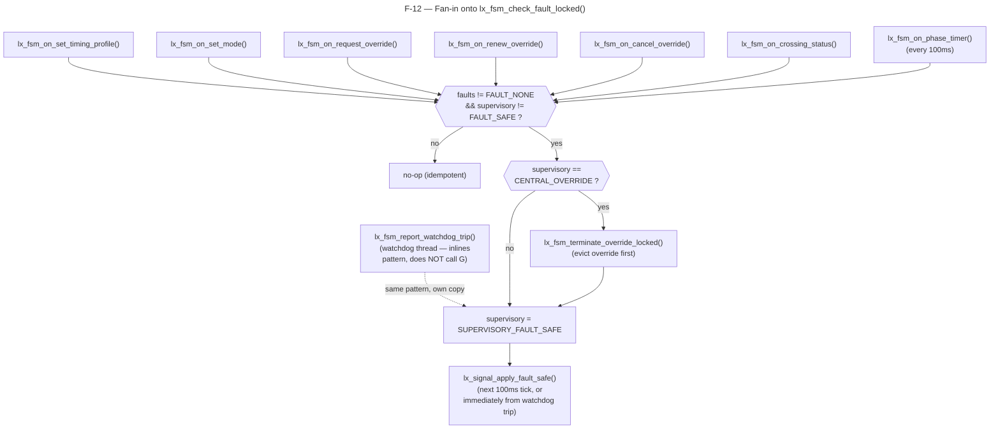
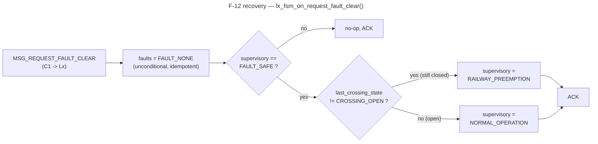

# F-12 — Intersection Local Fault-Safe Supervisory Override (SC-03A): Function-Level Flow

**Trigger:** fan-in guard `lx_fsm_check_fault_locked()`, called as the first statement (after lock) in 7 handlers: `lx_fsm_on_set_timing_profile`, `lx_fsm_on_set_mode`, `lx_fsm_on_request_override`, `lx_fsm_on_renew_override`, `lx_fsm_on_cancel_override`, `lx_fsm_on_crossing_status`, `lx_fsm_on_phase_timer` — plus `lx_fsm_report_watchdog_trip()`, which inlines the same 3-line pattern separately (runs on the watchdog thread, not the server thread)
**Scope:** single-node — `lx_main` only, no Central, no Railway, no Qnet message (PA-10)
**Spec:** `STATE_CHARTS.md` SC-03A · `system_assumptions_tables.md` PA-10 · feature F-12

Idempotent by design: the `supervisory != FAULT_SAFE` half of the guard condition means every one of the 7 call sites can run it unconditionally on *every* event, including every phase-timer tick while already faulted, without re-doing work.

### Recovery — `lx_fsm_on_request_fault_clear()`

`MSG_REQUEST_FAULT_CLEAR` (C1 → Lx) is the only way out of `FAULT_SAFE`; `last_crossing_state` decides which state it resumes into.

Without `last_crossing_state`, fault-clear would always resume `NORMAL_OPERATION` — silently forgetting a railway closure that began during the fault and admitting green toward a still-closed crossing.

## Code map

| # | Function | File : line | Path |
|---|---|---|---|
| 1 | `lx_fsm_on_set_timing_profile()` | `lx_fsm.c` ~660 | fan-in call site |
| 2 | `lx_fsm_on_set_mode()` | `lx_fsm.c` ~695 | fan-in call site |
| 3 | `lx_fsm_on_request_override()` | `lx_fsm.c` ~737 | fan-in call site |
| 4 | `lx_fsm_on_renew_override()` | `lx_fsm.c` ~811 | fan-in call site |
| 5 | `lx_fsm_on_cancel_override()` | `lx_fsm.c` ~836 | fan-in call site |
| 6 | `lx_fsm_on_crossing_status()` | `lx_fsm.c` ~852 | fan-in call site; also unconditionally records `last_crossing_state` |
| 7 | `lx_fsm_on_phase_timer()` | `lx_fsm.c` ~935 | fan-in call site; also applies `lx_signal_apply_fault_safe()` each tick while faulted |
| — | `lx_fsm_check_fault_locked()` | `lx_fsm.c` 60-68 | the guard itself |
| — | `lx_fsm_report_watchdog_trip()` | `lx_fsm.c` 473-485 | separate path, inlines same pattern, watchdog thread |
| — | `lx_fsm_on_request_fault_clear()` | `lx_fsm.c` ~1291 | recovery path, never calls the guard |

## Cross-node view

Local per PA-10 — `lx_fsm_check_fault_locked()` sends nothing and reads only `fsm->faults`/`fsm->supervisory`; no `C1` or `RLx` message can suppress or delay it. The resulting `FAULT_SAFE` state surfaces only passively, via `fsm->supervisory` packed into the next outbound `STATUS`/`HEARTBEAT` report (`lx_fsm_fill_status()`) — no dedicated push path exists.
