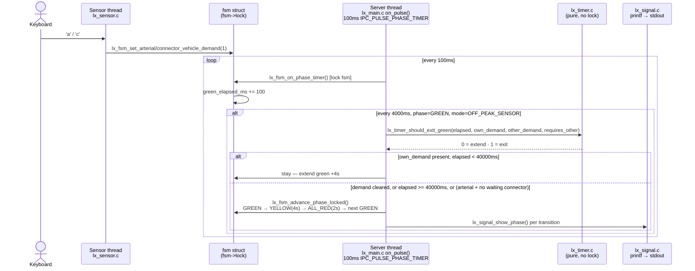

# UC-01 — Serve Vehicle Demand

**Trigger:** keypress `a`/`c` (arterial/connector vehicle present), cleared by `A`/`C`
**Scope:** single-node — `lx_main` only, no Central, no Railway, no Qnet message
**Spec:** `usecase.md` UC-01 · `SEQUENCE_DIAGRAMS.md` SD-01 · rules TL-01, TL-03, DP-04, DP-06, PA-04

Constants (`lx_timer.h`): `LX_MIN_GREEN_MS=8000` · `LX_MAX_GREEN_MS=40000` · `LX_EXTENSION_MS=4000` · `LX_YELLOW_MS=4000` · `LX_ALL_RED_MS=2000`.
Anti-starvation (DP-06/BR-4): arterial's exit guard takes `requires_other_demand=1` (won't yield without a real waiting connector); connector's takes `0` (no such requirement — arterial gets green again next cycle regardless).

## Code map

| Step | File : Function |
|---|---|
| Keypress → flag | `lx_sensor.c : lx_sensor_reader_thread()` → `lx_fsm.c : lx_fsm_set_{arterial,connector}_vehicle_demand()` |
| 100ms tick | `lx_main.c : on_pulse()` (`IPC_PULSE_PHASE_TIMER`) → `lx_fsm.c : lx_fsm_on_phase_timer()` |
| Exit decision | `lx_timer.c : lx_timer_should_exit_green()` |
| Phase change + output | `lx_fsm.c : lx_fsm_advance_phase_locked()` → `lx_signal.c : lx_signal_show_phase()` |

Two threads, one lock, zero IPC: the **sensor thread** only ever writes the
demand flag; the **server thread** (driven by the 100ms pulse) does every
other step. They share nothing but `fsm->lock`. The **client thread** takes
no part — it only ever carries outbound traffic to Central, none of which
this feature touches.

## Cross-node view

Single-node by construction — matches SD-01, whose only participants are
`Vehicle`, `Approach Sensor`, `Intersection Controller`, `Vehicle Signals`.
No `SET_MODE`/`HEARTBEAT`/`CROSSING_STATUS` or any other wire verb appears
in this path; Central never decides `PEAK_FIXED` vs `OFF_PEAK_SENSOR`
phase timing for a single demand event.
