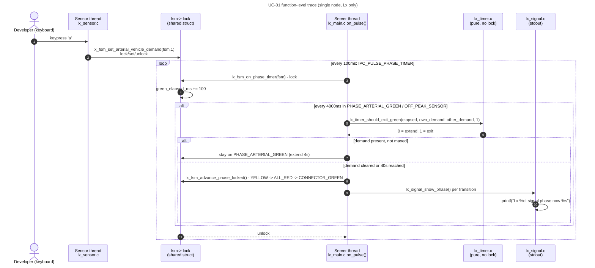

# UC-01 — Serve Vehicle Demand: Function-Level Flow

## What this feature does

`usecase.md` section 3.2.1 (UC-01 — Serve Vehicle Demand) states the goal as
serving arterial and connector traffic "safely according to the active
normal operating mode": fixed phase timing in `PEAK_FIXED`, detected demand
in `OFF_PEAK_SENSOR`. This document traces the `OFF_PEAK_SENSOR` path, since
that is the branch where a vehicle-presence keypress actually changes
behaviour (in `PEAK_FIXED`, UC-01's alt-flow 2.1 says "ordinary presence
sensors do not alter the fixed phase duration"). The business rules realised
here are **BR-1/TL-01** (4 s yellow + 2 s all-red clearance on every
conflicting transition), **BR-2/TL-01/TL-03** (green stays between 8 s and
40 s, extending only in 4 s increments), **BR-3/DP-04** (with no demand,
the system rests on the arterial phase), **BR-4/DP-06** (a latched connector
demand is never starved past one further arterial session), and
**BR-5/PA-04** (ordinary presence demand only affects phase selection in
`OFF_PEAK_SENSOR`). It also matches `SEQUENCE_DIAGRAMS.md`'s **SD-01 — Serve
Off-Peak Vehicle Demand**, which is explicitly the diagram that "realises
UC-01".

## Entry point

The simulated sensor input is a single keypress read on stdin by
`lx_sensor_reader_thread()` in `app/intersection/src/lx_sensor.c` (function
starts around line 28). Pressing **`a`** (arterial approach: vehicle
present) hits the `case 'a':` branch (around line 42) and calls
`lx_fsm_set_arterial_vehicle_demand(fsm, 1)`. The connector-side equivalent
is **`c`** (around line 48), calling
`lx_fsm_set_connector_vehicle_demand(fsm, 1)`. `A`/`C` clear the same flags
(`present = 0`). This thread is started from `app/intersection/src/lx_main.c`
around line 161 (`pthread_create(&sensor_tid, NULL,
lx_sensor_reader_thread, &ctx.fsm)`), i.e. it runs as its own dedicated
**sensor thread**, separate from the server and client IPC threads — the
comment in `lx_sensor.c` (around line 13) notes this is required because a
blocking `scanf()` on stdin cannot share the server or client thread.

## Function call chain

1. **Sensor thread** — `lx_sensor_reader_thread()` in `lx_sensor.c` blocks
   on `scanf(" %c", &input)` (around line 36). On key `'a'` it calls
   `lx_fsm_set_arterial_vehicle_demand(fsm, 1)` (declared
   `app/intersection/includes/lx_fsm.h` around line 259, defined
   `app/intersection/src/lx_fsm.c` around line 407).

2. **Sensor thread, inside `lx_fsm_set_arterial_vehicle_demand()`**
   (`lx_fsm.c` lines 407-412) — takes `fsm->lock`
   (`pthread_mutex_lock(&fsm->lock)`), sets
   `fsm->arterial_vehicle_demand = 1`, then unlocks. This setter is
   intentionally minimal: per the doc comment in `lx_fsm.h` (around line
   248-256), sensor-input setters never touch supervisory state and never
   call `lx_fsm_check_fault_locked()` — they only record the raw input. The
   connector key `'c'` follows the identical pattern through
   `lx_fsm_set_connector_vehicle_demand()` (`lx_fsm.c` lines 414-419),
   setting `fsm->connector_vehicle_demand`.

3. **Server thread** (a completely different thread — see below) —
   `app/intersection/src/lx_main.c`'s `main()` arms a 100 ms repeating pulse,
   `IPC_PULSE_PHASE_TIMER`, via `ipc_timer_arm(chid, IPC_PULSE_PHASE_TIMER,
   100, 100, &phase_timer)` (around line 185). That pulse is delivered
   through `ipc_server_run(chid, on_request, on_pulse, &ctx)` (around line
   201, `app/shared/src/qnet_utils.c` line 278), which is the **server
   thread**'s only loop — the same thread that calls `MsgReceive()` for
   every request, per `app/shared/README.md`'s "every node runs exactly 2
   dedicated IPC threads" pattern. On each `IPC_PULSE_PHASE_TIMER` pulse,
   `on_pulse()` (`lx_main.c` around line 80) hits `case
   IPC_PULSE_PHASE_TIMER:` (around line 85) and calls
   `lx_fsm_on_phase_timer(&ctx->fsm)`.

4. **Server thread, inside `lx_fsm_on_phase_timer()`** (`lx_fsm.c`, function
   starts around line 931) — takes `fsm->lock` immediately (line 933), then
   `lx_fsm_check_fault_locked(fsm)` (line 935; returns early to fault-safe
   output if a fault is latched — not relevant to this trace), then
   unconditionally accumulates `fsm->green_elapsed_ms += LX_PHASE_TICK_MS`
   (line 979, `LX_PHASE_TICK_MS == 100`, `lx_timer.h` line 53) and runs the
   pedestrian-service tick (line 985; independent of vehicle demand).

5. **Server thread, `switch (fsm->phase)` — `case PHASE_ARTERIAL_GREEN:`**
   (`lx_fsm.c` around line 1031) — because this trace assumes
   `fsm->mode == MODE_OFF_PEAK_SENSOR` (not `MODE_PEAK_FIXED`), control falls
   into the `else` branch at line 1053. Every 4000 ms
   (`fsm->green_elapsed_ms % LX_EXTENSION_MS == 0`, line 1062 —
   `LX_EXTENSION_MS == 4000`, `lx_timer.h` line 33) it computes:
   - `own_demand = fsm->arterial_vehicle_demand ||
     lx_fsm_arterial_ped_compatible_locked(fsm)` (line 1063) — this is the
     flag the sensor thread set in step 2.
   - `other_demand = fsm->connector_vehicle_demand ||
     lx_fsm_connector_ped_compatible_locked(fsm)` (line 1064).

6. **Server thread** calls `lx_timer_should_exit_green(fsm->green_elapsed_ms,
   own_demand, other_demand, /*requires_other_demand=*/1)` (line 1068,
   declared `lx_timer.h` line 117, defined `lx_timer.c`). This is a pure,
   lock-free function (no mutex — `lx_fsm.c` already holds `fsm->lock`
   around it):
   - Returns `0` (stay) unconditionally if `elapsed_ms < LX_MIN_GREEN_MS`
     (8000 ms) — BR-2/TL-01's 8 s floor.
   - Returns `0` if `requires_other_demand` is set and `other_demand` is
     false — this is **BR-4/DP-06**: arterial cannot yield without a real
     waiting connector request.
   - Otherwise returns `!own_demand || maxed`, where `maxed = elapsed_ms >=
     LX_MAX_GREEN_MS` (40000 ms) — BR-2/TL-01's 40 s ceiling. So: if the
     arterial's own demand (set by the `'a'` keypress) is still present and
     the phase isn't maxed out, the function returns `0` and the green is
     **extended** another 4 s increment (BR-2/TL-03) — this is the loop in
     SD-01 ("extend GREEN by 4 s"). If `'A'` had cleared the demand (or the
     40 s cap is hit), it returns `1`.

7. **Server thread** — if `lx_timer_should_exit_green()` returned `1`,
   `lx_fsm_on_phase_timer()` calls `lx_fsm_advance_phase_locked(fsm)` (line
   1069, function defined `lx_fsm.c` around line 228). This is where the
   phase actually changes: `PHASE_ARTERIAL_GREEN -> PHASE_ARTERIAL_YELLOW`
   (line 232). `fsm->green_elapsed_ms` resets to 0 (line 339), and the
   function calls `lx_signal_show_phase(fsm->self_id, fsm->phase)` (line
   347, declared `app/intersection/includes/lx_signal.h`, defined
   `app/intersection/src/lx_signal.c` lines 40-43) — a `printf("Lx %d:
   signal phase now %s\n", ...)`, the only observable output of a phase
   change in this PoC (stand-in for real GPIO/relay drive, per the file
   header comment in `lx_signal.c`).

8. The next two 100 ms ticks of `lx_fsm_on_phase_timer()` (still server
   thread) hit `case PHASE_ARTERIAL_YELLOW:` (line 1017) — once
   `green_elapsed_ms >= LX_YELLOW_MS` (4000 ms), calls
   `lx_fsm_advance_phase_locked()` again, moving to `PHASE_ALL_RED_A_TO_B`,
   again followed by a `lx_signal_show_phase()` print. Then `case
   PHASE_ALL_RED_A_TO_B:` (line 1024) — once `green_elapsed_ms >=
   LX_ALL_RED_MS` (2000 ms), `lx_fsm_advance_phase_locked()` runs its
   `PHASE_ALL_RED_A_TO_B` case (line 237): applies any pending mode switch,
   checks for an active override or `SUPERVISORY_RAILWAY_PREEMPTION` (both
   irrelevant to plain UC-01), then sets `fsm->phase = PHASE_CONNECTOR_GREEN`
   (line 294) and prints via `lx_signal_show_phase()` once more. This whole
   3-transition sequence (`ARTERIAL_GREEN -> YELLOW -> ALL_RED -> CONNECTOR_
   GREEN`) is exactly UC-01 main-flow steps 3-5 / BR-1's mandatory 4 s
   yellow + 2 s all-red clearance.

9. Once in `PHASE_CONNECTOR_GREEN`, the mirror-image logic runs at line
   1078 onward: `case PHASE_CONNECTOR_GREEN:` checks
   `MODE_OFF_PEAK_SENSOR`'s branch at line 1166, recomputing `own_demand =
   fsm->connector_vehicle_demand || lx_fsm_connector_ped_compatible_locked(fsm)`
   (line 1168) every 4 s and calling `lx_timer_should_exit_green(...,
   requires_other_demand=0)` (line 1175) — connector has no anti-starvation
   requirement on arterial demand, per BR-4/DP-06's asymmetry (arterial gets
   green again unconditionally next cycle). If demand is gone, connector
   exits back to `lx_fsm_advance_phase_locked()`, which returns the cycle to
   `PHASE_ARTERIAL_GREEN` (line 331) — the arterial "rest" state (BR-3/
   DP-04) if no new demand is pending, printed via `lx_signal_show_phase()`
   once more.

**Thread summary for this flow:** the keypress is captured and the demand
flag is written entirely on the **sensor thread** (step 1-2, protected by
`fsm->lock`); every subsequent decision — the 4 s recheck, the
`lx_timer_should_exit_green()` call, the phase transition, and the
`printf` actuation — runs entirely on the **server thread**, driven by the
100 ms `IPC_PULSE_PHASE_TIMER` pulse delivered through `ipc_server_run()`
(steps 3-9). The two threads only ever communicate through the single
`fsm->lock`-protected struct; there is no queue or message between them.
The **client thread** (`ipc_client_thread_main`, started `lx_main.c` around
line 155) plays no role in this feature at all — it only carries outbound
`MsgSend()` traffic to Central (`SET_TIMING_PROFILE`/`HEARTBEAT`/etc.),
none of which UC-01's vehicle-demand path touches.

## Cross-node view

**This feature is single-node.** Everything in the call chain above —
`lx_sensor.c` -> `lx_fsm.c` -> `lx_timer.c` -> `lx_signal.c` — executes
inside one `lx_main` process (one intersection controller, `L1`-`L6`), and
the only communication between its two threads is a mutex-protected struct
field, never an IPC message. Per `app/shared/README.md`'s "Why the scope is
cross-node only" section, verbs like ordinary vehicle presence never cross
a Qnet `MsgSend()`/`MsgReceive()` boundary — only `SET_TIMING_PROFILE`,
`SET_MODE`, `REQUEST_OVERRIDE`, `RENEW_OVERRIDE`, `CANCEL_OVERRIDE`,
`REQUEST_FAULT_CLEAR`, `HEARTBEAT` (Lx<->C1) and `CROSSING_STATUS` (RLx->Lx)
are shared-header wire verbs, and none of those appear anywhere in this
trace. Central (`c_main`) is not involved in selecting `PEAK_FIXED` vs.
`OFF_PEAK_SENSOR` phase timing for a given demand event, and no Railway
controller (`rlx_main`) message is read or written by this path (no
`SUPERVISORY_RAILWAY_PREEMPTION` branch is taken). This matches
`SEQUENCE_DIAGRAMS.md`'s SD-01 diagram, whose only participants are
`Vehicle`, `Approach Sensor`, `Intersection Controller`, and `Vehicle
Signals` — no Central or Railway lifeline appears in SD-01 either.

## System-level summary diagram

Zoomed all the way out: **keyboard -> sensor thread -> `fsm->lock` (shared
state, no IPC) -> server thread's 100 ms phase timer -> `lx_timer.c`'s pure
exit-guard -> `lx_fsm_advance_phase_locked()` -> `lx_signal.c`'s `printf`**.
No Central, no Railway controller, no Qnet message — the entire UC-01
demand path lives inside one `lx_main` process.
