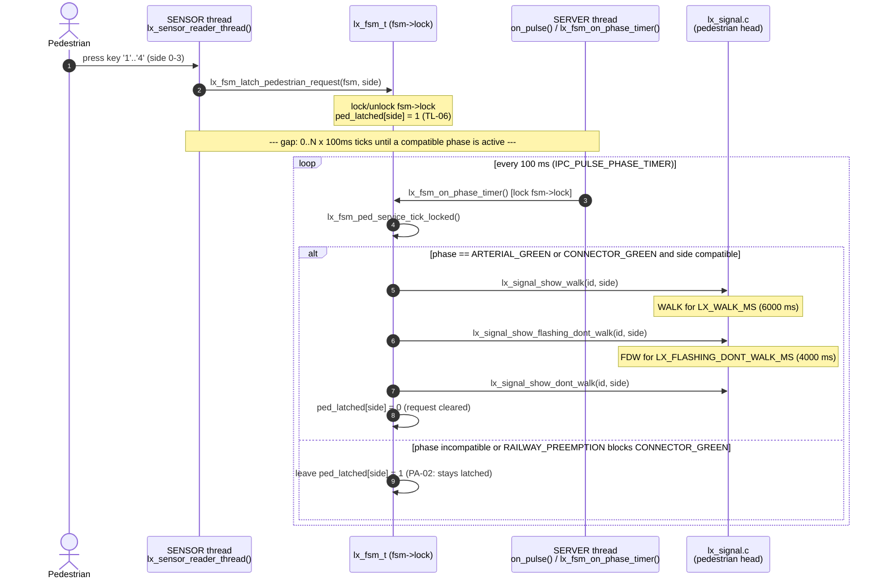

# UC-02 — Serve Pedestrian Crossing Request: Function-Level Flow

## What this feature does

Per `usecase.md` section 3.2.2 (UC-02), a pedestrian presses a crossing
push-button, the system latches exactly one pending request per side, and
that request is served with the next vehicle phase that does not conflict
with the crossing (`TL-05`, `TL-06`). Service always runs the complete
`WALK -> FLASHING_DONT_WALK -> DONT_WALK` sequence before any conflicting
vehicle movement can receive green (`TL-05`, `PA-03`), and a request that
cannot be served immediately (e.g. a railway restriction is in effect)
stays latched rather than being dropped (`PA-02`). This document traces
that behaviour through the actual `L1`-`L6` intersection-controller source
in `app/intersection/`.

## Entry point

The trigger is a keypress on the `lx_sensor_reader_thread()` stand-in for
the physical push-button, in
`app/intersection/src/lx_sensor.c` (around line 28). The thread blocks on
`scanf(" %c", &input)` (around line 36) and, for key `'1'`/`'2'`/`'3'`/`'4'`
(side 0-3, around lines 54-65), calls:

```c
lx_fsm_latch_pedestrian_request(fsm, side);
```

This is the single intra-process entry point into the FSM for a pedestrian
button event - `lx_fsm.h`'s "sensor-input setters" comment (around line
248) states `lx_sensor.c` must never touch `ped_latched[]` directly, only
call this setter.

## Function call chain

The button press and the actual `WALK` display are two separate events on
two separate threads, separated by however many 100 ms ticks it takes for
a compatible vehicle phase to come up. Both halves are numbered below.

### Half A — the press is latched (SENSOR thread, runs once, immediately)

1. **`lx_sensor_reader_thread()`** — `app/intersection/src/lx_sensor.c`
   around line 54-65. Runs on its own pthread (`sensor_tid`), started by
   `lx_main.c`'s `main()` around line 161
   (`pthread_create(&sensor_tid, NULL, lx_sensor_reader_thread, &ctx.fsm)`).
   Translates keypress `'1'..'4'` into a `side` value 0-3 and calls:
2. **`lx_fsm_latch_pedestrian_request(fsm, side)`** —
   `app/intersection/src/lx_fsm.c` around line 433-446. Takes `fsm->lock`
   itself (`pthread_mutex_lock(&fsm->lock)`, line 435) — this is the only
   lock touched by this half of the flow, and it is held only long enough
   to flip two flags:
   - If `side < 4` and that side is **not** currently mid-service
     (`ped_serving_mask` bit clear), sets `fsm->ped_latched[side] = 1`
     (line 443). Declared in `app/intersection/includes/lx_fsm.h` around
     line 107; per its comment this is one of "4 pedestrian-call sides,
     latched until served," and a repeated press for the same side is
     idempotent (`TL-06`, coalesces into the one pending request —
     `usecase.md` UC-02 alt-flow 2.1/2.2).
   - If the side's bit **is** already set in `ped_serving_mask` (a new
     press arrives while that side's `WALK`/`FLASHING_DONT_WALK` is
     already running), it instead sets `fsm->ped_recall[side] = 1` (line
     441) so the new call is not lost — `ped_recall[]` is documented in
     `lx_fsm.h` around line 108-120 as the "Verifier-audit fix" for this
     exact race.
   - Unlocks `fsm->lock` (line 445) and returns. Nothing is displayed yet.

At this point the request is durably recorded in `fsm` but no pedestrian
signal has changed. `lx_signal.c` has not been called.

### Half B — the request is served (SERVER thread, on a later 100 ms tick)

3. **`ipc_timer_arm(chid, IPC_PULSE_PHASE_TIMER, 100, 100, &phase_timer)`**
   — `app/intersection/src/lx_main.c` around line 185, armed once at
   startup on the main/server thread. It fires `IPC_PULSE_PHASE_TIMER`
   every 100 ms forever, independent of the button press.
4. **`ipc_server_run(chid, on_request, on_pulse, &ctx)`** —
   `lx_main.c` around line 201. This is the SERVER thread's blocking loop
   (`main()` never returns from it); it is the *only* code path allowed to
   call `MsgReceive()`/`MsgReply()` in this process (see the comment above
   it, line 198-200). Each `IPC_PULSE_PHASE_TIMER` pulse dispatches to:
5. **`on_pulse(IPC_PULSE_PHASE_TIMER, &ctx)`** — `lx_main.c` around line
   80-93 (case at line 85). Calls:
6. **`lx_fsm_on_phase_timer(&ctx->fsm)`** — `app/intersection/src/lx_fsm.c`
   around line 931. Runs on the SERVER thread, takes `fsm->lock` for the
   whole tick (line 933, unlocked before each return). After the
   fault-safe check (line 935-942) and override-expiry bookkeeping, it
   unconditionally calls:
7. **`lx_fsm_ped_service_tick_locked(fsm)`** — `app/intersection/src/lx_fsm.c`
   line 985 (called from inside `lx_fsm_on_phase_timer()`, already holding
   `fsm->lock` — this is a `_locked` helper, it takes no lock of its own).
   Defined at line 129-195. This is where `TL-05`/`TL-06`/UC-02's
   sequencing actually lives:
   - **If no sequence is running** (`fsm->ped_phase == PED_PHASE_NONE`,
     line 133): checks which sides are compatible with the *currently
     active vehicle phase* using the two compatibility helpers:
     - **`lx_fsm_arterial_ped_compatible_locked(fsm)`** — line 78-81,
       returns true if `ped_latched[0] || ped_latched[1]` (sides 0/1 cross
       the connector roadway, so they are compatible with
       `PHASE_ARTERIAL_GREEN`).
     - **`lx_fsm_connector_ped_compatible_locked(fsm)`** — line 85-88,
       mirror for `ped_latched[2] || ped_latched[3]` against
       `PHASE_CONNECTOR_GREEN`.
     - These are inlined directly in `lx_fsm_ped_service_tick_locked()`'s
       own `if (fsm->phase == PHASE_ARTERIAL_GREEN)` /
       `else if (fsm->phase == PHASE_CONNECTOR_GREEN)` branches
       (lines 136-142) to build `compatible_mask`.
     - If `compatible_mask != 0`: sets `ped_serving_mask = compatible_mask`,
       `ped_phase = PED_PHASE_WALK`, `ped_phase_elapsed_ms = 0`, and
       `ped_clearance_active = 1` (lines 145-150 — this last flag is what
       makes a Central override wait behind an in-progress crossing,
       `PA-03`/UC-08 alt-flow 3.1). Then, for every side in the mask:
8. **`lx_signal_show_walk(fsm->self_id, side)`** —
   `app/intersection/src/lx_signal.c` line 55-58 (called at line 153 of
   `lx_fsm.c`, inside the `for` loop over sides). This is the first
   *observable* pedestrian output: `WALK` is displayed. (In this PoC it is
   a `printf`; on real QNX hardware this is the point that would drive the
   physical pedestrian signal head.)
9. **Next tick(s), same `lx_fsm_on_phase_timer()` -> `lx_fsm_ped_service_tick_locked()`
   path**: once `ped_phase != PED_PHASE_NONE`, the function instead
   advances `ped_phase_elapsed_ms += LX_PHASE_TICK_MS` (100 ms,
   `lx_timer.h` line 53) each tick (line 160):
   - When `ped_phase_elapsed_ms >= LX_WALK_MS` (6000 ms, `lx_timer.h` line
     70) — i.e. after ~60 ticks of `WALK` — sets
     `ped_phase = PED_PHASE_FLASHING_DONT_WALK`, resets the elapsed
     counter, and calls **`lx_signal_show_flashing_dont_walk(fsm->self_id, side)`**
     (`lx_signal.c` line 60-63) for every served side (lines 162-171).
   - When `ped_phase_elapsed_ms >= LX_FLASHING_DONT_WALK_MS` (4000 ms,
     `lx_timer.h` line 71) — i.e. after ~40 more ticks — calls
     **`lx_signal_show_dont_walk(fsm->self_id, side)`** (`lx_signal.c`
     line 65-68) for every served side, then clears bookkeeping (lines
     172-192):
     - If `ped_recall[side]` was set (a new press arrived mid-service),
       clears the recall flag but leaves `ped_latched[side] = 1` so the
       side re-enters step 7 fresh on a later tick, instead of the request
       being lost (line 177-184).
     - Otherwise clears `ped_latched[side] = 0` — this is the exact point
       `TL-06`'s pending request is finally cleared (line 185).
     - Clears `ped_serving_mask`, resets `ped_phase = PED_PHASE_NONE`, and
       clears `ped_clearance_active = 0`, releasing any Central override
       that was queued behind this crossing (lines 189-192).

So the observable timeline for one side is: press (Half A, instantaneous)
→ **wait** an arbitrary number of 100 ms ticks until that side's
compatible vehicle phase is active and no other `WALK`/`FDW` sequence is
mid-flight → `WALK` (~60 ticks) → `FLASHING_DONT_WALK` (~40 ticks) →
`DONT_WALK` / latch cleared. The gap between "press" and "WALK actually
displayed" can be zero ticks (if a compatible phase already happens to be
green) up to a full vehicle-phase cycle or more (if the compatible phase
has just ended, or is being withheld by a higher-priority supervisory
state — see below).

Also relevant to step 7's compatibility check: the OFF_PEAK_SENSOR
green-extension guard in `lx_fsm_on_phase_timer()` (around line 1063-1064)
folds `lx_fsm_arterial_ped_compatible_locked()` /
`lx_fsm_connector_ped_compatible_locked()` into `own_demand`/`other_demand`,
so a latched pedestrian request also counts as demand that can extend or
force-exit a vehicle green — a second way this feature reaches back into
ordinary phase timing beyond just riding along on whatever phase happens
to be active.

## Cross-node view

This is a **single-node (Lx-only) flow**. Every function in the chain
above — `lx_sensor_reader_thread()`, `lx_fsm_latch_pedestrian_request()`,
`lx_fsm_on_phase_timer()`, `lx_fsm_ped_service_tick_locked()`,
`lx_fsm_arterial_ped_compatible_locked()`/
`lx_fsm_connector_ped_compatible_locked()`, and `lx_signal_show_*()` — runs
entirely inside one `L1`-`L6` process, on either its sensor thread or its
server thread, with `fsm->lock` as the only synchronization involved. No
`MsgSendv`/`ipc_client_post()` call appears anywhere in this trace, and
neither the Central controller (`C1`) nor any railway controller (`RL1`-
`RL3`) is a participant, message target, or dependency for latching or
serving a pedestrian request. This matches `PA-01` ("pedestrian facilities
are modelled at intersections only", `usecase.md` UC-02 BR-5) — there is
nothing to zoom out to at the network level for this feature's own logic.

The one place another node's messages *do* touch this flow indirectly is
railway pre-emption (`PA-02`, UC-02 alt-flow 3.1): `lx_fsm_on_crossing_status()`
(driven by an incoming `MSG_CROSSING_STATUS` from `RLx`, dispatched in
`lx_main.c`'s `on_request()` around line 59-64) can put `fsm->supervisory`
into `SUPERVISORY_RAILWAY_PREEMPTION`, and `lx_fsm_advance_phase_locked()`
(`lx_fsm.c` around line 263-277) then skips `PHASE_CONNECTOR_GREEN`
entirely for the duration of the closure — so a request latched on sides
2/3 (connector-compatible, served only by `PHASE_CONNECTOR_GREEN`) simply
never sees `compatible_mask != 0` in step 7 above and stays latched rather
than being served or discarded, exactly as `PA-02` requires, while sides
0/1 (arterial-compatible) can still be served normally since
`PHASE_ARTERIAL_GREEN` keeps cycling during pre-emption.

## System-level summary diagram



Zoomed out further: this is one box on the network diagram, not an
inter-node exchange —

```
Pedestrian --press--> [ Lx : sensor thread ]
                           |  lx_fsm_latch_pedestrian_request()
                           v
                     [ Lx : fsm (ped_latched[]) ]  <-- (later, unrelated tick)
                           ^
                           |  lx_fsm_on_phase_timer() / lx_fsm_ped_service_tick_locked()
                     [ Lx : server thread, every 100 ms ]
                           |
                           v
                 [ Lx : lx_signal.c pedestrian head ] --> WALK -> FLASHING_DONT_WALK -> DONT_WALK
```

No `C1` or `RLx` box appears in this feature's own control path; the only
cross-node input that matters here is the incoming `MSG_CROSSING_STATUS`
from `RLx` that can gate which vehicle phase (and therefore which sides)
`lx_fsm_ped_service_tick_locked()` is allowed to treat as compatible.
