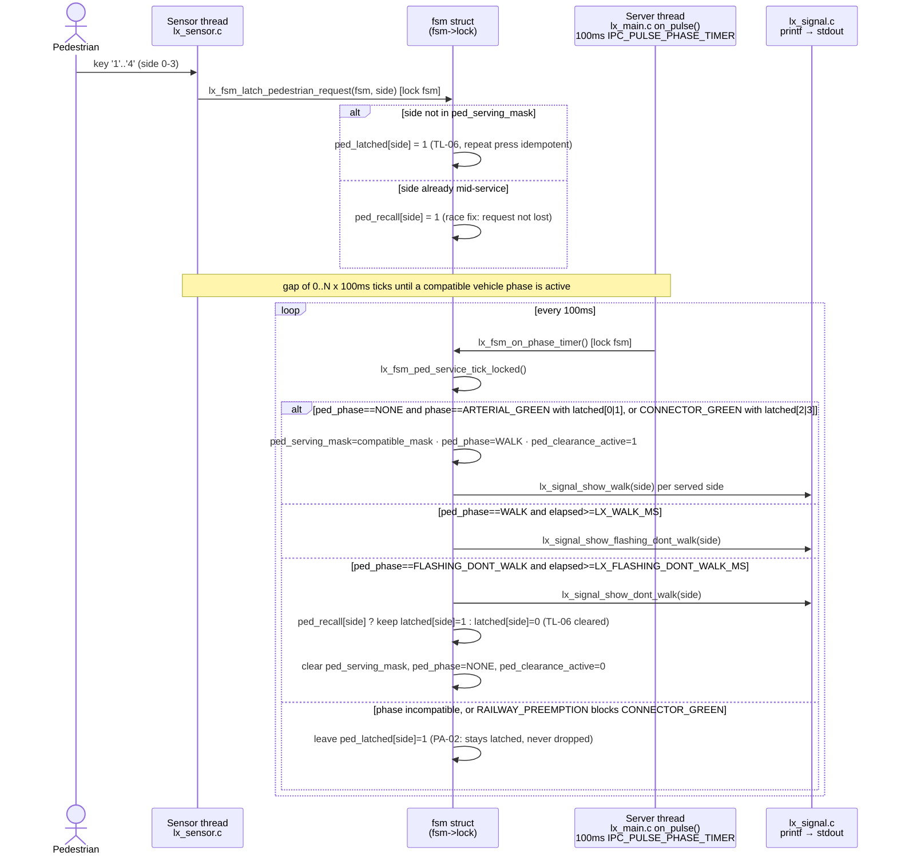

# UC-02 — Serve Pedestrian Crossing Request

**Trigger:** keypress `1`/`2`/`3`/`4` (pedestrian button, side 0-3)
**Scope:** single-node — `lx_main` only; railway pre-emption gates it indirectly via incoming `MSG_CROSSING_STATUS` from `RLx`
**Spec:** `usecase.md` UC-02 · `SEQUENCE_DIAGRAMS.md` SD-02 · rules TL-05, TL-06, PA-02, PA-03

Constants (`lx_timer.h`): `LX_PHASE_TICK_MS=100` · `LX_WALK_MS=6000` · `LX_FLASHING_DONT_WALK_MS=4000`.

## Code map

| Step | File : Function |
|---|---|
| Keypress → latch | `lx_sensor.c : lx_sensor_reader_thread()` → `lx_fsm.c : lx_fsm_latch_pedestrian_request()` |
| 100ms tick | `lx_main.c : on_pulse()` (`IPC_PULSE_PHASE_TIMER`) → `lx_fsm.c : lx_fsm_on_phase_timer()` |
| Compatibility + WALK/FDW/DONT_WALK sequencing | `lx_fsm.c : lx_fsm_ped_service_tick_locked()`, using `lx_fsm_arterial_ped_compatible_locked()` / `lx_fsm_connector_ped_compatible_locked()` |
| Pedestrian output | `lx_signal.c : lx_signal_show_walk() / show_flashing_dont_walk() / show_dont_walk()` |
| Feeds back into vehicle timing | `lx_fsm.c : lx_fsm_on_phase_timer()` folds ped-compatible flags into `own_demand`/`other_demand` for `lx_timer_should_exit_green()` |
| Railway gate on CONNECTOR side | `lx_fsm.c : lx_fsm_on_crossing_status()` (from `MSG_CROSSING_STATUS`) → `SUPERVISORY_RAILWAY_PREEMPTION` → `lx_fsm_advance_phase_locked()` skips `PHASE_CONNECTOR_GREEN` |

Two threads, one lock: the **sensor thread** only ever latches `ped_latched[]`/`ped_recall[]` via `lx_fsm_latch_pedestrian_request()`; the **server thread** (driven by the 100ms pulse) does the compatibility check, the WALK → FLASHING_DONT_WALK → DONT_WALK sequencing, and all `lx_signal_show_*()` output. They share nothing but `fsm->lock`, so a press can land anywhere between two ticks with no missed or double-counted state.

## Cross-node view

Single-node by construction — matches SD-02, whose own participants are `Pedestrian`, `Push-Button`, `Intersection Controller`, `Pedestrian Signals`. No `MsgSendv`/`ipc_client_post()` call appears in this trace, and neither `C1` nor any `RLx` is a target or dependency for latching or serving a request (`PA-01`). The one cross-node input that matters *indirectly* is an incoming `MSG_CROSSING_STATUS` from `RLx`, which can put the FSM into `SUPERVISORY_RAILWAY_PREEMPTION` and make `PHASE_CONNECTOR_GREEN` stop cycling — so sides 2/3 stay latched (`PA-02`) while sides 0/1 keep being served normally.
