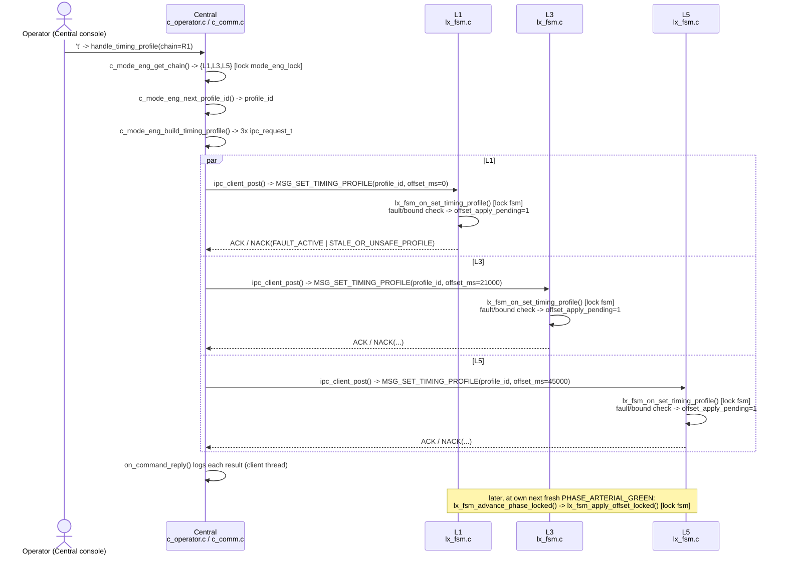

# UC-03 — Coordinate Arterial Traffic Progression

**Trigger:** keypress `t` at the Central console (prompts for chain 1=R1 or 2=R2 via `read_long()`), broadcasting `SET_TIMING_PROFILE`
**Scope:** multi-node — `C1` broadcasting to 3 of 6 intersection controllers (R1: `L1,L3,L5` or R2: `L2,L4,L6`); no Railway controllers
**Spec:** `usecase.md` UC-03 · `SEQUENCE_DIAGRAMS.md` SD-03 (section 4.2.3) · rules TC-01, TC-02, TC-03, TC-04, TC-05, TL-04, PA-09

Constants (`c_mode_eng.h`, ~lines 52–57): R1 `{L1,L3,L5}` offsets = `{0, 21000, 45000}` ms · R2 `{L2,L4,L6}` offsets = `{0, 19000, 42000}` ms. Reject bound: `offset_ms >= LX_CYCLE_LENGTH_MS` → `NACK_REASON_STALE_OR_UNSAFE_PROFILE` (PA-09).

## Code map

| Step | File : Function |
|---|---|
| Keypress → prompt | `c_operator.c : c_operator_reader_thread()` (~line 458) → `handle_timing_profile()` (~line 175) |
| Chain lookup | `c_mode_eng.c : c_mode_eng_get_chain()` (~line 126) → `R1_CHAIN[]`/`R2_CHAIN[]` (~lines 11–21) |
| Profile id | `c_mode_eng.c : c_mode_eng_next_profile_id()` (~line 121) |
| Build requests | `c_comm.c : c_comm_broadcast_timing_profile()` (~line 163) → `c_mode_eng.c : c_mode_eng_build_timing_profile()` (~line 104) |
| Enqueue ×3 | `qnet_utils.h : ipc_client_post()` (~line 141) — non-blocking, one call per chain member |
| Wire send | `qnet_utils.h : ipc_client_thread_main()` (~line 144) — the only thread that calls `MsgSend()` |
| Lx receive | `lx_main.c : on_request()` (~line 42, `case MSG_SET_TIMING_PROFILE`) |
| Lx validate + defer | `lx_fsm.c : lx_fsm_on_set_timing_profile()` (~line 657) → sets `offset_apply_pending=1`, replies ACK/NACK |
| Lx safe-boundary apply | `lx_fsm.c : lx_fsm_advance_phase_locked()` (~line 340) → `lx_fsm_apply_offset_locked()` (~line 572) |
| Reply logging | `c_comm.c : on_command_reply()` (~line 87) |

`handle_timing_profile()` holds `console_io_lock` (whole handler) and `mode_eng_lock` (steps 2–5, chain read + bookkeeping) — both released before `ipc_client_post()`. Each Lx validates and defers under its own `fsm->lock` on the **server thread** (must never block), then applies the offset later under the same lock from the **phase-timer path**, never truncating a phase already in progress.

## Cross-node view

Wire verb: **`MSG_SET_TIMING_PROFILE`** (`ipc_msg.h` ~line 64), payload `{profile_id, offset_ms}` — `profile_id` identical across all three sends, `offset_ms` unique per member. Four controllers per broadcast: `C1` + 3 of 6 `Lx` (never all six, never any `RLx`). Matches `SEQUENCE_DIAGRAMS.md` SD-03's `par ... and ... and ... end` fan-out; each Lx ACKs/NACKs and applies independently, with no coordination between chain members. R2 (`L2,L4,L6`) follows the identical pattern with its own offsets.
