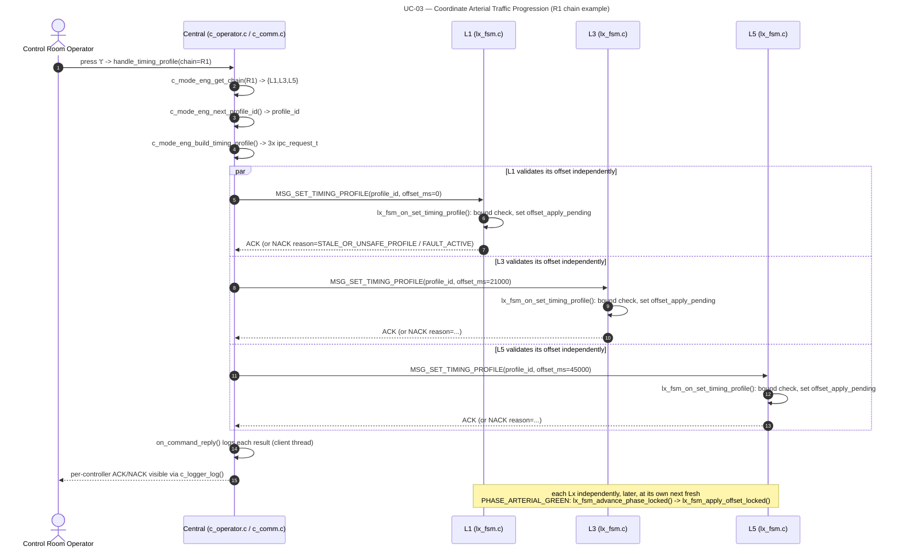

# UC-03 — Coordinate Arterial Traffic Progression: Function-Level Flow

## What this feature does

Per `usecase.md` section 3.2.3 (UC-03), the system coordinates successive arterial green
phases along `I1–I3–I5` (R1) and `I2–I4–I6` (R2) using distance/speed-derived travel-time
offsets (`TC-01`, `TC-02`). Central distributes a validated timing profile to each relevant
intersection, but every local controller independently validates and applies its own
assigned offset (`TC-03`) at a safe phase boundary, never bypassing local safety rules;
missing/stale coordination degrades to standalone operation (`TC-04`), and railway
disruption recovers through this same timing-profile path (`TC-05`).

## Entry point

The operator presses `t` at the Central operator console. This is read by the blocking
`scanf(" %c", &input)` loop in `c_operator_reader_thread()` in
`app/central/src/c_operator.c` (around line 458), whose `switch` dispatches `case 't':`
(around line 483) to `handle_timing_profile()` (around line 175). The key binding itself is
advertised to the operator by `print_help()`:

```
t = broadcast SET_TIMING_PROFILE for R1 or R2  (UC-03 / SD-03)
```

(`app/central/src/c_operator.c`, around line 119).

## Function call chain

All numbered steps below are real function calls in the current source tree, in call
order. "C1" = Central's process; "Lx" = whichever of L1/L2/L3/L4/L5/L6 is the current
chain member being described (the chain is walked three times, once per member, per the
broadcast note at the end of this section).

**C1 side — operator/reader thread, then C1's own client thread**

1. `c_operator_reader_thread()` (`app/central/src/c_operator.c`, around line 451) reads the
   `t` keypress and, still on the **operator console thread**, holds `console_io_lock` for
   the whole handler (around line 484) before calling `handle_timing_profile()`.
2. `handle_timing_profile()` (`app/central/src/c_operator.c`, around line 175) prompts for
   the chain number (1=R1, 2=R2) via `read_long()`, then takes `args->mode_eng_lock`
   (around line 191) — this is `mode_eng_lock`, the mutex protecting Central's decision
   layer (`c_mode_eng_t`).
3. Still holding `mode_eng_lock`, it calls `c_mode_eng_get_chain()`
   (`app/central/src/c_mode_eng.c`, around line 126) which returns a pointer to one of two
   read-only, file-local tables — `R1_CHAIN[]` = `{CTRL_L1, CTRL_L3, CTRL_L5}` or
   `R2_CHAIN[]` = `{CTRL_L2, CTRL_L4, CTRL_L6}` (`app/central/src/c_mode_eng.c`, around
   lines 11–21) — together with `chain_len` (3 today).
4. It calls `c_mode_eng_next_profile_id()` (`app/central/src/c_mode_eng.c`, around line
   121), which returns `eng->next_profile_id` and post-increments it — this is the single
   `profile_id` that will be sent, unchanged, to every member of the chain.
5. It loops over the chain (still under `mode_eng_lock`) updating each member's
   `last_applied_profile_id` bookkeeping in `c_mode_eng_t.controllers[]` (around line
   199–204), then releases `mode_eng_lock` (around line 205).
6. It logs the broadcast via `c_logger_log()` and calls
   `c_comm_broadcast_timing_profile(args->client_queue, chain, chain_len, profile_id)`
   (`app/central/src/c_comm.c`, around line 163), still on the operator console thread.
7. `c_comm_broadcast_timing_profile()` validates `chain`/`chain_len`, then calls
   `c_mode_eng_build_timing_profile(profile_id, chain, chain_len, requests)`
   (`app/central/src/c_mode_eng.c`, around line 104), which fills one `ipc_request_t` per
   chain entry: `verb = MSG_SET_TIMING_PROFILE`, `sender_id = CTRL_C1`,
   `target_id = chain[i].id`, `payload.timing_profile = {profile_id, chain[i].offset_ms}`
   (the `R1_L1_OFFSET_MS`/`R1_L3_OFFSET_MS`/`R1_L5_OFFSET_MS` /
   `R2_L2_OFFSET_MS`/`R2_L4_OFFSET_MS`/`R2_L6_OFFSET_MS` constants,
   `app/central/includes/c_mode_eng.h`, around lines 52–57).
8. Back in `c_comm_broadcast_timing_profile()` (around lines 181–188), it loops over the
   `n` built requests and calls `ipc_client_post(q, target, &requests[i], on_command_reply, NULL)`
   (declared `app/shared/includes/qnet_utils.h`, around line 141) **once per chain
   member** — three separate, independent posts for the one broadcast, all still
   originating from the operator console thread (`ipc_client_post()` is documented as
   safe to call from any thread — `qnet_utils.h`, around line 139).

**IPC boundary crossing.** `ipc_client_post()` only *enqueues* the request and returns
immediately (non-blocking); the actual blocking `name_open()`/`MsgSend()`/`name_close()`
for each queued job is performed later by C1's own dedicated **client thread**, running
`ipc_client_thread_main()` (`app/shared/includes/qnet_utils.h`, around line 144, "the ONLY
thread in the process that calls `MsgSend()`"). This is the point where each of the three
`MSG_SET_TIMING_PROFILE` messages actually crosses Qnet from C1's node to one Lx's node.

**Lx side — that node's server thread**

9. On the target Lx's node, the dedicated **server thread** is blocked in
   `ipc_server_run()` (`app/shared/includes/qnet_utils.h`, around line 116). The inbound
   `MsgSend()` wakes it, and it invokes the registered `on_request()` callback
   (`app/intersection/src/lx_main.c`, around line 37).
10. `on_request()`'s `switch ((msg_type_t)req->verb)` matches `case MSG_SET_TIMING_PROFILE:`
    (`app/intersection/src/lx_main.c`, around line 42) and calls
    `lx_fsm_on_set_timing_profile(&ctx->fsm, &req->payload.timing_profile, reply)` —
    still on the **server thread**, which must never block (no `MsgSend()`, per
    `qnet_utils.h`'s documented contract on `ipc_request_handler_t`).
11. `lx_fsm_on_set_timing_profile()` (`app/intersection/src/lx_fsm.c`, around line 657)
    takes `fsm->lock` (around line 659) and calls `lx_fsm_check_fault_locked(fsm)`, then
    validates the payload:
    - if `fsm->supervisory == SUPERVISORY_FAULT_SAFE` → `RESULT_NACK` /
      `NACK_REASON_FAULT_ACTIVE`;
    - else if `payload->offset_ms >= LX_CYCLE_LENGTH_MS` → `RESULT_NACK` /
      `NACK_REASON_STALE_OR_UNSAFE_PROFILE` (this is the PA-09 safety bound named in the
      task — an offset that would alias past the fixed 90 s cycle is rejected outright,
      around line 666–677);
    - else it accepts: sets `fsm->active_profile_id = payload->profile_id`,
      `fsm->assigned_offset_ms = payload->offset_ms`, and — critically — only sets
      `fsm->offset_apply_pending = 1` (around lines 679–686) rather than applying the
      offset immediately, then replies `RESULT_ACK`.
    - `fsm->lock` is released (around line 689) before `on_request()` returns and
      `ipc_server_run()` `MsgReply()`s the `ACK`/`NACK` back across Qnet to C1.
12. Later — asynchronously, and only at a **safe phase boundary** — the deferred offset is
    actually applied. `lx_fsm_advance_phase_locked()` (`app/intersection/src/lx_fsm.c`,
    around line 228) runs (under `fsm->lock`, called from the phase-timer pulse path) and,
    at the exact moment it lands on a **fresh** `PHASE_ARTERIAL_GREEN`
    (`fsm->green_elapsed_ms` just reset to 0, no green time shown yet for this instance),
    checks `if (fsm->phase == PHASE_ARTERIAL_GREEN && fsm->offset_apply_pending)` (around
    line 340). If true, it clears the pending flag and calls
    `lx_fsm_apply_offset_locked(fsm)` (around line 345).
13. `lx_fsm_apply_offset_locked()` (`app/intersection/src/lx_fsm.c`, around line 572) is
    the actual offset-application logic: it only runs for `MODE_PEAK_FIXED` +
    `PHASE_ARTERIAL_GREEN` (around line 589), reads `CLOCK_REALTIME`, computes the signed
    wall-clock error between where this fresh green actually started in the 90 s cycle and
    where `fsm->assigned_offset_ms` says it should start, and nudges
    `fsm->green_elapsed_ms` (or sets `fsm->offset_extra_hold_ms` for a "started too early"
    correction) so the *next* arterial-green start moves toward the planned offset —
    clamped so at least `LX_MIN_GREEN_MS` of real green is always shown. This never
    truncates a phase already in progress, matching TC-02/TC-03 and the "safe phase
    boundary" wording of UC-03's main-flow step 4.

**This is a broadcast, not three separate use cases.** Steps 6–8 send the *same*
`profile_id` three times — once per chain member — each carrying only that member's own
`offset_ms`. Each Lx independently repeats steps 9–13 with no coordination between chain
members: one may ACK while another NACKs (e.g. a different Lx currently in
`SUPERVISORY_FAULT_SAFE`), and each applies (or doesn't) its own offset at its own next
`PHASE_ARTERIAL_GREEN` boundary, entirely locally.

## Cross-node view

The IPC verb crossing the wire is **`MSG_SET_TIMING_PROFILE`** (`app/shared/includes/ipc_msg.h`,
around line 64: `"C1 -> Lx (TC-01..TC-05, TL-04)"`), carrying a
`set_timing_profile_payload_t` (`app/shared/includes/ipc_msg.h`, around lines 92–95) with
exactly two payload fields:

- `profile_id` (`uint32_t`) — identical across all three sends of one broadcast;
- `offset_ms` (`uint32_t`) — the one field that differs per chain member (0 / 21000 / 45000
  for R1's L1/L3/L5; 0 / 19000 / 42000 for R2's L2/L4/L6, per
  `app/central/includes/c_mode_eng.h` around lines 52–57).

Four controllers are involved per broadcast: **C1** (the sender) plus **3 of the 6 Lx**
controllers — either {L1, L3, L5} or {L2, L4, L6} — never all six and never any RLx
(railway controllers have no timing profile of their own). The reply direction reuses the
generic `ipc_reply_t` (`app/shared/includes/ipc_msg.h`, around lines 180–189): `result`
(`RESULT_ACK`/`RESULT_NACK`/…) and, when NACKed, `reason` (e.g.
`NACK_REASON_STALE_OR_UNSAFE_PROFILE`). C1 logs each reply asynchronously via
`on_command_reply()` (`app/central/src/c_comm.c`, around line 87), which runs on **C1's
client thread**, not the operator thread, and deliberately never touches `c_mode_eng_t`
(logging only).

This exchange is exactly what `SEQUENCE_DIAGRAMS.md`'s **SD-03 — "Configure and Apply an
Arterial Coordination Profile"** (section 4.2.3) depicts at the message level: the operator
submits `SET_TIMING_PROFILE(profile)` to C1, which fans it out to L1/L3/L5 (or L2/L4/L6) in
parallel (`par ... and ... and ... end`), each validating independently and returning
`ACK`/`NACK`, each applying at its own safe boundary before reporting `STATUS`.

## System-level summary diagram



This matches `SEQUENCE_DIAGRAMS.md` section 4.2.3, SD-03. The R2 chain (L2 → L4 → L6)
follows the identical pattern with its own offsets, as noted in SD-03's diagram.
