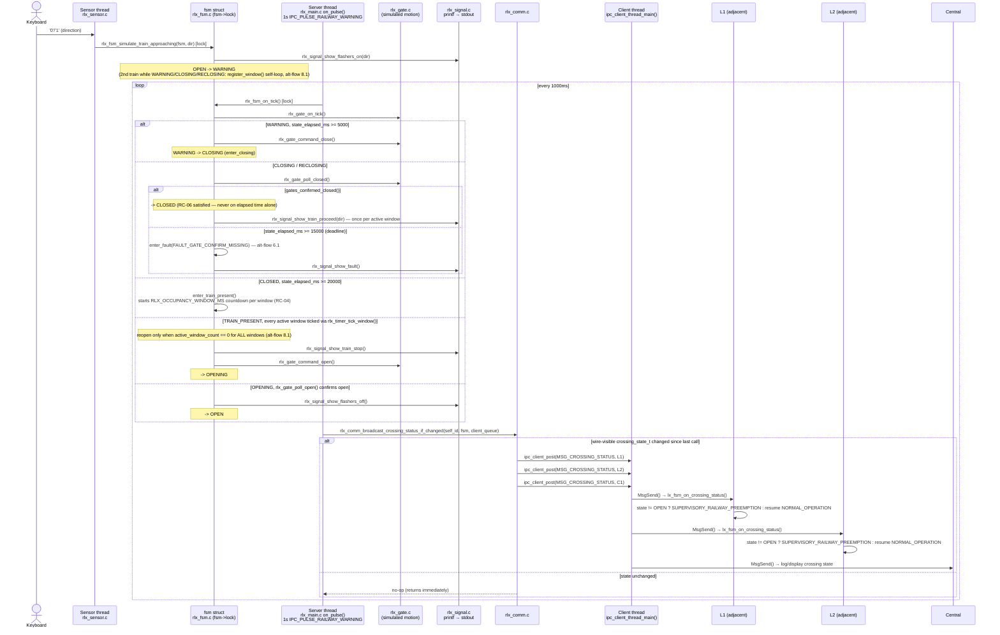

# UC-04 — Protect a Railway Crossing for an Approaching Train

**Trigger:** keypress `0`/`1` on RLx stdin (simulated `TRAIN_APPROACHING(direction)`)
**Scope:** multi-node — `RLx` (owner/actuator) broadcasts to two adjacent `Lx` + `C1`
**Spec:** `usecase.md` UC-04 · `SEQUENCE_DIAGRAMS.md` SD-04 · rules RC-01, RC-02, RC-03, RC-04, RC-06, RC-10

Constants (`rlx_timer.h`): `RLX_WARNING_TO_CLOSING_MS=5000` (RC-03 flash-only lead) · `RLX_CLOSING_DEADLINE_MS=15000` (5s lead + 10s close allowance) · `RLX_EXPECTED_ARRIVAL_MS=20000` (placeholder) · `RLX_OCCUPANCY_WINDOW_MS=20000` (RC-04 per-direction window) · `RLX_OPENING_DEADLINE_MS=15000`.

## Code map

| Step | File : Function |
|---|---|
| Keypress → simulated sensor | `rlx_sensor.c:34-39 : rlx_sensor_reader_thread()` → `rlx_fsm.c:243 : rlx_fsm_simulate_train_approaching()` (OPEN→WARNING) |
| 1s tick, gate motion | `rlx_main.c:57 : on_pulse()` (`IPC_PULSE_RAILWAY_WARNING`) → `rlx_fsm.c:328 : rlx_fsm_on_tick()` → `rlx_gate.c:71-95 : rlx_gate_on_tick()` |
| Enter closing | `rlx_fsm.c:162-167 : enter_closing()` → `rlx_gate.c:45-56 : rlx_gate_command_close()` |
| Gate confirmation (RC-06) | `rlx_fsm.c:124-142 : check_closing_or_reclosing_complete()` → `rlx_gate.c:97-104 : rlx_gate_poll_closed()` |
| Fault on missed deadline | `rlx_fsm.c:106-121 : enter_fault()` → `rlx_signal.c:47-51 : rlx_signal_show_fault()` |
| Train proceed | `rlx_signal.c:32-35 : rlx_signal_show_train_proceed()` (once per active occupancy window) |
| Occupancy window start (RC-04) | `rlx_fsm.c:178-196 : enter_train_present()` |
| Window countdown / reopen | `rlx_timer.c : rlx_timer_tick_window()` → `rlx_fsm.c:198-204 : enter_opening()` (only when `active_window_count == 0` for all windows) |
| Broadcast fan-out | `rlx_main.c:62 : on_pulse()` → `rlx_comm.c:146-171 : rlx_comm_broadcast_crossing_status_if_changed()` → `rlx_comm.c:126-144 : send_crossing_status()` ×3 → `ipc_client_post()` |
| Adjacent Lx reaction | `lx_main.c:59-64 : on_request()` → `lx_fsm.c:849-909 : lx_fsm_on_crossing_status()` (sets/clears `SUPERVISORY_RAILWAY_PREEMPTION`) |

Adjacency (`rlx_comm.c:109-113`, compile-time, matches `SYSTEM_DIAGRAMS.md` Diagram 4): `RL1→{L1,L2}`, `RL2→{L3,L4}`, `RL3→{L5,L6}`; every RLx also targets `C1`.

Three threads: **sensor thread** only calls `rlx_fsm_simulate_train_approaching()`; **server thread** (1s pulse) runs the whole FSM tick and the broadcast call — it never blocks in `MsgSend()`; the actual sends happen later on RLx's own **client thread** (`ipc_client_thread_main()`), which drains the three `ipc_client_post()` calls enqueued by `send_crossing_status()`. All FSM access is serialized under `fsm->lock`.

## Cross-node view

`RLx` fans one `MSG_CROSSING_STATUS(state)` out to exactly three recipients per state change: the two adjacent `Lx` controllers (e.g. `L1`, `L2`), which each suppress the movement toward the crossing via `SUPERVISORY_RAILWAY_PREEMPTION` and resume normal operation once `state == CROSSING_OPEN`, and `C1` (Central), which only logs/displays it. `RLx` never waits on Central or on any `Lx` reply (`RC-10`) — `Lx` always `RESULT_ACK`s since it may only observe, never command, railway equipment (`RC-02`).
