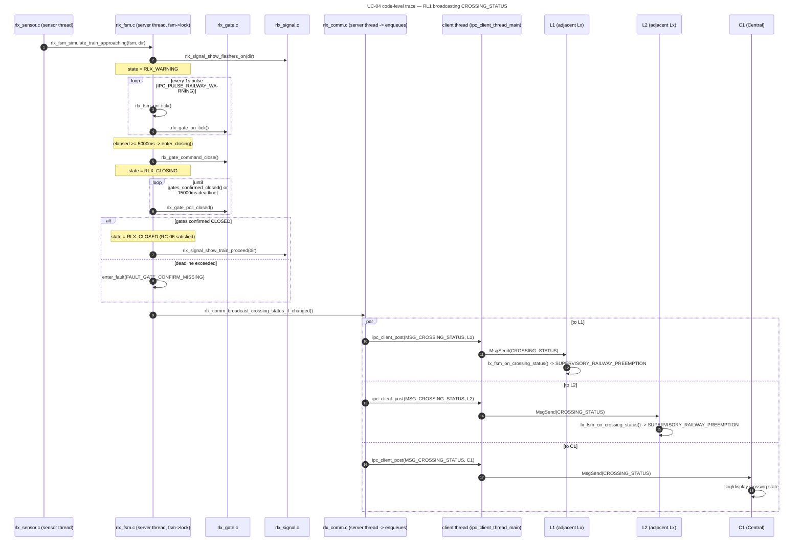

# UC-04 — Protect a Railway Crossing for an Approaching Train: Function-Level Flow

## What this feature does

Per `usecase.md` UC-04 (section 3.2.4), when a train-approach sensor reports
`TRAIN_APPROACHING`, the owning railway controller (`RLx`) warns road users,
tells the two adjacent intersection controllers and Central to suppress the
movement toward the crossing, and only lets the train `PROCEED` once the
boom gates are sensor-confirmed `CLOSED` — never on elapsed time alone
(`RC-06`). Gates stay down until every active train-occupancy window has
elapsed (`RC-04`), the whole sequence runs on an approximately 45-second
warning-to-arrival budget (`RC-03`), and none of it depends on Central being
reachable (`RC-10`).

This document traces one concrete instance of that flow through the real
source: a keyboard-simulated `TRAIN_APPROACHING(direction)` event on `RL1`,
through `rlx_fsm.c`'s internal state machine, the simulated gate/signal
modules, and out to the three-recipient `MSG_CROSSING_STATUS` broadcast
(`L1`, `L2`, and `C1`).

## Entry point

`app/railway/src/rlx_sensor.c:34-39`, function `rlx_sensor_reader_thread()`
(around line 25). This thread is the demo/keyboard stand-in for a real
train-approach sensor (RC-01) and runs as its own dedicated thread — per
`app/shared/README.md`'s "Threading pattern," it must never share the
server thread (`ipc_server_run()`) or client thread
(`ipc_client_thread_main()`), because both of those must stay free to
service IPC without blocking on `scanf()`.

Pressing `0` or `1` at the RLx process's stdin calls, around line 34-38:

```c
case '0':
    rlx_fsm_simulate_train_approaching(fsm, 0);
    break;
case '1':
    rlx_fsm_simulate_train_approaching(fsm, 1);
    break;
```

This is `rlx_fsm_simulate_train_approaching()`, declared in
`app/railway/includes/rlx_fsm.h` around line 64 as an explicitly
demo/test-only entry point standing in for a real continuous sensor line
until real hardware exists — the header's own comment notes it is "not part
of the Qnet contract."

## Function call chain

Numbered trace of real function calls, file:function, with thread and
locking noted at each step.

1. **`app/railway/src/rlx_sensor.c:35`** (sensor thread) —
   `rlx_sensor_reader_thread()` reads the keypress and calls
   `rlx_fsm_simulate_train_approaching(fsm, direction)`.

2. **`app/railway/src/rlx_fsm.c:243` `rlx_fsm_simulate_train_approaching()`**
   (sensor thread) — takes `fsm->lock` (line 245). In the `RLX_OPEN` case
   (around line 248-253):
   - line 249: calls `rlx_signal_show_flashers_on(direction)` —
     `app/railway/src/rlx_signal.c:22-25` (`RLx: flashers ON ...`).
   - line 250: calls `register_window(fsm, direction, 0)` (helper, around
     line 83) to create/refresh an occupancy-window slot for that
     direction, `remaining_ms = 0` (arrival not yet expected).
   - line 251-252: sets `fsm->state = RLX_WARNING`, resets
     `state_elapsed_ms = 0`.
   - releases `fsm->lock` at line 294.

   This is the OPEN -> WARNING transition. (If a second train approaches
   while already in `RLX_WARNING`/`RLX_CLOSING`/`RLX_RECLOSING`, the
   `case RLX_WARNING: case RLX_CLOSING: case RLX_RECLOSING:` branch at
   lines 255-261 just calls `register_window()` again as a self-loop —
   the alt-flow "8.1 second train detected" from `usecase.md`.)

3. **`app/railway/src/rlx_main.c:57` `on_pulse()` / `IPC_PULSE_RAILWAY_WARNING`**
   (**server thread** — the callback `ipc_server_run()` invokes for every
   pulse landing on RLx's channel, per `qnet_utils.h` line ~105) — every 1
   second (armed at `rlx_main.c:156`), calls
   `rlx_fsm_on_tick(&ctx->fsm)`.

4. **`app/railway/src/rlx_fsm.c:328` `rlx_fsm_on_tick()`** (server thread) —
   takes `fsm->lock` (line 332). Unconditionally calls
   `rlx_gate_on_tick()` (line 335,
   `app/railway/src/rlx_gate.c:71-95`) once per FSM tick, advancing any
   in-progress simulated gate motion. Then dispatches on `fsm->state`:

   - **`RLX_WARNING`** (lines 342-363): `state_elapsed_ms += 1000`. Once
     `state_elapsed_ms >= RLX_WARNING_TO_CLOSING_MS` (5000 ms, RC-03's
     flash-only lead — `app/railway/includes/rlx_timer.h:15`), calls
     **`enter_closing(fsm)`** (line 361 -> helper at line 162-167):
     - `rlx_gate_command_close()` — `app/railway/src/rlx_gate.c:45-56` —
       starts a simulated `RLX_GATE_MOTION_MS`-long close motion, clears
       both `g_confirmed_closed`/`g_confirmed_open`.
     - `fsm->state = RLX_CLOSING`, `state_elapsed_ms = 0`.

   - **`RLX_CLOSING` / `RLX_RECLOSING`** (lines 365-369, on later ticks):
     `state_elapsed_ms += 1000`, then calls
     **`check_closing_or_reclosing_complete(fsm)`** (line 368 -> helper at
     line 124-142) — **this is the exact gate-confirmation check that
     grants PROCEED (RC-06):**
     ```c
     if (gates_confirmed_closed()) {
         fsm->state = RLX_CLOSED;
         ...
         for (i = 0; i < RLX_MAX_OCCUPANCY_WINDOWS; i++) {
             if (fsm->windows[i].active) {
                 rlx_signal_show_train_proceed(fsm->windows[i].direction);
             }
         }
     } else if (fsm->state_elapsed_ms >= RLX_CLOSING_DEADLINE_MS) {
         enter_fault(fsm, FAULT_GATE_CONFIRM_MISSING);
     }
     ```
     (`rlx_fsm.c:126-141`). `gates_confirmed_closed()` (line 64-67) is a
     thin wrapper over **`rlx_gate_poll_closed()`**
     (`app/railway/src/rlx_gate.c:97-104`), which only ever returns 1 once
     `rlx_gate_on_tick()` (step 4's first call, line 71-95) has completed
     the simulated motion and set `g_confirmed_closed = 1` at line 86 —
     never from elapsed time. If not yet confirmed and
     `RLX_CLOSING_DEADLINE_MS` (15000 ms) has passed, `enter_fault()`
     (line 106-121) forces gates down, calls
     `rlx_signal_show_fault()` (`rlx_signal.c:47-51`), and sets
     `RLX_FAULT` — this is UC-04 alt-flow 6.1.

     On success, `rlx_signal_show_train_proceed(direction)` —
     `app/railway/src/rlx_signal.c:32-35` — is the train-signal actuation
     that sets `PROCEED`, called once per currently-active occupancy
     window (covers alt-flow 8.1's "second train already registered
     before this gate cycle finished").

   - **`RLX_CLOSED`** (lines 371-379, on subsequent ticks):
     `state_elapsed_ms += 1000`;
     `check_gate_contradiction_closed(fsm)` (line 373 -> line 144-149) —
     re-polls `gates_confirmed_closed()` every tick and forces
     `enter_fault()` if the gates ever stop reading closed while the
     crossing believes itself `CLOSED`. Once
     `state_elapsed_ms >= RLX_EXPECTED_ARRIVAL_MS` (20000 ms placeholder,
     `rlx_timer.h:17`) and gates are still confirmed closed, calls
     **`enter_train_present(fsm)`** (line 377 -> helper at line 178-196),
     which starts the real RC-04 20-second occupancy countdown
     (`RLX_OCCUPANCY_WINDOW_MS`, `rlx_timer.h:21`) on every window still
     at `remaining_ms == 0`, and sets `fsm->state = RLX_TRAIN_PRESENT`.

   - **`RLX_TRAIN_PRESENT`** (lines 381-400): each tick,
     `check_gate_contradiction_closed(fsm)` runs again, then every active
     window's `remaining_ms` is ticked down by
     `rlx_timer_tick_window(&fsm->windows[i].remaining_ms, 1000u)`
     (`app/railway/src/rlx_timer.c`); an expired window clears
     `active`/decrements `active_window_count`. Per RC-04, reopening only
     fires once `active_window_count == 0` for **every** window (line 396),
     not on any single window's expiry — this is the mechanism behind
     alt-flow 8.1 ("gates remain closed while either occupancy window
     remains active"). That calls **`enter_opening(fsm)`** (line 397 ->
     helper at line 198-204):
     - `rlx_signal_show_train_stop()` — `rlx_signal.c:37-40` — all train
       signals back to `STOP`.
     - `rlx_gate_command_open()` — `rlx_gate.c:58-69` — starts the
       simulated open motion.
     - `fsm->state = RLX_OPENING`.

   - **`RLX_OPENING`** (lines 402-405): `state_elapsed_ms += 1000`, then
     `check_opening_complete(fsm)` (line 404 -> helper at line 151-160) —
     symmetric to the closing check: if `rlx_gate_poll_open()` confirms
     open, calls `rlx_signal_show_flashers_off()`
     (`rlx_signal.c:27-30`) and returns to `RLX_OPEN`; otherwise, past
     `RLX_OPENING_DEADLINE_MS` (15000 ms), `enter_fault()` again.

   `rlx_fsm_on_tick()` releases `fsm->lock` at line 415.

5. **`app/railway/src/rlx_main.c:59-60` `on_pulse()`** (server thread,
   same callback as step 3, immediately after `rlx_fsm_on_tick()`
   returns) — calls `rlx_fsm_take_fault_report_pending(&ctx->fsm)`
   (`rlx_fsm.c:429-439`, its own `fsm->lock` acquisition) and, if a fault
   just latched, `rlx_comm_send_fault_report()` — the independent,
   parallel RC-10 fault path (not part of the normal-flow trace below).

6. **`app/railway/src/rlx_main.c:62` `on_pulse()`** (server thread) —
   unconditionally calls
   `rlx_comm_broadcast_crossing_status_if_changed(ctx->self_id, &ctx->fsm, ctx->client_queue)`
   once per tick. This is the function that performs the cross-node
   broadcast described below (step 7 onward). Note this call happens
   *every tick*, but the function itself is a no-op unless the
   wire-visible `crossing_state_t` actually changed since the last call
   (so it fires exactly once at each OPEN->WARNING, WARNING/CLOSING-
   >CLOSED, and CLOSED-family->OPEN edge, not every second).

## Cross-node view

**`app/railway/src/rlx_comm.c:146-171` `rlx_comm_broadcast_crossing_status_if_changed()`**
(still executing on the **server thread**, since `on_pulse()` called it
directly — see step 6):

1. Reads `current = rlx_fsm_get_crossing_state(fsm)` (line 157) —
   `rlx_fsm.c:418-427`, which maps the internal sub-state to the
   wire-visible `crossing_state_t` (`CROSSING_OPEN` / `CROSSING_WARNING` /
   `CROSSING_CLOSED` / `CROSSING_FAULT`, `sys_types.h:52-56`) under its own
   `fsm->lock` acquisition — e.g. both `RLX_WARNING` and `RLX_CLOSING`
   collapse to `CROSSING_WARNING` (`rlx_fsm.c:45-53`); `RLX_CLOSED`,
   `RLX_TRAIN_PRESENT`, and `RLX_OPENING` all collapse to
   `CROSSING_CLOSED` (`rlx_fsm.c:54-57`).
2. Compares against the function's own `static int last_broadcast_state`
   (line 153); if unchanged, returns immediately (line 158-160) — this is
   the "if_changed" behavior, and it is tracked entirely inside
   `rlx_comm.c`, not inside `rlx_fsm_t`.
3. On a real change, looks up `find_adjacency(self_id)` (line 163 ->
   line 115-124) against the static **`ADJACENCY[]`** table
   (line 109-113):
   ```c
   static const rlx_adjacency_t ADJACENCY[] = {
       { CTRL_RL1, { CTRL_L1, CTRL_L2 } },
       { CTRL_RL2, { CTRL_L3, CTRL_L4 } },
       { CTRL_RL3, { CTRL_L5, CTRL_L6 } },
   };
   ```
   This is how RLx knows which two `Lx` are "adjacent" — a fixed,
   compile-time table matching `SYSTEM_DIAGRAMS.md` Diagram 4's topology
   (RC1 between I1/I2, RC2 between I3/I4, RC3 between I5/I6), not a
   runtime discovery mechanism.
4. Calls **`send_crossing_status()`** (line 126-144) three times
   (lines 168-170), once per recipient:
   ```c
   send_crossing_status(self_id, adj->adjacent_lx[0], current, client_queue);  // e.g. L1
   send_crossing_status(self_id, adj->adjacent_lx[1], current, client_queue);  // e.g. L2
   send_crossing_status(self_id, CTRL_C1, current, client_queue);              // C1
   ```
   Each call builds an `ipc_request_t` with `verb = MSG_CROSSING_STATUS`
   and `payload.crossing_status.state = (uint32_t)state`
   (`crossing_status_payload_t`, `app/shared/includes/ipc_msg.h:150-151`),
   then calls **`ipc_client_post(client_queue, target_id, &req, on_reply_log_failure, NULL)`**
   (line 141) — three separate, independent `ipc_client_post()` calls, one
   per target. `ipc_client_post()` only enqueues onto `client_queue`; the
   actual `MsgSend()` for each of the three happens later, asynchronously,
   on RLx's dedicated **client thread**
   (`ipc_client_thread_main()`, per `app/shared/README.md`'s "Threading
   pattern" — the server thread that is running this whole callback chain
   must never itself block in `MsgSend()`).

   `MSG_CROSSING_STATUS` is declared in `ipc_msg.h:73` as
   `"RLx -> Lx (RC-02); RLx -> C1 (SD-04, SD-05, UC-04)"` — confirming
   both destinations are intentional, not incidental.

On the receiving `Lx` side: **`app/intersection/src/lx_main.c:59-64`
`on_request()`**, dispatching on `MSG_CROSSING_STATUS`, calls
`lx_fsm_on_crossing_status(&ctx->fsm, &req->payload.crossing_status, reply)`.
**`app/intersection/src/lx_fsm.c:849-909` `lx_fsm_on_crossing_status()`**
takes `fsm->lock`, unconditionally records
`fsm->last_crossing_state = (crossing_state_t)payload->state` (line 859,
even under `SUPERVISORY_FAULT_SAFE`), and — unless already
`SUPERVISORY_FAULT_SAFE` — if `state != CROSSING_OPEN`, sets
`fsm->supervisory = SUPERVISORY_RAILWAY_PREEMPTION` (line 873), cancelling
any active `SUPERVISORY_CENTRAL_OVERRIDE` first via
`lx_fsm_terminate_override_locked()` (line 871). This is how the adjacent
intersection "safely clears the movement heading toward the crossing"
(usecase.md Main Flow step 4 / `CC-01`/`CC-02`) — actual green suppression
happens later, on `Lx`'s own `IPC_PULSE_PHASE_TIMER` tick
(`lx_fsm_on_phase_timer()`). `Lx` always `RESULT_ACK`s
(line 906-907) — per RC-02, "no Lx may command railway equipment," so it
only ever observes, never rejects, the status. When `state == CROSSING_OPEN`
and supervisory was `SUPERVISORY_RAILWAY_PREEMPTION`, it resumes
`SUPERVISORY_NORMAL_OPERATION` (line 879-899) — the reverse edge, at the
end of UC-04's Main Flow step 11 / UC-05's handoff.

`C1`'s side of the same broadcast is a status/log sink (`c_logger.c`/
`c_main.c`'s `MSG_CROSSING_STATUS` handling) — out of scope for this
function-chain trace, but the same three `ipc_client_post()` calls above
are its only source.

See `SEQUENCE_DIAGRAMS.md`'s **SD-04 — Protect a Railway Crossing for an
Approaching Train** (section 4.2.4) for the full message-level sequence
diagram this call chain implements, including the `par`/`alt`/`loop`
blocks for the simultaneous local-warning + status-distribution step, the
gate-confirmation branch, and the occupancy-window loop.

## System-level summary diagram



ASCII view matching `SYSTEM_DIAGRAMS.md` Diagram 4's style — RL1 at the
center, one-way status fanning out to both adjacent intersections and
Central, with equipment actuation strictly local to RL1:

```text
                    L1 (adjacent Lx, North)
                       ^
                       |  MSG_CROSSING_STATUS(state)
                       |  [lx_fsm_on_crossing_status ->
                       |   SUPERVISORY_RAILWAY_PREEMPTION]
                       |
   [BG][FL][TS] <---  RL1  ---> MSG_CROSSING_STATUS(state) ---> C1 (Central)
   (owns + actuates)    |        [status/log sink]
                       |
                       |  MSG_CROSSING_STATUS(state)
                       v
                    L2 (adjacent Lx, South)

   RL1 is the only actuator of [BG]/[FL]/[TS] (RC-01/RC-02).
   L1, L2, C1 each receive one ipc_client_post() call per state
   change (three total) from rlx_comm_broadcast_crossing_status_if_changed().
```
