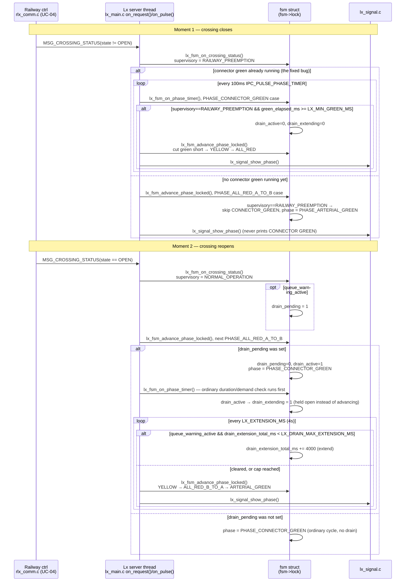

# UC-05 — Manage Traffic During and After a Railway Closure

**Trigger:** inbound `MSG_CROSSING_STATUS` from `RLx` (adjacent railway controller)
**Scope:** cross-node — this is `Lx`'s reaction only; the `RLx` send side is documented in UC-04
**Spec:** `usecase.md` UC-05 · `SEQUENCE_DIAGRAMS.md` SD-05 · rules CC-01, CC-02, CC-03

Constants (`lx_timer.h`): `LX_MIN_GREEN_MS=8000` · `LX_EXTENSION_MS=4000` · `LX_DRAIN_MAX_EXTENSION_MS=60000`.
The Branch-A early-cutoff check runs on **every** 100ms tick (not gated to a 4s modulo like ordinary demand checks) — before this fix, an already-running connector green was never truncated, only prevented from starting fresh (Branch B).

## Code map

| Step | File : Function |
|---|---|
| Inbound message | `lx_main.c : on_request()` (`MSG_CROSSING_STATUS`) → `lx_fsm.c : lx_fsm_on_crossing_status()` |
| Suppress — mid-green cutoff (Branch A) | `lx_fsm.c : lx_fsm_on_phase_timer()`, `PHASE_CONNECTOR_GREEN` case, early-cutoff check |
| Suppress — boundary guard (Branch B) | `lx_fsm.c : lx_fsm_advance_phase_locked()`, `PHASE_ALL_RED_A_TO_B` case |
| Drain arm → consume | `lx_fsm_on_crossing_status()` sets `drain_pending` → `lx_fsm_advance_phase_locked()` consumes it into `drain_active` |
| Drain extend/exit loop | `lx_fsm_on_phase_timer()`, `drain_active && drain_extending` block |
| Phase output | `lx_signal.c : lx_signal_show_phase()` |

One server thread (QNX single-channel receive loop) handles `MSG_CROSSING_STATUS`, every other request verb, and the 100ms `IPC_PULSE_PHASE_TIMER` pulse, so `lx_fsm_on_crossing_status()` and `lx_fsm_on_phase_timer()` never run concurrently with each other — `fsm->lock` is still needed because `lx_sensor.c`, `lx_watchdog.c`, and `lx_comm.c` touch `fsm` from other threads.

## Cross-node view

This trace is `Lx`'s reaction to a message it did not originate. `RLx` sends via `rlx_comm.c : send_crossing_status()` / `rlx_comm_broadcast_crossing_status_if_changed()`, fanned out per the fixed `ADJACENCY` table; `Lx` always `ACK`s and never commands railway equipment back (`RC-02`). See UC-04's flow diagram for how `RLx` decides when to send `WARNING`/`CLOSED`/`OPEN`/`FAULT` (SD-04). This document is the `Lx`-side function-level expansion of SD-05.
