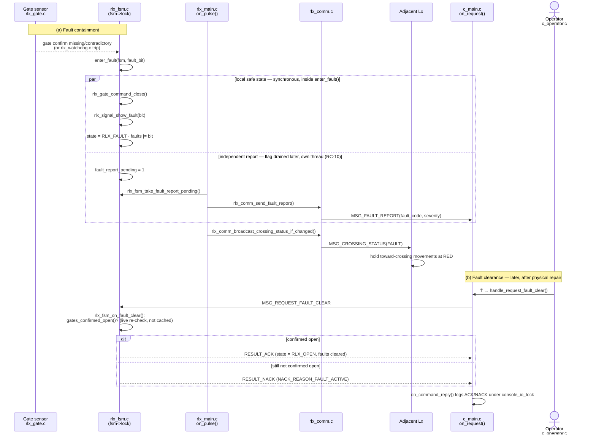

# UC-06 — Respond to a Railway Equipment Fault

**Trigger:** fault detection inside `rlx_fsm.c` (`enter_fault()`), and — for clearance — operator keypress `f`
**Scope:** cross-node — RLx ↔ C1, plus RLx → adjacent Lx broadcast
**Spec:** `usecase.md` UC-06 · `SEQUENCE_DIAGRAMS.md` SD-06 · rules RC-06, RC-09, RC-10, PA-09

RC-10 in one line: `enter_fault()` performs the local-safety branch synchronously, then only *sets a flag* (`fault_report_pending`) — a different thread (`on_pulse()`) drains that flag on its own schedule to send `MSG_FAULT_REPORT`. Neither branch waits on the other; that's why they're drawn as `par`, not sequential steps.
RC-09 in one line: Central's `MSG_REQUEST_FAULT_CLEAR` never carries a gate/signal command — `rlx_fsm_on_fault_clear()` is the only thing it can trigger, and the RLx alone decides ACK/NACK from a fresh sensor read.

## Code map

| Step | File : Function |
|---|---|
| Trigger sites (3x deadline/contradiction + watchdog) | `rlx_fsm.c : check_closing_or_reclosing_complete/check_gate_contradiction_closed/check_opening_complete()` · `rlx_watchdog.c → rlx_fsm_report_watchdog_trip()` |
| Fork point | `rlx_fsm.c : enter_fault()` |
| Local safety branch | `rlx_gate.c : rlx_gate_command_close()` · `rlx_signal.c : rlx_signal_show_fault()` |
| Report branch (independent thread) | `rlx_fsm.c : rlx_fsm_take_fault_report_pending()` → `rlx_comm.c : rlx_comm_send_fault_report()` |
| Adjacency notify | `rlx_comm.c : rlx_comm_broadcast_crossing_status_if_changed()` |
| Central receives report | `c_main.c : on_request()` (`MSG_FAULT_REPORT` case) → `c_server_record_fault_report()` |
| Operator requests clear | `c_operator.c : handle_request_fault_clear()` → `c_comm.c : c_comm_send_request_fault_clear()` |
| RLx handles clear | `rlx_main.c : on_request()` (`MSG_REQUEST_FAULT_CLEAR` case) → `rlx_fsm.c : rlx_fsm_on_fault_clear()` |

## Cross-node view

- **`MSG_FAULT_REPORT`** (RLx → C1) — carries `fault_code`/`severity`; sent by `rlx_comm_send_fault_report()`, received in `c_main.c`'s `on_request()`.
- **`MSG_REQUEST_FAULT_CLEAR`** (C1 → RLx) — no payload; sent by `c_comm_send_request_fault_clear()`, received in `rlx_main.c`'s `on_request()`, answered synchronously with `RESULT_ACK`/`RESULT_NACK`.
- **`MSG_CROSSING_STATUS`** (RLx → adjacent Lx, RLx → C1) — fired from the same `on_pulse()` tick as the report branch; how adjacent intersections learn to hold RED (RC-07 adjacency), independent of the C1 report path.
