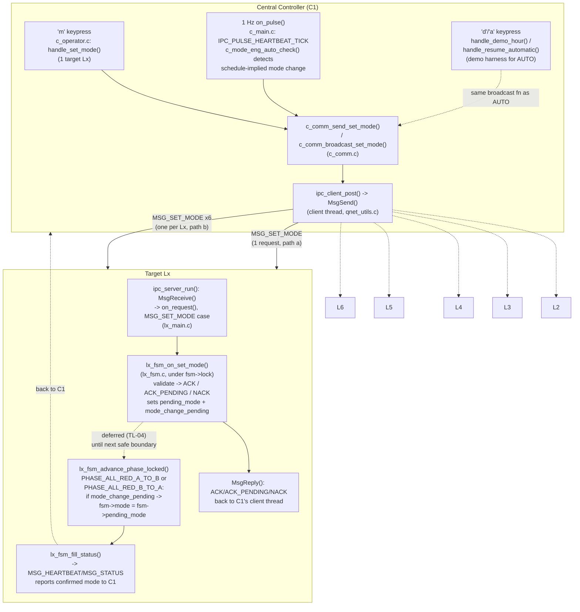

# UC-07 — Configure Traffic Operating Parameters (SET_MODE): Function-Level Flow

## What this feature does

Per `usecase.md` section 3.2.7 (`UC-07 — Configure Traffic Operating Parameters`), Central can
request a normal operating-mode change (`PEAK_FIXED` or `OFF_PEAK_SENSOR`, `DP-01`) for a target
intersection controller (Lx). The target Lx validates the request against supported ranges and its
own local safety state, `ACK`s or `NACK`s it (`PA-09`), and — if a phase is currently active —
defers actually switching modes until the next safe phase boundary rather than truncating an
in-progress phase (`TL-04`, BR-2). This document covers only the `SET_MODE` half of UC-07
(`SET_TIMING_PROFILE` is UC-03, documented separately). It also traces a second, non-operator
trigger for the identical wire message: the automatic peak-hour switch (`DP-01`/`DP-02`), which
recomputes the schedule-implied mode once a second and broadcasts `SET_MODE` to all six Lx
controllers whenever that computed mode changes.

## Entry points

This feature has **two** independent entry points in the real source that both end up posting the
same `MSG_SET_MODE` request and land on the same Lx-side handler:

- **(a) Manual operator command** — the `'m'` keypress in `c_operator_reader_thread()`
  (`app/central/src/c_operator.c` around line 478), which dispatches to `handle_set_mode()`
  (around line 133). The operator picks **one** target Lx (1-6) and one mode; this path always
  sends a single `SET_MODE` to a single controller.
- **(b) Automatic peak-hour auto-check** — the `IPC_PULSE_HEARTBEAT_TICK` case of `on_pulse()`
  (`app/central/src/c_main.c` around line 149), which runs once a second regardless of any
  operator action. Its DP-01/DP-02 block (around line 176-213) calls `c_mode_eng_auto_check()`
  and, only when the schedule-implied mode has actually changed since the last tick, calls
  `c_comm_broadcast_set_mode()`, which sends `SET_MODE` to **all six** L1-L6 controllers, one
  message per controller.

A closely related demo harness — the `'d'` (`handle_demo_hour()`, around line 408) and `'a'`
(`handle_resume_automatic()`, around line 439) keypresses — lets an operator force a simulated
hour into path (b)'s schedule instead of waiting for a real clock boundary. `handle_demo_hour()`
does not invent a third wire message: it calls the exact same `c_comm_broadcast_set_mode()`
function used by path (b), just triggered synchronously from the console instead of from the next
`on_pulse()` tick. `handle_resume_automatic()` sends nothing itself; it only clears the forced-hour
flag so the very next real 1 Hz tick's `c_mode_eng_auto_check()` re-evaluates against the real
wall clock.

Both (a) and (b) converge before the wire: they both end up calling `c_comm_send_set_mode()`
(`app/central/src/c_comm.c` around line 120), which builds an `ipc_request_t` with
`verb = MSG_SET_MODE` and posts it via `ipc_client_post()`. On the receiving side, every one of
those wire messages — whether there is 1 of them (path a) or 6 of them (path b) — is handled by
the identical function on the Lx side: `on_request()`'s `MSG_SET_MODE` case in
`app/intersection/src/lx_main.c` (around line 45), which calls `lx_fsm_on_set_mode()`
(`app/intersection/src/lx_fsm.c` around line 692). From that point on, both entry points are
indistinguishable to the Lx — it has no way to tell a manually-issued `SET_MODE` apart from an
auto-check-issued one, and does not need to.

## Function call chain

### (a) Manual operator path — C1 side, target = one Lx

1. `c_operator_reader_thread()` (`c_operator.c` around line 451-534) reads a keypress; on `'m'`
   (around line 478-482) it locks `console_io_lock` as the **outer** lock for the whole handler
   call, then calls `handle_set_mode()`, then unlocks `console_io_lock`.
2. `handle_set_mode()` (`c_operator.c` around line 133-169), running on the operator-console
   thread:
   - Calls `read_long()` (around line 25-63) twice — once for the Lx number (1-6), once for the
     mode (0/1) — each of which briefly **releases** `console_io_lock` around its blocking
     `scanf()` (around line 44-46) so an operator who is mid-keystroke never freezes the 1 Hz
     status table or blocks the auto-check broadcast in `on_pulse()`, then re-acquires it.
   - `parse_lx()` (around line 70-77) validates the Lx number is in `1..6`.
   - Takes `mode_eng_lock` (around line 160) — **inner** lock, nested inside the already-held
     `console_io_lock` — to look up the controller's slot via `c_mode_eng_controller_index()`
     (`c_mode_eng.c` around line 52-61) and record `last_commanded_mode` (pure "what C1 last told
     this controller" bookkeeping); releases `mode_eng_lock` (around line 165).
   - Logs via `c_logger_log()`, then calls `c_comm_send_set_mode(args->client_queue, target, mode)`
     (around line 168) — **outside** any lock.

### (b) Automatic peak-hour auto-check path — C1 side, target = all six Lx

1. `on_pulse()` (`c_main.c` around line 144-227), `IPC_PULSE_HEARTBEAT_TICK` case (around line
   149), running on the server thread once per second, unconditionally (no operator action
   involved).
2. Locks `mode_eng_lock` (around line 185); reads `demo_hour_override_active` — if set (via the
   `'d'` command), uses `demo_hour` as `current_hour`; otherwise reads the real wall clock with
   `time()`/`localtime_r()` (around line 189-193).
3. Calls `c_mode_eng_auto_check(&ctx->mode_eng, current_hour, &auto_mode)` (around line 195;
   `c_mode_eng.c` around line 71-93):
   - Calls `c_mode_eng_select_mode()` (around line 73; `c_mode_eng.c` around line 63-69) — the
     DP-01/DP-02 schedule rule: `PEAK_FIXED` if `current_hour` falls in
     `[peak_start_hour, peak_end_hour)`, else `OFF_PEAK_SENSOR`.
   - On the very first call ever (`last_auto_mode_valid == 0`), just seeds the baseline and
     returns 0 (no broadcast at process start-up).
   - If the computed mode equals `last_auto_mode`, returns 0 (no change → no broadcast).
   - Otherwise updates `last_auto_mode`, writes `*out_mode`, and returns 1.
4. If it returned 1 (`mode_changed`), still under `mode_eng_lock`, calls
   `c_mode_eng_mark_all_lx_commanded(&ctx->mode_eng, auto_mode)` (around line 197;
   `c_mode_eng.c` around line 95-102) to update `last_commanded_mode` for all six L1-L6 slots.
5. Releases `mode_eng_lock` (around line 199) **before** doing any IPC — the code comment here is
   explicit that a blocking/queueing send must never happen while `mode_eng_lock` is held.
6. If `mode_changed`, locks `console_io_lock` only long enough to log the auto-switch (around
   line 207-211), releases it, then calls `c_comm_broadcast_set_mode(ctx->client_queue, auto_mode)`
   (around line 212) — outside any lock.

*(Demo variant: `handle_demo_hour()`, `'d'` key, `c_operator.c` around line 408-433, takes
`console_io_lock` then `mode_eng_lock`, calls `c_mode_eng_select_mode()` directly, seeds
`last_auto_mode`/`last_auto_mode_valid` itself so the next tick doesn't re-fire, calls
`c_mode_eng_mark_all_lx_commanded()`, releases `mode_eng_lock`, then calls
`c_comm_broadcast_set_mode()` itself — same function as step 6 above, just invoked synchronously
from the console instead of from `on_pulse()`.)*

### Convergence — building and posting the wire message (both paths)

7. `c_comm_broadcast_set_mode()` (`c_comm.c` around line 136-143) — **only path (b)/`'d'`ever
   calls this**: loops `i = 0..5` and calls `c_comm_send_set_mode(q, CTRL_L1 + i, mode)` once per
   controller, i.e. 6 separate outgoing requests.
8. `c_comm_send_set_mode(q, target, mode)` (`c_comm.c` around line 120-134) — called once per
   target by both paths (directly by path (a), 6 times by path (b) via step 7): `memset()`s an
   `ipc_request_t` to zero, sets `verb = MSG_SET_MODE`, `sender_id = CTRL_C1`, `target_id = target`,
   `payload.mode.mode = (uint32_t)mode` (`set_mode_payload_t`, `ipc_msg.h` around line 97-99), then
   calls `ipc_client_post(q, target, &req, on_command_reply, NULL)` (around line 131). No lock is
   held here.
9. `ipc_client_post()` enqueues the job for C1's single dedicated client thread
   (`app/shared/README.md`'s "Threading pattern" — only that thread ever calls `MsgSend()`). That
   thread resolves the target Lx's channel by name and calls `MsgSend()`
   (`app/shared/src/qnet_utils.c` around line 438), blocking until the target Lx replies. This is
   the actual cross-node transmission of `MSG_SET_MODE`.

### Shared path — Lx side, from wire receipt to deferred apply (identical for both entry points)

10. The target Lx's server thread is blocked in `MsgReceive()` inside `ipc_server_run()`
    (`app/shared/src/qnet_utils.c` around line 278-319). A real message (`rcvid > 0`) is
    dispatched to `on_request(&msg, &reply, ctx)` (around line 316).
11. `on_request()` (`app/intersection/src/lx_main.c` around line 37-78), `MSG_SET_MODE` case
    (around line 45-47): calls `lx_fsm_on_set_mode(&ctx->fsm, &req->payload.mode, reply)`.
12. `lx_fsm_on_set_mode()` (`app/intersection/src/lx_fsm.c` around line 692-732), running on the
    Lx server thread:
    - Locks `fsm->lock` (around line 694) for the whole call.
    - Calls `lx_fsm_check_fault_locked()` (around line 695) to refresh fault state first.
    - If `fsm->supervisory == SUPERVISORY_FAULT_SAFE` → `RESULT_NACK`,
      `NACK_REASON_FAULT_ACTIVE` (around line 698-700).
    - Else if `payload->mode` is neither `MODE_PEAK_FIXED` nor `MODE_OFF_PEAK_SENSOR` →
      `RESULT_NACK`, `NACK_REASON_OUT_OF_RANGE` (around line 701-713) — this is the "validates the
      request against supported ranges" step from UC-07's main flow step 3, and BR-5/`PA-09`.
    - Else if the requested mode already equals `fsm->mode` → treated as a no-op: clears
      `mode_change_pending`, replies `RESULT_ACK` immediately, no boundary wait needed (around
      line 714-723).
    - Else (a genuine mode change while a phase is active, which SC-01A notes is almost always
      the case): sets `fsm->pending_mode = payload->mode`, `fsm->mode_change_pending = 1`, and
      replies `RESULT_ACK_PENDING` (around line 724-729) — this is UC-07 main-flow step 5, "the
      accepted change remains pending until the current phase and required clearances complete,"
      and BR-2/`TL-04`.
    - Unlocks `fsm->lock` (around line 731).
13. Back in `ipc_server_run()`, `MsgReply(rcvid, EOK, &reply, sizeof(reply))` (around line 318)
    sends the `ACK` / `ACK_PENDING` / `NACK` back over the same connection C1's client thread is
    blocked on in `MsgSend()`. C1's `on_command_reply()` callback (`c_comm.c` around line 87-118)
    then logs the result under `console_io_lock` — this runs on C1's client thread, never the
    server thread, and deliberately touches no `c_mode_eng_t` state (see that function's own
    concurrency note) to avoid a third writer racing `mode_eng_lock`.
14. **Deferred apply** (UC-07 main-flow step 6, TL-04): the pending mode is only actually applied
    inside `lx_fsm_advance_phase_locked()` (`lx_fsm.c` around line 228-348), called from
    `lx_fsm_on_phase_timer()` whenever the current phase's timer expires, at its two `ALL_RED`
    boundary cases:
    - `PHASE_ALL_RED_A_TO_B` (around line 237-243): "boundary_after_arterial" — if
      `fsm->mode_change_pending`, sets `fsm->mode = fsm->pending_mode` and clears
      `mode_change_pending`, then unconditionally continues into `PHASE_CONNECTOR_GREEN` either
      way (SC-01A: a mode switch never resets the cycle back to arterial).
    - `PHASE_ALL_RED_B_TO_A` (around line 302-310): "boundary_after_connector" — the identical
      check, applied independently at the other half-cycle boundary (SC-01B), so a pending switch
      is picked up at whichever `ALL_RED` boundary comes first.
    Both boundaries run under `fsm->lock` (held by the caller chain from
    `lx_fsm_on_phase_timer()`), so the mode flip is atomic with respect to any concurrent
    `lx_fsm_on_set_mode()` call.
15. **Reporting the updated mode** (UC-07 main-flow step 7): the next periodic
    `lx_comm_send_heartbeat()` (`app/intersection/src/lx_comm.c` around line 35, invoked from
    `lx_main.c`'s own `on_pulse()` around line 95) calls `lx_fsm_fill_status()` (`lx_fsm.c` around
    line 1196-1230), which copies the now-updated `fsm->mode` into `status.mode` under
    `fsm->lock`. That `status_report_payload_t` travels back to C1 inside a `MSG_HEARTBEAT` (or a
    `MSG_STATUS`), giving Central the confirmed mode — UC-07's postcondition 1.

## Cross-node view

The wire message is `MSG_SET_MODE` (`msg_type_t`, `app/shared/includes/ipc_msg.h` around line 65),
carrying `set_mode_payload_t { uint32_t mode; }` (around line 97-99, an `operating_mode_t` value)
inside `ipc_request_t.payload.mode` (around line 169). `sender_id` is always `CTRL_C1`;
`target_id` is the one addressed Lx.

- **Manual path (a):** exactly 1 `MSG_SET_MODE` request, 1 target, 1 `ACK`/`ACK_PENDING`/`NACK`
  reply.
- **Automatic/auto-check path (b) (and its `'d'`-triggered variant):** a broadcast of 6 separate
  `MSG_SET_MODE` requests (`c_comm_broadcast_set_mode()` looping `CTRL_L1..CTRL_L6`), each an
  independent request/reply exchange with its own target Lx — there is no single "broadcast"
  message on the wire, just 6 sequential unicast sends from the same client thread.

Both paths are variants of the same interaction `SEQUENCE_DIAGRAMS.md` documents in
**SD-03 — Configure and Apply an Arterial Coordination Profile**, specifically its
`opt operator requests a mode change` block (around line 166-177): `Op->>C1: submit SET_MODE(mode)`
/ `C1->>L1: SET_MODE(mode)` / `L1->>L1: validate request and wait for safe boundary`, followed by
the `alt request accepted` / `else request rejected` branches matching `RESULT_ACK_PENDING` and
`RESULT_NACK` respectively. SD-03's diagram shows this against a single `L1`; path (b) is the same
opt block replayed once per controller across all of L1-L6, with the trigger being
`c_mode_eng_auto_check()` inside `on_pulse()` instead of an `Op->>C1` submission.

## System-level summary diagram

Key point the diagram captures: whether the trigger is the operator's `'m'` command (1 target) or
the automatic peak-hour auto-check (6 targets), every resulting request is the same
`MSG_SET_MODE` message handled by the same `lx_fsm_on_set_mode()` function, and every accepted
change is applied at the same two `ALL_RED` phase-boundary points in `lx_fsm_advance_phase_locked()`
— never immediately, per `TL-04`.
