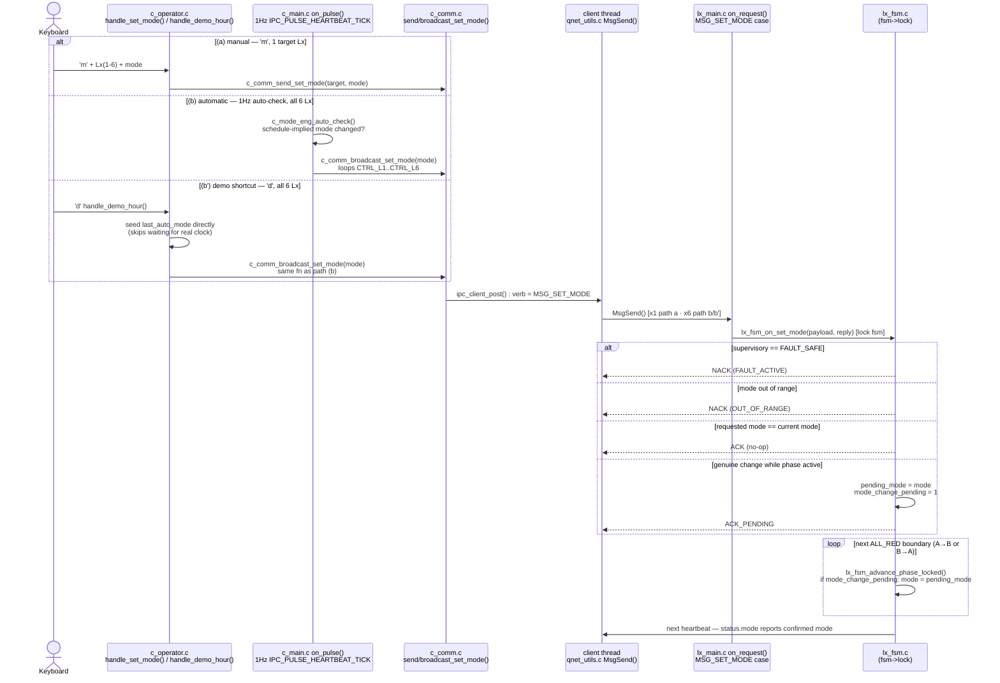

# UC-07 — Configure Traffic Operating Parameters (SET_MODE)

**Trigger:** keypress `m` (manual, `handle_set_mode()`, targets **1** chosen Lx) · 1Hz auto-check `IPC_PULSE_HEARTBEAT_TICK` (automatic, `c_mode_eng_auto_check()`, targets **all 6** Lx) · keypress `d` (`handle_demo_hour()`, demo-hour shortcut) reuses the exact same broadcast path as the automatic trigger
**Scope:** two-node — Central (C1) client thread → target Lx server thread(s), over `MSG_SET_MODE`
**Spec:** `usecase.md` UC-07 · `SEQUENCE_DIAGRAMS.md` SD-03 · rules DP-01, DP-02, TL-04, PA-09

NACK reasons (`PA-09`): `NACK_REASON_FAULT_ACTIVE` · `NACK_REASON_OUT_OF_RANGE`.
Path (b)/(b') is **6 independent unicast** `MSG_SET_MODE` sends, not one broadcast wire message.
`console_io_lock` (outer) and `mode_eng_lock` (inner) guard C1-side bookkeeping only — neither is
held across `MsgSend()`/`MsgReceive()`. On the Lx side, `fsm->lock` covers both validation and the
deferred apply, so they're atomic with respect to each other.

## Code map

| Step | File : Function |
|---|---|
| (a) Manual keypress → send | `c_operator.c : c_operator_reader_thread()` `'m'` → `handle_set_mode()` → `c_comm.c : c_comm_send_set_mode()` |
| (b) Auto-check tick → broadcast | `c_main.c : on_pulse()` (`IPC_PULSE_HEARTBEAT_TICK`) → `c_mode_eng.c : c_mode_eng_auto_check()` → `c_comm.c : c_comm_broadcast_set_mode()` |
| (b') Demo shortcut → broadcast | `c_operator.c : handle_demo_hour()` (`'d'`) → same `c_comm_broadcast_set_mode()` as (b) |
| Wire send (both) | `c_comm.c : c_comm_send_set_mode()` → `ipc_client_post()` → `qnet_utils.c` client thread `MsgSend()` |
| Receive + dispatch | `lx_main.c : on_request()` (`MSG_SET_MODE` case) → `lx_fsm.c : lx_fsm_on_set_mode()` |
| Deferred apply | `lx_fsm.c : lx_fsm_advance_phase_locked()` at `PHASE_ALL_RED_A_TO_B` / `PHASE_ALL_RED_B_TO_A` |
| Confirm to Central | `lx_comm.c : lx_comm_send_heartbeat()` → `lx_fsm_fill_status()` → `MSG_HEARTBEAT`/`MSG_STATUS` |

## Cross-node view

Wire message: `MSG_SET_MODE` (`ipc_msg.h`), payload `set_mode_payload_t { uint32_t mode; }`,
`sender_id = CTRL_C1`, `target_id` = the addressed Lx.

- **Path (a):** 1 request → 1 target → 1 `ACK`/`ACK_PENDING`/`NACK`.
- **Paths (b)/(b'):** 6 sequential unicast requests (`CTRL_L1..CTRL_L6`), each its own
  request/reply exchange — no single broadcast frame exists on the wire.

Matches `SEQUENCE_DIAGRAMS.md` SD-03's `opt operator requests a mode change` block
(`Op->>C1: submit SET_MODE` / `C1->>L1: SET_MODE` / `L1->>L1: validate + wait for safe boundary`,
then `alt accepted / else rejected`). Path (b)/(b') replays the identical `opt` block once per
controller across L1-L6, triggered by `c_mode_eng_auto_check()` instead of an operator submission.
