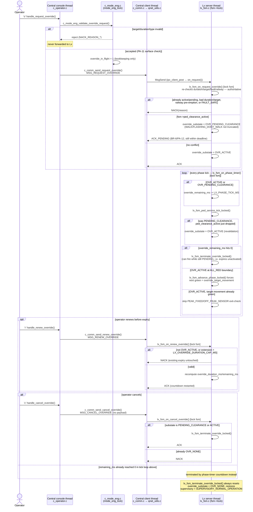

# UC-08 — Clear-Route Override

**Trigger:** operator keys `o` (request) / `r` (renew) / `c` (cancel)
**Scope:** Central (`c_operator.c`, `c_mode_eng.c`, `c_comm.c`) <-> target Lx (`lx_fsm.c`) over Qnet
**Spec:** `usecase.md` UC-08 · `SEQUENCE_DIAGRAMS.md` SD-07 · rules PA-09, PA-11, PA-12

## Code map

| Step | File : Function |
|---|---|
| Request keypress | `c_operator.c : c_operator_reader_thread()` → `handle_request_override()` |
| Central surface check | `c_mode_eng.c : c_mode_eng_validate_override_request()` |
| Wire send (request) | `c_comm.c : c_comm_send_request_override()` → `qnet_utils.c : ipc_client_post()` |
| Lx dispatch | `lx_main.c : on_request()` → `lx_fsm.c : lx_fsm_on_request_override()` |
| Countdown + re-validate | `lx_main.c : on_pulse()` → `lx_fsm.c : lx_fsm_on_phase_timer()`, `lx_fsm_ped_service_tick_locked()` |
| Phase steering | `lx_fsm.c : lx_fsm_advance_phase_locked()` |
| Renew | `c_operator.c : handle_renew_override()` → `c_comm.c : c_comm_send_renew_override()` → `lx_fsm.c : lx_fsm_on_renew_override()` |
| Cancel | `c_operator.c : handle_cancel_override()` → `c_comm.c : c_comm_send_cancel_override()` → `lx_fsm.c : lx_fsm_on_cancel_override()` |
| Termination (shared) | `lx_fsm.c : lx_fsm_terminate_override_locked()` |

Per `app/shared/README.md`'s threading pattern: the console thread only ever
builds the request and enqueues it; Central's dedicated **client thread**
(`ipc_client_thread_main()`) does the actual `MsgSend()`, so the console
never blocks on the Lx's reply. `override_in_flight` on Central is local
bookkeeping only — never synchronised with the Lx's real state.

## Cross-node view

Three IPC verbs (`ipc_msg.h`) carry the whole lifecycle, all Central-to-Lx,
all replied to synchronously (`RESULT_ACK` / `RESULT_ACK_PENDING` /
`RESULT_NACK`) via `MsgSend`/`MsgReceive`/`MsgReply`:

- `MSG_REQUEST_OVERRIDE` — start (may `ACK`, `ACK_PENDING`, or `NACK`)
- `MSG_RENEW_OVERRIDE` — extend an `OVR_ACTIVE` override before it expires
- `MSG_CANCEL_OVERRIDE` — operator-initiated early termination

Matches **SD-07** (`SEQUENCE_DIAGRAMS.md` §4.2.7) — the most detailed
diagram in that document — including the pedestrian-deferral branch, the
renewal loop, and the expiry-vs-cancel termination paths.
