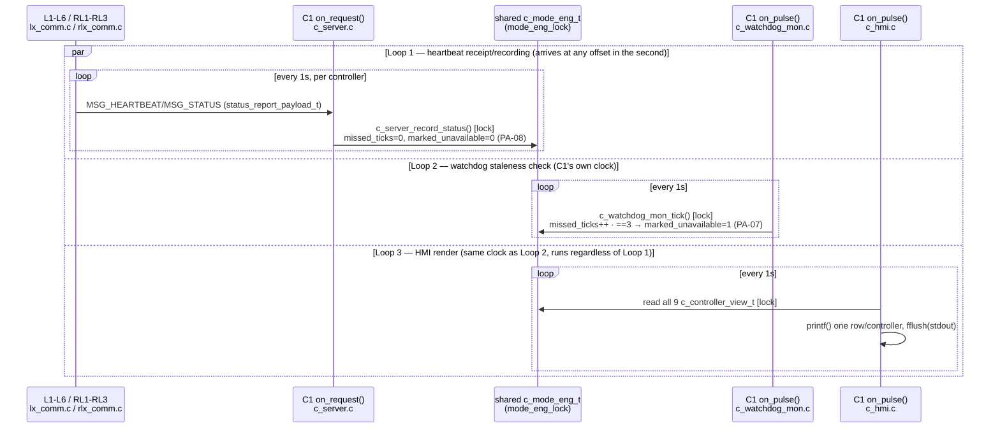
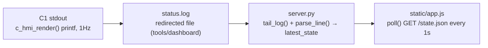

# UC-09 — Monitor Network Status and Faults

**Trigger:** `IPC_PULSE_HEARTBEAT_TICK`, armed 1000ms/1000ms — continuous, self-driving 1Hz tick on all 9 controllers and on C1, forever; no operator action, no one-shot entry point
**Scope:** all 9 local controllers (L1-L6, RL1-RL3) → C1, over `MSG_HEARTBEAT`/`MSG_STATUS`/`MSG_CROSSING_STATUS`, plus an extra dashboard tool layer outside the QNX/C process boundary
**Spec:** `usecase.md` UC-09 · `SEQUENCE_DIAGRAMS.md` SD-08 · rules PA-07, PA-08

Loop A/B is per-message (any sub-second offset); Loops C/D share C1's fixed 1Hz clock and never call into each other or into Loop A/B directly — the three loops only meet at `eng` under `mode_eng_lock`. Dashboard layer is a passive log-tailer: no IPC/socket into the traffic network, staleness there is inferred purely from `last_update_ts` age.

## Code map

| Step | File : Function |
|---|---|
| Build + send heartbeat | `lx_comm.c : lx_comm_send_heartbeat()` / `rlx_comm.c : rlx_comm_send_heartbeat()` → `lx_fsm_fill_status()` / `rlx_fsm_fill_status()` |
| Local ack handling (UC-10, not Central) | `lx_comm.c : on_heartbeat_reply()` → `lx_fsm_on_heartbeat_result()` |
| Record into shared state (PA-08 reset) | `c_main.c : on_request()` → `c_server.c : c_server_record_status()` / `c_server_record_crossing_status()` |
| Reconnect log | `c_main.c : log_reconnect_if_needed()` |
| Watchdog staleness (PA-07) | `c_main.c : on_pulse()` → `c_watchdog_mon.c : c_watchdog_mon_tick()` |
| HMI render | `c_main.c : on_pulse()` → `c_hmi.c : c_hmi_render()` |
| Log → dashboard tail | `tools/dashboard/server.py : tail_log()` |
| Parse + serve state | `server.py : parse_line()` / `ROW_RE` → `latest_state` → `Handler.do_GET()` `/state.json` |
| Browser render | `static/app.js : poll()` → `updateOverview()` / `renderRawTable()` / `renderDetail()` |

## Cross-node view

All 9 controllers independently run Loop 1's send side into the single node C1 — matches SD-08's `loop every 1s while connected` (`HEARTBEAT`/`HEARTBEAT_ACK`) plus its three-miss `loop` block (Loop 2) and "C1 --> Op: display current controller status" (Loop 3). Three wire verbs, all landing on the same `c_mode_eng_t`:

- `MSG_HEARTBEAT` — Lx/RLx → C1, once/sec, full `status_report_payload_t` (PA-07 input).
- `MSG_STATUS` — Lx/RLx → C1, on state transition, shares `c_server_record_status()`.
- `MSG_CROSSING_STATUS` — RLx → Lx (RC-02, local preemption) **and** RLx → C1 (fan-out, not point-to-point).

RC-10: the report to Central is a side channel sent *after* the local controller already applied its own safe state — never a precondition for it. Central's monitoring here grants no actuation authority (BR-1).
