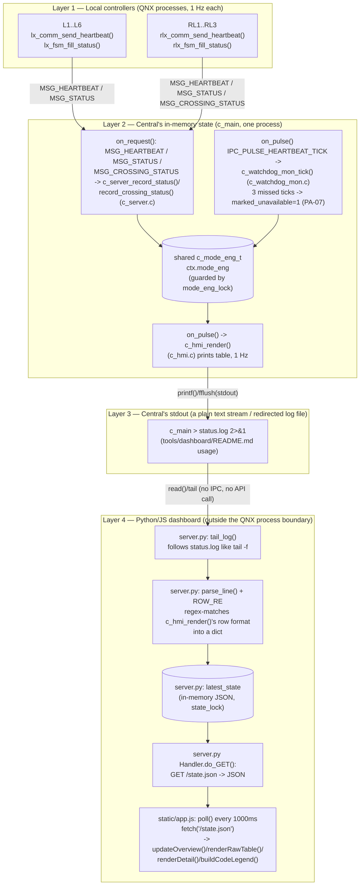

# UC-09 — Monitor Network Status and Faults: Function-Level Flow

## What this feature does

Per `usecase.md` section 3.2.9 (UC-09, around lines 133-147), Central must give the Control
Room Operator "an accurate network-wide view of controller states and faults" for all nine
local controllers (L1-L6, RL1-RL3), and must distinguish current, stale, unavailable, and
faulted controllers — without that monitoring granting Central any direct hardware-actuation
authority (BR-1). Two business rules drive the code traced below: **PA-07** — heartbeat loss
is declared after three consecutive missed heartbeats — and **PA-08** — a reconnected
controller's fresh state replaces the stale view only after it reports again. **RC-10** (a
railway fault report must never delay the local `STOP` response) shows up as an architectural
constraint: the fault/heartbeat report to Central is a side channel, sent *after* the local
railway controller has already applied its own safe state, never a precondition for it.

## Entry point

This is **not** a one-shot, operator-triggered flow. It is a continuous, self-driving 1 Hz
loop that runs independently on *every* local controller for as long as the process is alive:

- `app/intersection/src/lx_comm.c:lx_comm_send_heartbeat()` (around line 35) — one call per
  second on each of L1-L6.
- `app/railway/src/rlx_comm.c:rlx_comm_send_heartbeat()` (around line 44) — one call per
  second on each of RL1-RL3.

Both are invoked from the `IPC_PULSE_HEARTBEAT_TICK` case of each controller's pulse handler —
`app/intersection/src/lx_main.c` around line 94-95, `app/railway/src/rlx_main.c` around line
69-70 — which in turn fires because each `main()` arms a repeating QNX interval timer with
`ipc_timer_arm(chid, IPC_PULSE_HEARTBEAT_TICK, 1000, 1000, &heartbeat_timer)` (`lx_main.c`
around line 190; `rlx_main.c` around line 148: 1000 ms initial delay, 1000 ms period). There
is no user keypress or external stimulus in this path — the trigger is the RTOS timer pulse
itself, arriving once per second on all nine controllers, forever.

## Function call chain

There is **no single call chain** from sender to display. UC-09 is three independent 1 Hz
loops — one per local controller's send side, one on Central's watchdog side, one on
Central's HMI side — that never call each other directly. They only communicate by reading
and writing the same shared `c_mode_eng_t eng` (defined in
`app/central/includes/c_mode_eng.h`, embedded in `central_context_t.mode_eng` in
`app/central/src/c_main.c` around line 39), always under the single mutex
`central_context_t.mode_eng_lock` (declared around line 53). Below, each loop is numbered
separately, in the order a single 1-second slice actually executes across all nine
controllers plus Central.

### Loop A — every local controller, every second: build and send the heartbeat

1. `IPC_PULSE_HEARTBEAT_TICK` fires on Lx (`lx_main.c` ~line 94) or RLx (`rlx_main.c` ~line
   69), calling `lx_comm_send_heartbeat()` / `rlx_comm_send_heartbeat()`.
2. Inside, `lx_fsm_fill_status(fsm, &req.payload.heartbeat.summary)` (`lx_comm.c` ~line 51) /
   `rlx_fsm_fill_status(fsm, &req.payload.heartbeat.summary)` (`rlx_comm.c` ~line 62) snapshot
   the FSM under `fsm->lock` into a `status_report_payload_t`. For Lx,
   `lx_fsm_fill_status()` (`app/intersection/src/lx_fsm.c` around lines 1196-1230) fills
   `role=ROLE_INTERSECTION`, `mode`, `signal_phase`, `supervisory_state`, `faults`,
   `sensor_status` (built from `arterial_vehicle_demand`/`connector_vehicle_demand`/
   `ped_latched[0..3]`/`queue_warning_active` — the "sensor status" UC-09 asks for),
   `active_profile_id`, `override_active`, and `link_state`; `crossing_state` is left 0
   because it is not meaningful for an intersection. `rlx_fsm_fill_status()` fills the railway
   equivalent (`role`, `crossing_state`, `faults`, `link_state`), leaving `mode`/
   `signal_phase`/`supervisory_state` at 0 since they don't apply to `ROLE_RAILWAY`.
3. `lx_comm_send_heartbeat()` / `rlx_comm_send_heartbeat()` set `req.verb = MSG_HEARTBEAT`,
   `req.sender_id = self_id`, `req.target_id = CTRL_C1`, and `req.timestamp_ms = 0` (a known,
   documented codebase-wide gap — no monotonic-clock helper exists yet, so `timestamp_ms` is
   always the placeholder 0; the freshness check in Loop B therefore counts *ticks*, not real
   elapsed time — see Loop B, step 2).
4. `ipc_client_post(client_queue, CTRL_C1, &req, on_heartbeat_reply, fsm)` enqueues the
   message on that controller's own client thread. If the queue is full or shutting down
   (return != 0), the send is logged as dropped and immediately counted as a miss via
   `lx_fsm_on_heartbeat_result(fsm, 0)` / `rlx_fsm_on_heartbeat_result(fsm, 0)` — a heartbeat
   that never left the queue is treated exactly like one C1 never acknowledged.
5. When the client thread's `MsgSend()` completes, `on_heartbeat_reply()` (`lx_comm.c` ~line
   14) checks `send_ok && reply->result == RESULT_ACK`, and calls
   `lx_fsm_on_heartbeat_result(fsm, acked)`, which is what actually drives that controller's
   own local `DEGRADED_LOCAL` / reconnect transitions (UC-10) — this is the *local* PA-07
   consumer, separate from Central's.

### Loop B — Central's server thread, on every inbound message: record into shared state

6. C1's channel receives the `MSG_HEARTBEAT` (or a standalone `MSG_STATUS`, or
   `MSG_CROSSING_STATUS` from an RLx) via `ipc_server_run()`'s `MsgReceive()` loop, which
   dispatches to `on_request()` in `app/central/src/c_main.c` (around lines 81-142).
7. For `MSG_HEARTBEAT` (case around line 96) and `MSG_STATUS` (case around line 87),
   `on_request()` takes `mode_eng_lock` and calls
   `c_server_record_status(&ctx->mode_eng, sender_id, &payload, req->timestamp_ms)`
   (`app/central/src/c_server.c` around lines 3-28). For a railway crossing update sent on its
   own (`MSG_CROSSING_STATUS`, case around line 123),
   `c_server_record_crossing_status()` (`c_server.c` around lines 46-62) is called instead.
   Both look up the controller's slot with `c_mode_eng_controller_index(sender_id)`
   (`app/central/src/c_mode_eng.c` around lines 52-61: L1-L6 → index 0-5, RL1-RL3 → index
   6-8), then overwrite that `c_controller_view_t`'s `last_reported_*` fields, reset
   `missed_heartbeat_ticks = 0`, and clear `marked_unavailable = 0` — this reset is what makes
   PA-08 reconnection work: the very next inbound report from a previously-stale controller
   proves it is alive again, before Central resumes trusting its state as current.
8. Both record functions return `was_unavailable` (1 if the controller had been latched
   `UNAVAILABLE`). Back in `on_request()`, after releasing `mode_eng_lock`,
   `log_reconnect_if_needed(ctx, sender_id, reconnected)` (`c_main.c` around lines 71-79)
   logs `"Controller %d reconnected (PA-08)"` under `console_io_lock` — one log line per
   reconnect edge, not per heartbeat.
9. `on_request()` sets `reply->result = RESULT_ACK` in every success case; this reply is what
   crosses back to the sending Lx/RLx and becomes the `acked` flag in step 5 above (Loop A) —
   the only point of contact between Loop A and Loop B is this one request/reply pair, not a
   function call.

### Loop C — Central's own 1 Hz tick: detect staleness (independent of Loop B)

10. Separately from any inbound message, C1's own `IPC_PULSE_HEARTBEAT_TICK` fires once a
    second (armed in `c_main.c` around line 289, same 1000/1000 ms pattern as the Lx/RLx
    senders, but **this is Central's own clock, not triggered by any specific controller's
    send**), landing in `on_pulse()` (`c_main.c` around lines 144-233).
11. `on_pulse()` takes `mode_eng_lock` and calls
    `c_watchdog_mon_tick(&ctx->mode_eng, newly_unavailable)`
    (`app/central/src/c_watchdog_mon.c`, the whole file is ~19 lines): for all 9 slots it
    increments `missed_heartbeat_ticks`, and the instant a slot reaches exactly 3 with
    `marked_unavailable` still 0, it latches `marked_unavailable = 1` and appends that
    controller's id to `newly_unavailable[]` — this is the literal PA-07 rule ("identified
    after three consecutive missed heartbeats") as executable code.
12. After releasing `mode_eng_lock`, `on_pulse()` logs each newly-stale id under
    `console_io_lock`: `"Controller %d marked UNAVAILABLE - missed 3 consecutive heartbeats
    (PA-07)"` (`c_main.c` around lines 167-174). Note `c_watchdog_mon_tick()` itself never
    logs — it runs under `mode_eng_lock`, and `c_logger_log()` needs `console_io_lock`, so the
    log side-effect is deliberately hoisted to the caller after the lock is released.

### Loop D — Central's own 1 Hz tick: render the display (independent of Loops A-C)

13. Still inside the *same* `IPC_PULSE_HEARTBEAT_TICK` firing (but logically a separate,
    independent step — it would run even if no heartbeat had arrived that second),
    `on_pulse()` acquires `console_io_lock` then `mode_eng_lock` (always in that order — see
    the comment at `c_main.c` around lines 215-220 explaining why the reverse order would
    deadlock against `c_operator.c`'s command thread) and calls
    `c_hmi_render(&ctx->mode_eng)` (`c_main.c` around lines 221-225).
14. `c_hmi_render()` (`app/central/src/c_hmi.c`, around lines 35-79) walks all 9
    `c_controller_view_t` entries and `printf()`s one fixed-width row per controller: `ID`,
    `ROLE`, `MODE`, `PHASE`, `CROSSING_STATE`, `SUPERVISORY`, `FAULTS`, `SENSOR`, `OVERRIDE`,
    and `AVAILABILITY` (`"AVAILABLE"` or `"UNAVAILABLE"` from `marked_unavailable`), then
    `fflush(stdout)` (line 78). This is the entire UC-09 "display" as it exists in the C
    codebase today — a plain stdout table, once per second, always reflecting exactly what
    Loops B and C last wrote into `eng`.

The key point: heartbeats can arrive at any offset within the second (Loop B), the staleness
check runs on C1's own fixed 1 Hz clock (Loop C), and the render runs right after it on the
same clock (Loop D) — but a `MSG_HEARTBEAT` arriving does **not** call into
`c_watchdog_mon_tick()` or `c_hmi_render()` directly (see the repeated comment in
`on_request()`, e.g. around lines 92-93: "UC-09 display refresh happens on the 1 Hz
`IPC_PULSE_HEARTBEAT_TICK`... not per-request"). All three loops only ever meet at the shared,
mutex-guarded `c_mode_eng_t`.

## Cross-node view

All nine local controllers — L1-L6 (`app/intersection`) and RL1-RL3 (`app/railway`) —
independently run Loop A above and send to the single Central node, C1, using three message
types defined in the shared IPC contract (`app/shared/includes/ipc_msg.h` around lines 71-74):

- `MSG_HEARTBEAT` — Lx/RLx → C1, once per second, carrying a full `status_report_payload_t`
  snapshot inside `heartbeat_payload_t.summary` (PA-07).
- `MSG_STATUS` — Lx/RLx → C1, sent on a state transition (UC-09 main flow step 2; not traced
  step-by-step here since it shares `c_server_record_status()` with `MSG_HEARTBEAT`).
- `MSG_CROSSING_STATUS` — RLx → Lx directly (RC-02, for local railway-preemption at the
  adjacent intersections) **and** RLx → C1 (recorded via
  `c_server_record_crossing_status()`), so the wire format is genuinely fan-out, not just
  point-to-point to Central.

This 9-to-1 fan-in, plus the loss/reconnect handling in Loop A/B, is exactly what
`SEQUENCE_DIAGRAMS.md`'s **SD-08 — Monitor Controllers, Lose Central Link, and Resynchronise**
(around line 480) documents at the sequence-diagram level: the `loop every 1 s while
connected` block (`HEARTBEAT` / `HEARTBEAT_ACK`) is Loop A + the reply in Loop B step 9; "C1:
update network view and log" is Loop B step 7; the three-miss `loop` block is Loop C; and
"C1 --> Op: display current controller status" is Loop D. SD-08 states it "realises UC-09 and
UC-10" — UC-10 (local `DEGRADED_LOCAL` autonomy) is the Lx/RLx-side consequence of the same
missed-ACK signal that drives `lx_fsm_on_heartbeat_result()` in Loop A step 5, running
entirely locally and requiring no cooperation from Central, consistent with RC-10.

## System-level summary diagram

Four layers: the nine local controllers, Central's in-memory state, Central's stdout text
stream, and — outside the C/QNX process boundary entirely — a Python/JS dashboard that only
ever reads that text stream. The dashboard has no IPC channel of its own into the traffic
network; it is a passive log-tailer.

The load-bearing detail is the Layer 3 → Layer 4 edge: `tools/dashboard/server.py`'s
`tail_log()` (around lines 74-121) does not talk to any QNX resource manager, channel, or
socket exposed by `c_main` — it literally opens `status.log` as a file, seeks/reads new bytes
the way `tail -f` would (including detecting truncation via `stat().st_size < f.tell()`), and
splits complete lines. Each line is handed to `parse_line()` (around lines 55-71), which
applies `ROW_RE` (around lines 38-49) — a regex built to match `c_hmi_render()`'s exact
fixed-width column order (`ID ROLE MODE PHASE CROSSING_STATE SUPERVISORY FAULTS SENSOR
OVERRIDE AVAILABILITY`, per the comment at `c_hmi.c` line 40-41) — and turns a match into a
JSON-able dict, stored per-controller-id in the module-level `latest_state["nodes"]` under
`state_lock`. The embedded HTTP server's `do_GET()` (around lines 128-140) serves that dict
verbatim as `/state.json`, with `Cache-Control: no-store` so it is never stale-cached.
`static/app.js`'s `poll()` (around lines 379-403) fetches `/state.json` once a second and
feeds it to `updateOverview()` (the topology map, colored via `colorClassFor()`/
`subLabelFor()`), `renderRawTable()` (a browser reproduction of `c_hmi_render()`'s own table,
around lines 217-248), `renderDetail()` (a per-node drill-down), and the static
`buildCodeLegend()` panel (around lines 189-210) that decodes the same `MODE_NAMES` /
`PHASE_NAMES` / `SUPERVISORY_NAMES` / `CROSSING_NAMES` / `FAULT_BITS` / `SENSOR_BITS` tables
(around lines 5-28) so the browser's enum/bitmask decoding can never drift from what the regex
actually captured. If `c_main`'s process dies or stops printing, no code path here notices via
any signal or disconnect — the dashboard only infers staleness from `last_update_ts` age
(`poll()`'s `ageSec` check), which is a UI-layer echo of the same PA-07 freshness concept
Central itself computes at the C level in Loop C, computed completely independently and purely
from watching text scroll by.
