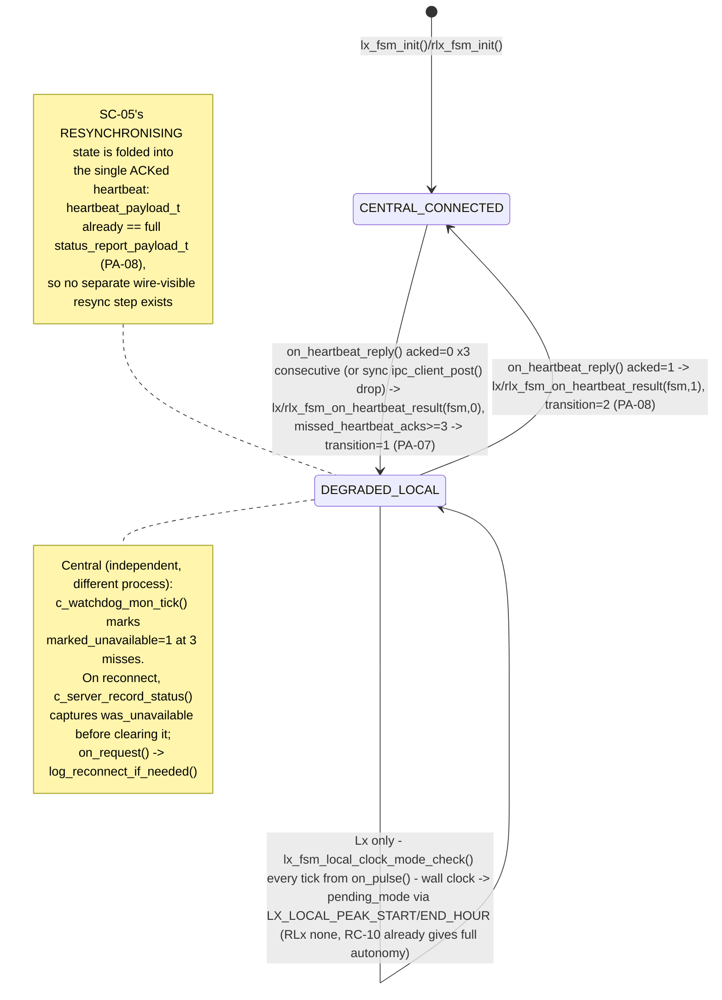
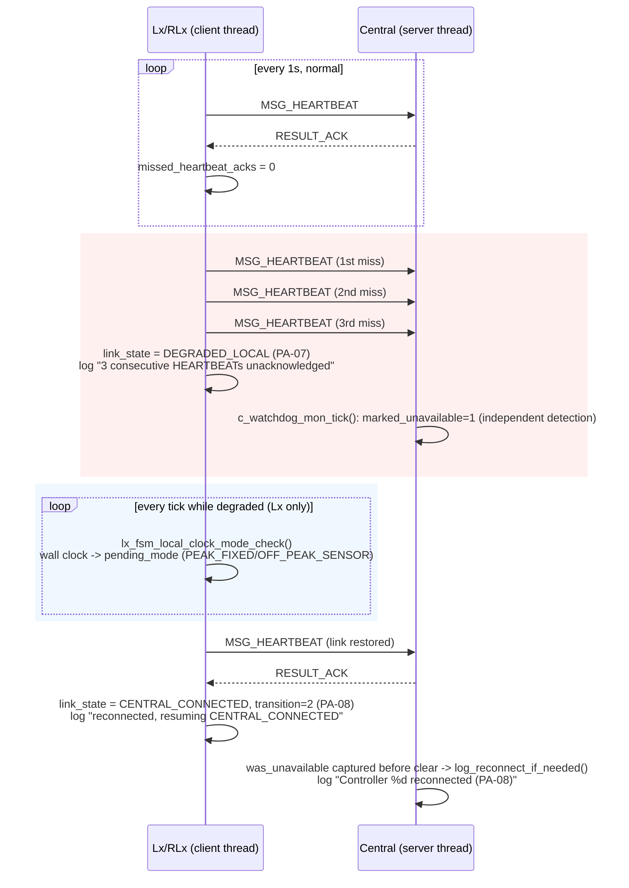

# UC-10 — Continue Local Operation During Central Link Loss

**Trigger:** `on_heartbeat_reply()` — the reply callback on every outgoing `MSG_HEARTBEAT`, firing once per second forever (`IPC_PULSE_HEARTBEAT_TICK`); continuous per-heartbeat evaluation, not a one-shot event
**Scope:** Lx and RLx each evaluate their own link independently; Central detects the same event independently on its own watchdog tick — no shared state between the two sides
**Spec:** `usecase.md` UC-10 · `SEQUENCE_DIAGRAMS.md` SD-08 · `STATE_CHARTS.md` SC-05 · rules PA-07, PA-08, TC-04

Time-ordered trace (SD-08's three-phase shape):

## Code map

| Step | File : Function |
|---|---|
| Send + build payload | `lx_comm.c : lx_comm_send_heartbeat()` / `rlx_comm.c : rlx_comm_send_heartbeat()` — payload via `lx_fsm_fill_status()` (real, observed `link_state`, no override) |
| Reply callback (client thread) | `lx_comm.c : on_heartbeat_reply()` (~L14) / `rlx_comm.c : on_heartbeat_reply()` (~L23) |
| Miss/ACK accounting + transition | `lx_fsm.c : lx_fsm_on_heartbeat_result()` (~L1232) / `rlx_fsm.c : rlx_fsm_on_heartbeat_result()` (~L451) |
| Local clock fallback (Lx only) | `lx_fsm.c : lx_fsm_local_clock_mode_check()` (~L1265), called from `lx_main.c : on_pulse()` every `IPC_PULSE_HEARTBEAT_TICK` |
| Synchronous send failure | `lx_comm_send_heartbeat()` calls `lx_fsm_on_heartbeat_result(fsm,0)` directly when `ipc_client_post()` itself fails — reply callback never runs for that tick |
| Central: independent miss detection | `c_watchdog_mon.c : c_watchdog_mon_tick()` — increments `missed_heartbeat_ticks`, sets `marked_unavailable` at 3 |
| Central: reconnect logging | `c_server.c : c_server_record_status()` / `record_crossing_status()` (capture-then-clear `was_unavailable`) → `c_main.c : on_request()` → `log_reconnect_if_needed()` |

Threads/locks: on Lx/RLx, everything above takes only `fsm->lock` — server thread (`on_pulse()`, `lx_fsm_local_clock_mode_check()`) and client thread (`on_heartbeat_reply()`) never nest it with anything else, so there's no cross-thread lock-ordering hazard. Central takes `mode_eng_lock` around `c_server_record_*()` and, separately (never nested with it), `console_io_lock` for logging.

## Cross-node view

No new IPC verb needed — UC-10 rides entirely on the pre-existing `MSG_HEARTBEAT`/`RESULT_ACK` exchange already used for UC-09 status monitoring:

- `heartbeat_payload_t` (`ipc_msg.h` L139-141) is literally `{ status_report_payload_t summary; }` — the same full-state struct as `MSG_STATUS`.
- So the first ACKed heartbeat after an outage already carries `link_state`, `mode`, `signal_phase`, `supervisory_state`, faults, etc. — satisfying PA-08's "complete current state on reconnect" for free, with no dedicated `MSG_RESYNC` verb or two-phase resync handshake.
- `connectivity_state_t` does define `LINK_RESYNCHRONISING` (`sys_types.h` L96-99, matching SC-05), but this implementation never sets it as an observable window — `link_state` jumps `DEGRADED_LOCAL` → `CENTRAL_CONNECTED` directly on one ACKed heartbeat, one fewer wire-visible step than SC-05/SD-08 illustrate; both diagrams model `RESYNCHRONISING` for generality, not as a mandatory separate step.
- Central detects both the miss and the reconnect purely from its own `c_watchdog_mon_tick()`/`marked_unavailable` bookkeeping — it never reads Lx's `link_state` field.
