# UC-10 — Continue Local Operation During Central Link Loss: Function-Level Flow

## What this feature does

`usecase.md` section 3.2.10 (UC-10) requires that a local controller (Lx or
RLx) declare its Central link unavailable after three consecutive missed
1 s heartbeats, keep running with its last-validated parameters (`PA-07`),
resume Central coordination automatically on reconnection by sending its
complete current state (`PA-08`), and never freeze or force an unnecessary
all-red purely because Central is unreachable (`TC-04`). This document
traces the code that implements that behavior end to end. It was
implemented for real in the current session — `link_state` used to be a
hardcoded field written by `lx_comm.c`/`rlx_comm.c` before every send,
never actually observed; it is now a genuine connectivity observation
driven by each heartbeat's real outcome.

## Entry point

`app/intersection/src/lx_comm.c`'s `on_heartbeat_reply()` (around line 14)
and the equivalent `app/railway/src/rlx_comm.c`'s `on_heartbeat_reply()`
(around line 23). Both are `ipc_client_post()` reply callbacks registered
on *every* outgoing `MSG_HEARTBEAT`, which fires once per second forever
(`IPC_PULSE_HEARTBEAT_TICK`, armed with a 1000/1000 ms period —
`app/intersection/src/lx_main.c` around line 190). This is not a one-shot
event handler: it is a continuous per-heartbeat evaluation that runs on
the CLIENT thread once a second for the lifetime of the process, and
`lx_fsm_on_heartbeat_result()`/`rlx_fsm_on_heartbeat_result()` (called from
inside it) are what actually accumulate the miss count and flip
`link_state`.

## Function call chain

### (a) Normal operation — heartbeat ACKed, counter reset

1. `lx_main.c`'s `on_pulse()` receives `IPC_PULSE_HEARTBEAT_TICK` (server
   thread) and calls `lx_comm_send_heartbeat()` (around line 94-95).
2. `lx_comm_send_heartbeat()` (`lx_comm.c` around line 35) builds an
   `ipc_request_t` with `verb = MSG_HEARTBEAT`, fills
   `req.payload.heartbeat.summary` via `lx_fsm_fill_status()` (this now
   copies the FSM's *real*, observed `link_state` — no override), and
   calls `ipc_client_post(client_queue, CTRL_C1, &req, on_heartbeat_reply, fsm)`
   — note `fsm` itself, not a separate struct, is passed as the reply
   `ctx` (line 61).
3. The client-queue worker thread performs the actual `MsgSend()`-style
   transport to Central and, on completion, invokes `on_heartbeat_reply()`
   (line 14) — this runs on the CLIENT thread, never the server thread.
4. On the Central side, `c_main.c`'s `on_request()` (around line 81)
   receives `MSG_HEARTBEAT` on the SERVER thread, calls
   `c_server_record_status()` under `ctx->mode_eng_lock`, and always
   replies `RESULT_ACK` (line 103) — this ACK-always behavior is exactly
   what `on_heartbeat_reply()` depends on to treat "acked" as a true
   proof-of-life signal.
5. Back on the Lx CLIENT thread, `on_heartbeat_reply()` computes
   `acked = send_ok && reply != NULL && reply->result == RESULT_ACK`
   (line 18) and calls `lx_fsm_on_heartbeat_result(fsm, acked)` (line 27).
6. Inside `lx_fsm_on_heartbeat_result()` (`lx_fsm.c` line 1232), under
   `fsm->lock`: since `acked == 1` and `link_state` is already
   `LINK_CENTRAL_CONNECTED`, only `fsm->missed_heartbeat_acks = 0` happens
   (line 1242) — no transition, return value 0. `on_heartbeat_reply()`
   logs nothing for this case.
7. `rlx_comm.c`/`rlx_fsm.c` mirror steps 1-6 exactly:
   `rlx_comm_send_heartbeat()` -> `on_heartbeat_reply()` (`rlx_comm.c` line
   23) -> `rlx_fsm_on_heartbeat_result()` (`rlx_fsm.c` line 451), same
   struct shape, same lock discipline.

### (b) Degradation — 3 consecutive misses

8. Suppose C1 stops replying (process down, Qnet partition, etc.), or
   `ipc_client_post()` itself returns non-zero because the outgoing queue
   is full/stopping. In the synchronous-failure case,
   `lx_comm_send_heartbeat()` logs `"HEARTBEAT to C1 dropped..."` and
   calls `lx_fsm_on_heartbeat_result(fsm, 0)` directly, itself, on the
   spot (line 63) — `on_heartbeat_reply()` never runs for that particular
   heartbeat, since the message was never even enqueued. In the
   asynchronous-failure case (send attempted but no ACK, a NACK/ERROR
   reply, or `send_ok == 0`), `on_heartbeat_reply()` still fires as in
   step 3-5 above, but `acked` evaluates to 0.
9. Either way, `lx_fsm_on_heartbeat_result(fsm, 0)` runs (`lx_fsm.c` line
   1232): `fsm->missed_heartbeat_acks++` (line 1245). This repeats for
   three consecutive 1 Hz ticks (`usecase.md` UC-10's stated trigger and
   `PA-07`'s "three consecutive misses" rule).
10. On the 3rd consecutive miss, `missed_heartbeat_acks >= 3 &&
    link_state == LINK_CENTRAL_CONNECTED` is true (line 1247):
    `fsm->link_state = LINK_DEGRADED_LOCAL` and the function returns `1`.
11. Back in `on_heartbeat_reply()` (or, for the synchronous-drop path,
    the `lx_comm_send_heartbeat()` call site itself just discards the
    return value — only the reply-callback path logs the transition):
    `transition == 1` prints `"Lx: 3 consecutive HEARTBEATs
    unacknowledged - entering DEGRADED_LOCAL (PA-07)"` (line 29).
12. From the *next* `IPC_PULSE_HEARTBEAT_TICK` onward,
    `on_pulse()` (`lx_main.c` line 98) also calls
    `lx_fsm_local_clock_mode_check(fsm)` immediately after
    `lx_comm_send_heartbeat()` — every tick, unconditionally, but the
    function itself is the gate: it takes `fsm->lock`, checks
    `link_state == LINK_CENTRAL_CONNECTED` and returns immediately if so
    (`lx_fsm.c` line 1265-1270). Now that `link_state ==
    LINK_DEGRADED_LOCAL`, it proceeds: reads the wall clock
    (`time(NULL)`/`localtime_r()`), computes `schedule_mode` from
    `LX_LOCAL_PEAK_START_HOUR`/`LX_LOCAL_PEAK_END_HOUR` (`lx_timer.h`
    lines 48-49, values 6 and 9), and — if that differs from
    `fsm->mode` — sets `pending_mode`/`mode_change_pending` (lines
    1282-1287), the same deferred-apply fields `lx_fsm_on_set_mode()`
    uses, so the mode change is applied at the next safe `ALL_RED`
    boundary by the existing phase-advance logic (`TL-04`), fulfilling
    `PA-07`'s "local clock continues selecting `PEAK_FIXED`/
    `OFF_PEAK_SENSOR`" and `TC-04`'s "degrade to standalone, don't block."
    Everything else this controller does (phase timing, pedestrian
    service, railway pre-emption handling) is already central-independent
    and untouched by `link_state` — per `SC-05`'s note, connectivity loss
    alone never forces all-red or frozen timing.
13. `rlx_fsm.c` has **no** equivalent of step 12: there is no
    `rlx_fsm_local_clock_mode_check()` anywhere in `rlx_fsm.c`/`rlx_fsm.h`.
    This is intentional, not an oversight — `rlx_fsm.h` states it
    explicitly next to `rlx_fsm_on_heartbeat_result()`'s declaration
    (around line 109): railway crossings have no `operating_mode_t`
    Peak/Off-Peak concept to select, and RC-10's pre-existing rule that a
    railway controller's fault/train-detection response "never waits for
    Central" already gives RLx full local autonomy for its actual
    safety-relevant behavior (gate sequencing on train approach). RLx's
    `link_state` still degrades/reconnects via
    `rlx_fsm_on_heartbeat_result()` for `UC-09` status-reporting
    purposes, it just has nothing extra to do locally as a *result* of
    that degradation, unlike Lx's mode selection.
14. Central's side of degradation runs independently on C1's own 1 Hz
    `on_pulse()` (`c_main.c`, `IPC_PULSE_HEARTBEAT_TICK` case, around line
    149): `c_watchdog_mon_tick()` (`app/central/src/c_watchdog_mon.c` line
    3) increments `missed_heartbeat_ticks` for all 9 controllers, and
    marks any controller reaching exactly 3 misses as
    `marked_unavailable = 1`, returning it in `newly_unavailable[]`. This
    is Central's own independent detection of the same event, driven by
    *absence* of heartbeats rather than by the Lx/RLx-side ACK outcome —
    the two sides discover the same link loss from opposite ends, with no
    shared state between them.

### (c) Reconnection — next ACKed heartbeat

15. Once C1 is reachable again, the next `MSG_HEARTBEAT` completes
    normally: `on_heartbeat_reply()` computes `acked == 1` and calls
    `lx_fsm_on_heartbeat_result(fsm, 1)`.
16. Inside it (line 1236-1242): `acked` is true and `link_state !=
    LINK_CENTRAL_CONNECTED` (it is `LINK_DEGRADED_LOCAL`), so
    `fsm->link_state = LINK_CENTRAL_CONNECTED`, `transition = 2`, and
    `missed_heartbeat_acks` resets to 0. This single ACK is enough — see
    the "Cross-node view" section below for why no separate
    `LINK_RESYNCHRONISING`-only message exchange is needed.
17. `on_heartbeat_reply()` sees `transition == 2` and logs `"Lx: HEARTBEAT
    acknowledged by C1 - reconnected, resuming CENTRAL_CONNECTED
    (PA-08)"` (line 31).
18. On the very next `IPC_PULSE_HEARTBEAT_TICK`,
    `lx_fsm_local_clock_mode_check()` now sees `link_state ==
    LINK_CENTRAL_CONNECTED` again and returns immediately (line
    1265-1270) — Central resumes sole mode authority.
19. On the Central SERVER thread, the very heartbeat that carried the
    reconnection is processed by `on_request()`'s `MSG_HEARTBEAT` case
    (`c_main.c` line 96-104): `c_server_record_status()`
    (`c_server.c` line 3) captures `was_unavailable =
    eng->controllers[idx].marked_unavailable` *before* clearing it (lines
    12-14), and returns that captured value. Because
    `c_watchdog_mon_tick()` (step 14) had set `marked_unavailable = 1`
    while degraded, this returns `1` now.
20. `on_request()` receives that return value as `reconnected` and calls
    `log_reconnect_if_needed(ctx, sender_id, reconnected)` (line 91,
    defined at line 71): under `ctx->console_io_lock` (a *different* lock
    than `mode_eng_lock`, taken only after `mode_eng_lock` has already
    been released — line 90 unlocks before line 91's call), it logs
    `"Controller %d reconnected (PA-08)"`. This is Central's own,
    independently-derived detection of the reconnect edge — it does not
    read Lx's `link_state` field at all; it infers the edge purely from
    its own `marked_unavailable` bookkeeping transitioning true->false.
21. The identical `was_unavailable`-capture-then-clear pattern exists in
    `c_server_record_crossing_status()` (`c_server.c` line 46-62) for
    `MSG_CROSSING_STATUS`, and `on_request()`'s `MSG_CROSSING_STATUS` case
    calls `log_reconnect_if_needed()` the same way (line 127) — so an
    RLx reconnecting via a crossing-status message (rather than only via
    heartbeat) is logged too.

**Threads/locks recap:** steps 1-2, 12-13 run on the Lx SERVER thread
inside `on_pulse()` (must never block — `lx_fsm_*` calls take only the
short, uncontended `fsm->lock`). Steps 3, 5-6, 8-9, 15-17 run on the Lx
CLIENT thread inside the reply callback, also only ever taking
`fsm->lock` — never nested with anything else, so there is no
cross-thread lock-ordering hazard on the Lx/RLx side. Steps 4, 14, 19-21
run on Central's SERVER thread inside `on_request()`/`on_pulse()`, taking
`mode_eng_lock` (short, around the `c_server_record_*()` calls only) and,
separately and never nested with it in the same direction twice, the
`console_io_lock` used for logging.

## Cross-node view

This flow does not add a new message — it *is* the connectivity-tracking
mechanism, riding entirely on the pre-existing `MSG_HEARTBEAT`/
`RESULT_ACK` request-reply exchange that already existed for `UC-09`
status monitoring. `PA-08` requires reconnection to send "complete current
state," and that requirement is met for free: `heartbeat_payload_t` (
`app/shared/includes/ipc_msg.h` line 139-141) is defined as `{
status_report_payload_t summary; }` — the exact same full-state snapshot
struct used for `MSG_STATUS` — with the comment at line 115-117
explicitly noting "Reused for both the periodic STATUS report and the
body of a HEARTBEAT — PA-08 requires the 'complete current state' on
reconnect to be the same shape as an ordinary status report." Because
every single heartbeat already carries the full snapshot (including
`link_state` itself, `mode`, `signal_phase`, `supervisory_state`, faults,
etc. — line 118-137), the heartbeat that happens to be the first one ACKed
after an outage automatically doubles as the state-resync message UC-10
step 8 describes. No dedicated `MSG_RESYNC` verb, no two-phase
"resync-then-resume" handshake, and no extra round trip were invented for
this.

This is also why `lx_fsm_on_heartbeat_result()`'s doc comment (`lx_fsm.h`
line 316-323) documents a deliberate scoping decision: `connectivity_state_t`
does define a `LINK_RESYNCHRONISING` value (`sys_types.h` line 96-99,
matching `SC-05`), but this implementation never sets it as an
independently-observable window — the single ACKed heartbeat that proves
reconnection already *is* the full-state resync, so `link_state` jumps
directly from `LINK_DEGRADED_LOCAL` to `LINK_CENTRAL_CONNECTED` with no
separate resync tick in between. `STATE_CHARTS.md`'s `SC-05` ("Central
Connectivity and Local Autonomy," line 347-373) models
`RESYNCHRONISING` as a distinct state for generality, and
`SEQUENCE_DIAGRAMS.md`'s `SD-08` ("Monitor Controllers, Lose Central Link,
and Resynchronise," line 480-...) shows the same three-phase shape at the
sequence level (routine heartbeat loop -> 3 misses -> autonomous operation
-> reconnect); this codebase's actual behavior realizes that same
contract with one fewer wire-visible step than the diagrams suggest is
possible, which is a valid implementation of the same state chart, not a
deviation from it.

## System-level summary diagram

```mermaid
stateDiagram-v2
    accTitle: UC-10 as implemented - real function names per transition
    accDescr: Lx/RLx connectivity state driven by lx_fsm_on_heartbeat_result()/rlx_fsm_on_heartbeat_result(), with Lx-only local clock fallback and Central's independent reconnect detection.

    [*] --> CENTRAL_CONNECTED : lx_fsm_init()/rlx_fsm_init()\n(starts LINK_DEGRADED_LOCAL until\nfirst heartbeat is ACKed)

    CENTRAL_CONNECTED --> DEGRADED_LOCAL : lx_fsm_on_heartbeat_result(fsm,0)\n/ rlx_fsm_on_heartbeat_result(fsm,0)\nmissed_heartbeat_acks reaches 3\n(3rd consecutive on_heartbeat_reply\nacked==0, or synchronous\nipc_client_post() drop)\nreturns transition=1

    DEGRADED_LOCAL --> DEGRADED_LOCAL : Lx only:\nlx_fsm_local_clock_mode_check()\ncalled every IPC_PULSE_HEARTBEAT_TICK\nfrom lx_main.c on_pulse();\nsets pending_mode via\nLX_LOCAL_PEAK_START_HOUR/_END_HOUR\n(RLx: no equivalent - RC-10 fault\nresponse already covers autonomy)

    DEGRADED_LOCAL --> CENTRAL_CONNECTED : lx_fsm_on_heartbeat_result(fsm,1)\n/ rlx_fsm_on_heartbeat_result(fsm,1)\nnext heartbeat ACKed\nreturns transition=2\n(no observable RESYNCHRONISING\nwindow - see scoping note below)

    note right of DEGRADED_LOCAL
        Central side (independent detection,
        different process, different thread):
        c_watchdog_mon_tick() marks
        marked_unavailable=1 after 3 missed
        ticks (c_watchdog_mon.c).
        On the reconnecting HEARTBEAT/STATUS/
        CROSSING_STATUS, c_server_record_status()/
        record_crossing_status() capture
        was_unavailable before clearing
        marked_unavailable; on_request() calls
        log_reconnect_if_needed() -> logs
        "Controller %d reconnected (PA-08)"
    end note

    note left of DEGRADED_LOCAL
        SC-05 defines a RESYNCHRONISING state;
        this implementation folds it into the
        single ACKed heartbeat (heartbeat_payload_t
        already = full status_report_payload_t
        snapshot, per PA-08) rather than modelling
        it as a separate wire step.
    end note
```

